# Agent 与 Tool 配置执行机制深度分析

## 目录

1. [系统概述](#系统概述)
2. [架构设计](#架构设计)
3. [Tool 配置执行流程](#tool-配置执行流程)
4. [事件系统](#事件系统)
5. [权限控制机制](#权限控制机制)
6. [UI 交互流程](#ui-交互流程)
7. [核心代码分析](#核心代码分析)
8. [流程图详解](#流程图详解)
9. [最佳实践与扩展](#最佳实践与扩展)

---

## 系统概述

本分析文档深入探讨了 Renx Code Agent 系统中 Agent 与 Tool 配置执行的核心机制。该系统是一个功能完整的 AI Agent 运行时框架，专为 CLI 环境设计，基于 TypeScript 和 React 构建，提供了完整的 Agent 生命周期管理、多模型支持、工具系统集成、事件流处理和状态持久化功能。

该系统的核心设计理念是通过模块化架构实现高度的可扩展性和灵活性，支持动态加载核心模块，使得 Agent 能够在运行时动态获取和执行各种工具。系统的Tool 执行机制是一个复杂的多阶段流程，涵盖了从 Tool 的注册、配置、到执行、结果处理的全过程。

### 核心特性

1. **动态模块加载**: 系统通过动态导入实现模块的延迟加载，支持热重载和模块更新
2. **事件驱动架构**: 采用事件流处理机制，支持实时的事件监控和响应
3. **权限控制系统**: 实现细粒度的 Tool 权限管理和用户确认机制
4. **状态持久化**: 使用 SQLite 存储对话历史和状态，支持会话恢复
5. **多模型支持**: 支持多种 AI 模型的无缝切换

---

## 架构设计

### 整体架构图

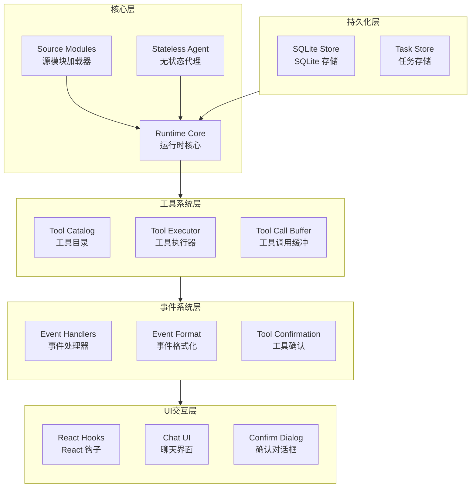

### 目录结构

```
src/agent/runtime/
├── runtime.ts              # 核心运行时实现 (32562字节)
├── types.ts                # 类型定义 (4330字节)
├── source-modules.ts       # 源模块加载器 (10057字节)
├── tool-catalog.ts         # 工具目录管理 (769字节)
├── tool-confirmation.ts    # 工具确认机制 (1210字节)
├── tool-call-buffer.ts     # 工具调用缓冲 (1623字节)
├── event-format.ts         # 事件格式化 (7104字节)
├── workspace-paths.ts      # 工作区路径解析 (1276字节)
└── *.test.ts              # 测试文件

src/components/
├── tool-display-config.ts    # 工具显示配置
├── tool-confirm-dialog.tsx   # 工具确认对话框
├── tool-confirm-dialog-content.ts # 确认对话框内容
└── chat/
    └── assistant-tool-group.tsx  # 工具组显示组件

src/hooks/
├── use-agent-chat.ts          # Agent 聊天钩子 (25647字节)
├── agent-event-handlers.ts    # 事件处理器 (5713字节)
└── turn-updater.ts            # 对话更新器
```

---

## Tool 配置执行流程

### 整体执行流程

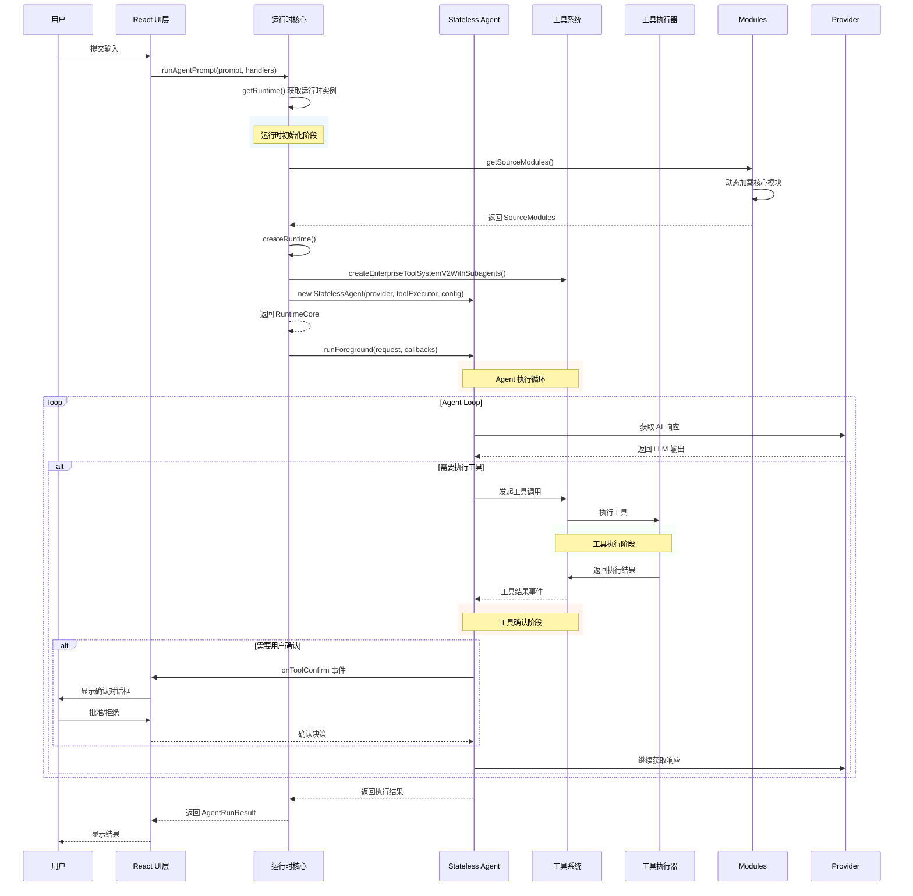

### 运行时初始化流程

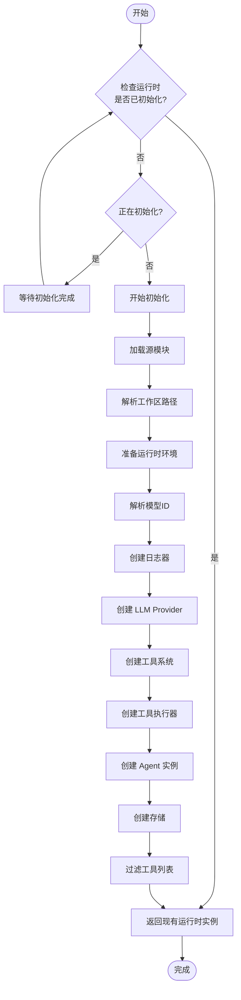

### 工具系统创建流程

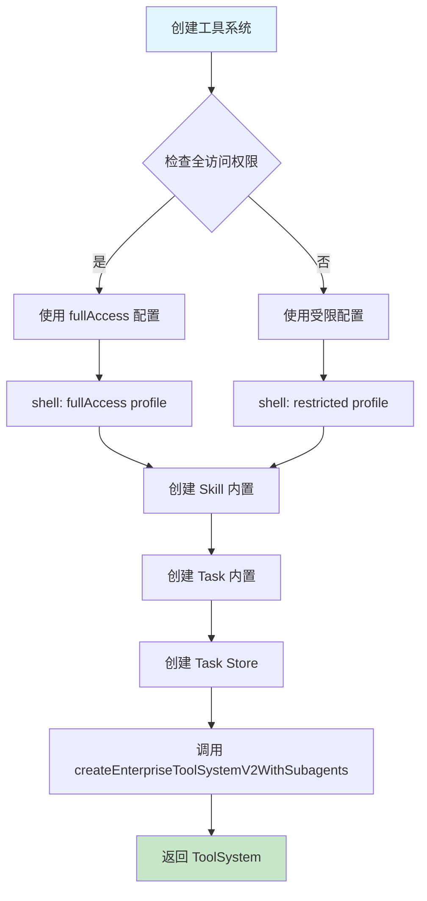

---

## 事件系统

### 事件类型定义

系统在 `types.ts` 中定义了丰富的事件类型：

```typescript
// 文本事件
export type AgentTextDeltaEvent = {
  text: string;
  isReasoning?: boolean;
};

// 工具流事件
export type AgentToolStreamEvent = {
  toolCallId: string;
  toolName: string;
  type: string;
  sequence: number;
  timestamp: number;
  content?: string;
  data?: unknown;
};

// 工具确认事件
export type AgentToolConfirmEvent = {
  kind: 'approval';
  toolCallId: string;
  toolName: string;
  args: Record<string, unknown>;
  rawArgs: Record<string, unknown>;
  reason?: string;
  metadata?: Record<string, unknown>;
};

// 工具使用事件
export type AgentToolUseEvent = {
  [key: string]: unknown;
};

// 工具结果事件
export type AgentToolResultEvent = {
  toolCall: unknown;
  result: unknown;
};

// 步骤事件
export type AgentStepEvent = {
  stepIndex: number;
  finishReason?: string;
  toolCallsCount: number;
};

// 循环事件
export type AgentLoopEvent = {
  loopIndex: number;
  steps: number;
};

// 停止事件
export type AgentStopEvent = {
  reason: string;
  message?: string;
};

// 使用情况事件
export type AgentUsageEvent = {
  promptTokens: number;
  completionTokens: number;
  totalTokens: number;
  cumulativePromptTokens?: number;
  cumulativeCompletionTokens?: number;
  cumulativeTotalTokens?: number;
  contextTokens?: number;
  contextLimit?: number;
  contextUsagePercent?: number;
};
```

### 事件处理器接口

```typescript
export type AgentEventHandlers = {
  onTextDelta?: (event: AgentTextDeltaEvent) => void;
  onTextComplete?: (text: string) => void;
  onToolStream?: (event: AgentToolStreamEvent) => void;
  onToolConfirm?: (event: AgentToolConfirmEvent) => void;
  onToolConfirmRequest?: (
    event: AgentToolConfirmEvent
  ) => AgentToolConfirmDecision | Promise<AgentToolConfirmDecision>;
  onToolPermission?: (event: AgentToolPermissionEvent) => void;
  onToolPermissionRequest?: (
    event: AgentToolPermissionEvent
  ) => AgentToolPermissionGrant | Promise<AgentToolPermissionGrant>;
  onToolUse?: (event: AgentToolUseEvent) => void;
  onToolResult?: (event: AgentToolResultEvent) => void;
  onStep?: (event: AgentStepEvent) => void;
  onLoop?: (event: AgentLoopEvent) => void;
  onUserMessage?: (event: AgentUserMessageEvent) => void;
  onStop?: (event: AgentStopEvent) => void;
  onContextUsage?: (event: AgentContextUsageEvent) => void;
  onUsage?: (event: AgentUsageEvent) => void;
};
```

### 事件流转流程

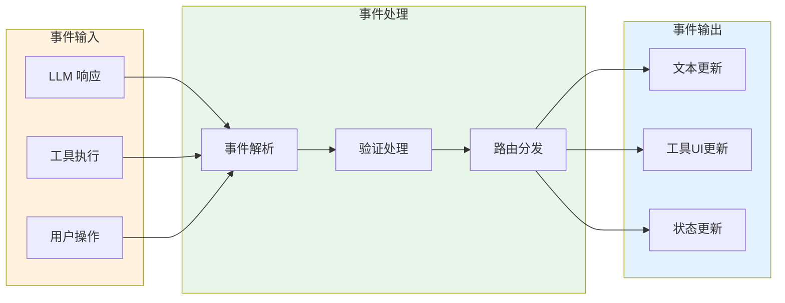

### 事件处理详细流程

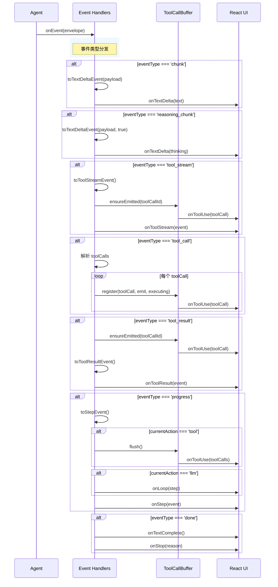

---

## 权限控制机制

### 权限确认流程

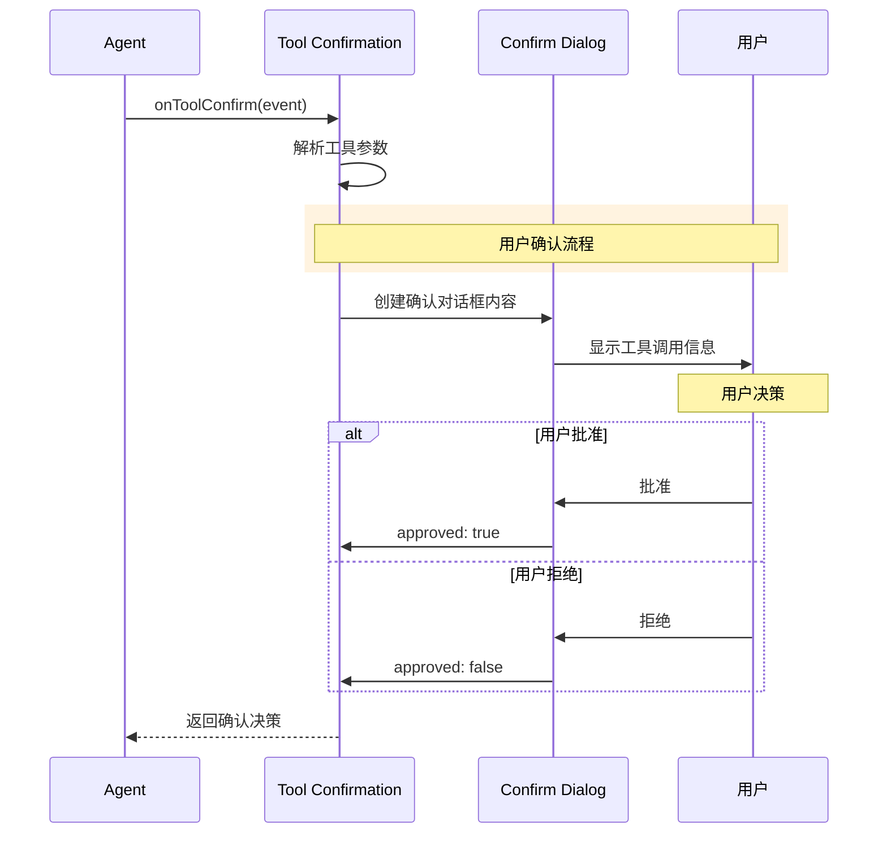

### 权限事件处理

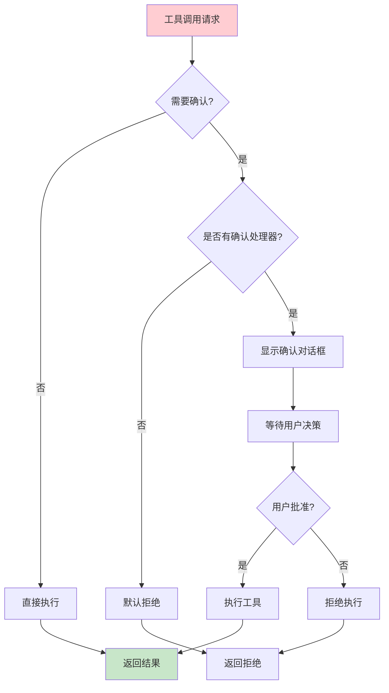

### 工具显示配置

系统通过 `tool-display-config.ts` 定义了工具的显示配置：

```typescript
export type ToolDisplayConfig = {
  displayName?: string;  // 显示名称
  icon?: string;        // 图标
  hiddenArgumentKeys?: string[]; // 隐藏的参数键
};

const TOOL_DISPLAY_CONFIG: Record<string, ToolDisplayConfig> = {
  spawn_agent: {
    displayName: 'spawn agent',
    icon: '◉',
    hiddenArgumentKeys: ['prompt', 'description', 'metadata'],
  },
  agent_status: {
    displayName: 'agent status',
    icon: '◉',
  },
  local_shell: {
    icon: '$',
    hiddenArgumentKeys: ['command', 'description'],
  },
  read_file: {
    icon: '→',
    hiddenArgumentKeys: ['path'],
  },
  file_edit: {
    icon: '←',
    hiddenArgumentKeys: ['path'],
  },
  write_file: {
    icon: '←',
    hiddenArgumentKeys: ['path'],
  },
  glob: {
    icon: '✱',
    hiddenArgumentKeys: ['pattern', 'path'],
  },
  grep: {
    icon: '✱',
    hiddenArgumentKeys: ['pattern', 'path'],
  },
  web_fetch: {
    icon: '%',
  },
  web_search: {
    icon: '%',
  },
};
```

---

## UI 交互流程

### React Hook 状态管理

```mermaid
stateDiagram-v2
    [*] --> Idle
    
    Idle --> Thinking: 提交输入
    Thinking --> Thinking: 事件处理中
    
    Thinking --> Done: 完成
    Thinking --> Error: 错误
    Thinking --> Cancelled: 取消
    
    Done --> Idle: 重置
    Error --> Idle: 重置
    Cancelled --> Idle: 重置
    
    note right of Thinking
      处理事件:
      - onTextDelta
      - onToolStream
      - onToolUse
      - onToolResult
      - onToolConfirm
      - onUsage
    end
```

### 工具确认对话框流程

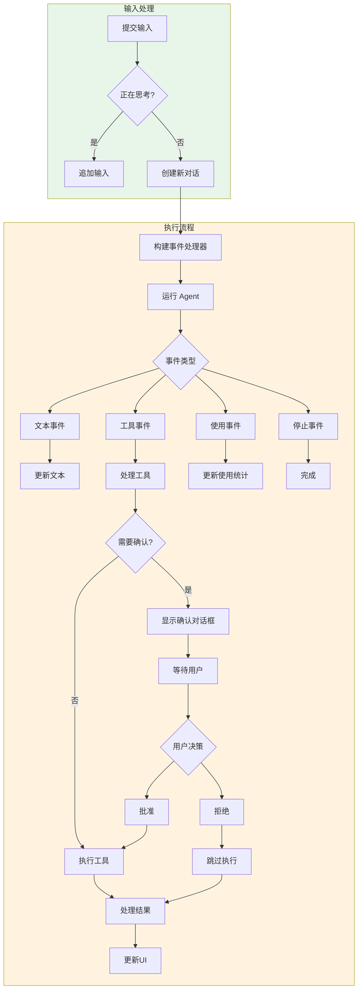

### 确认队列管理

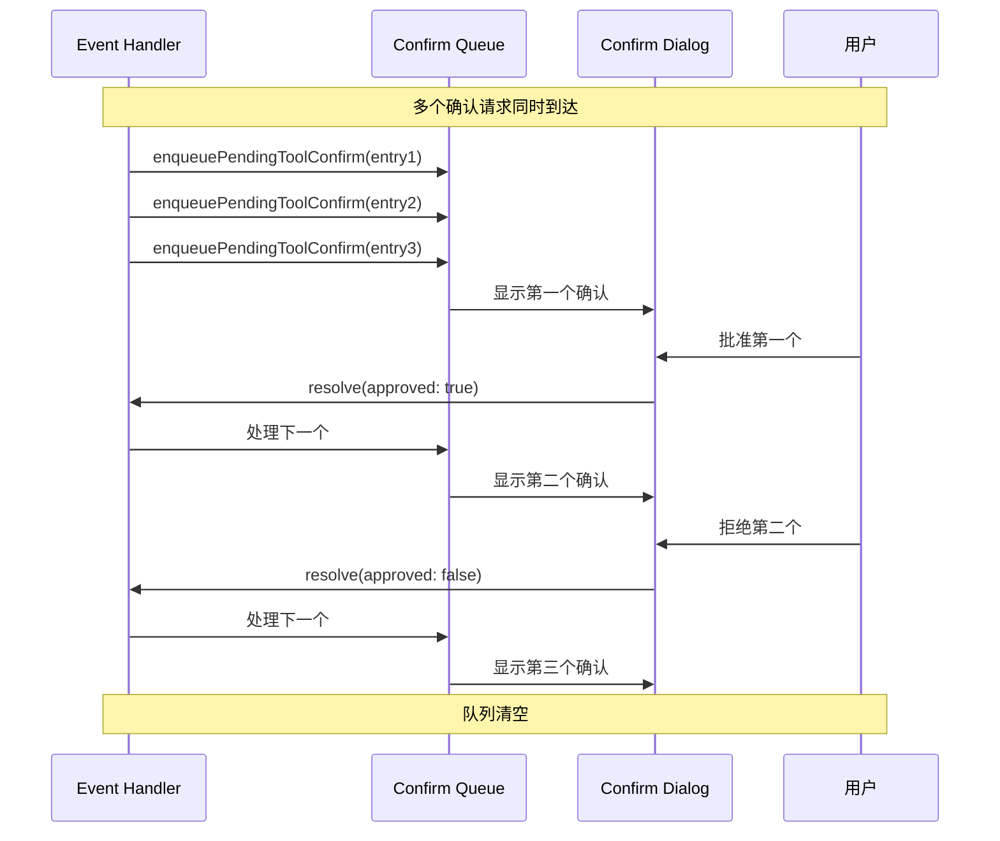

---

## 核心代码分析

### 1. 运行时核心 (runtime.ts)

运行时采用单例模式，通过双重检查锁定确保线程安全：

```typescript
let runtimePromise: Promise<RuntimeCore> | null = null;
let initializing = false;

const getRuntime = async (): Promise<RuntimeCore> => {
  if (runtimePromise) {
    return runtimePromise;
  }

  if (initializing) {
    while (initializing) {
      await new Promise((resolve) => setTimeout(resolve, 10));
    }
    if (runtimePromise) {
      return runtimePromise;
    }
  }

  initializing = true;
  try {
    const promise = createRuntime();
    runtimePromise = promise;
    promise.catch(() => {
      runtimePromise = null;
    });
    return promise;
  } finally {
    initializing = false;
  }
};
```

运行时核心结构：

```typescript
type RuntimeCore = {
  modelId: string;           // 当前模型ID
  modelLabel: string;        // 模型显示名称
  maxSteps: number;          // 最大执行步数
  conversationId: string;    // 对话ID
  workspaceRoot: string;     // 工作区根目录
  parentTools: ToolSchemaLike[]; // 父级工具列表
  agent: StatelessAgentLike; // 无状态Agent实例
  appService: AgentAppServiceLike; // 应用服务
  appStore: AgentAppStoreLike; // 应用存储
  logger?: { close?: () => void | Promise<void> }; // 日志器
  modules: SourceModules;     // 源模块
};
```

### 2. 工具目录管理 (tool-catalog.ts)

工具目录管理器负责过滤和管理可用的工具：

```typescript
export function filterToolSchemas(
  schemas: ToolSchemaLike[],
  options?: {
    allowedTools?: string[];
    hiddenToolNames?: Set<string>;
  }
): ToolSchemaLike[] {
  const hiddenToolNames = options?.hiddenToolNames;
  const allowedTools = options?.allowedTools;

  // 首先过滤隐藏的工具
  const visibleSchemas = schemas.filter((schema) => {
    const name = schema.function?.name;
    return typeof name === 'string' && !hiddenToolNames?.has(name);
  });

  // 如果没有指定允许列表，返回所有可见工具
  if (!allowedTools || allowedTools.length === 0) {
    return visibleSchemas;
  }

  // 进一步过滤只保留允许的工具
  const allowed = new Set(allowedTools);
  return visibleSchemas.filter((schema) => {
    const name = schema.function?.name;
    return typeof name === 'string' && allowed.has(name);
  });
}
```

隐藏的工具名称集合：

```typescript
const PARENT_HIDDEN_TOOL_NAMES = new Set(['file_history_list', 'file_history_restore']);
```

### 3. 工具调用缓冲 (tool-call-buffer.ts)

工具调用缓冲器管理工具调用的顺序和状态：

```typescript
export class ToolCallBuffer {
  private readonly plannedOrder: string[] = [];
  private readonly plannedIds = new Set<string>();
  private readonly toolCallsById = new Map<string, AgentToolUseEvent>();
  private readonly emittedIds = new Set<string>();

  // 注册工具调用
  register(
    toolCall: AgentToolUseEvent,
    emit: (event: AgentToolUseEvent) => void,
    executing = false
  ) {
    const toolCallId = readToolCallId(toolCall);
    if (!toolCallId) {
      emit(toolCall);  // 没有ID立即发射
      return;
    }

    this.toolCallsById.set(toolCallId, toolCall);
    if (!this.plannedIds.has(toolCallId)) {
      this.plannedIds.add(toolCallId);
      this.plannedOrder.push(toolCallId);
    }

    // 如果正在执行，立即发射
    if (executing) {
      this.emit(toolCallId, emit);
    }
  }

  // 刷新所有待处理的工具调用
  flush(emit: (event: AgentToolUseEvent) => void) {
    for (const toolCallId of this.plannedOrder) {
      this.emit(toolCallId, emit);
    }
  }

  // 确保指定ID的工具调用已被发射
  ensureEmitted(toolCallId: string | undefined, emit: (event: AgentToolUseEvent) => void) {
    if (!toolCallId) {
      return;
    }
    this.emit(toolCallId, emit);
  }

  private emit(toolCallId: string, emit: (event: AgentToolUseEvent) => void) {
    // 避免重复发射
    if (this.emittedIds.has(toolCallId)) {
      return;
    }
    const toolCall = this.toolCallsById.get(toolCallId);
    if (!toolCall) {
      return;
    }
    this.emittedIds.add(toolCallId);
    emit(toolCall);
  }
}
```

### 4. 工具确认机制 (tool-confirmation.ts)

```typescript
export const resolveToolConfirmDecision = async (
  event: AgentToolConfirmEvent,
  handlers: AgentEventHandlers
): Promise<AgentToolConfirmDecision> => {
  // 如果没有确认处理器，默认拒绝
  if (!handlers.onToolConfirmRequest) {
    return DEFAULT_FALLBACK_DECISION;
  }

  const decision = await handlers.onToolConfirmRequest(event);
  return decision ?? { approved: false, message: 'Tool confirmation was not resolved.' };
};

export const resolveToolPermissionGrant = async (
  event: AgentToolPermissionEvent,
  handlers: AgentEventHandlers
): Promise<AgentToolPermissionGrant> => {
  if (!handlers.onToolPermissionRequest) {
    return {
      ...DEFAULT_FALLBACK_PERMISSION_GRANT,
      scope: event.requestedScope,
    };
  }

  return (await handlers.onToolPermissionRequest(event)) ?? DEFAULT_FALLBACK_PERMISSION_GRANT;
};
```

### 5. 事件格式化 (event-format.ts)

工具使用事件格式化：

```typescript
export const formatToolUseEventCode = (event: AgentToolUseEvent): string => {
  return formatToolUseAsCode(toToolCall(event));
};

const formatToolUseAsCode = (toolCall: ToolCallLike): string => {
  const toolName = toolCall.function?.name ?? 'tool';
  const callId = toolCall.id ?? 'unknown';
  const args = parseToolArguments(toolCall.function?.arguments);

  // 特殊处理 shell 命令
  if (toolName === 'local_shell') {
    const command = pickString(args.command) ?? '';
    const timeoutMs = args.timeoutMs;
    const workdir = pickString(args.workdir);
    const lines = [`# Tool: local_shell (${callId})`, `$ ${command}`];
    if (typeof timeoutMs === 'number') {
      lines.push(`# timeout: ${timeoutMs}ms`);
    }
    if (workdir) {
      lines.push(`# workdir: ${workdir}`);
    }
    return lines.join('\n');
  }

  // 特殊处理文件操作
  if (toolName === 'read_file' || toolName === 'write_file' || toolName.startsWith('file_')) {
    const path = pickString(args.path);
    const action = pickString(args.action);
    const lines = [`# Tool: ${toolName} (${callId})`];
    if (action) {
      lines.push(`# action: ${action}`);
    }
    if (path) {
      lines.push(`# path: ${path}`);
    }
    // ... 其他参数
    return lines.join('\n');
  }

  return [`# Tool: ${toolName} (${callId})`, stringifyPretty(args)].join('\n');
};
```

---

## 流程图详解

### 主执行流程图

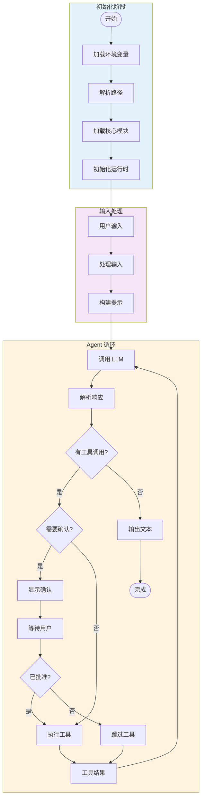

### 工具执行详细流程

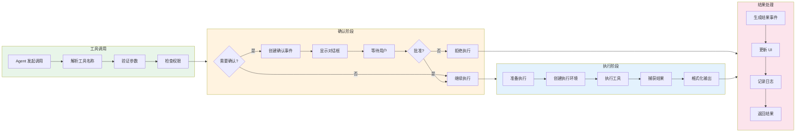

### 事件处理流程

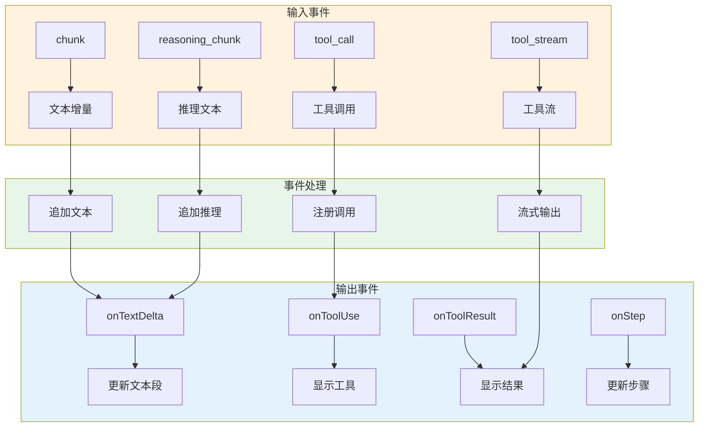

---

## 最佳实践与扩展

### 扩展工具系统

系统支持自定义工具集成：

```typescript
const toolSystem = modules.createEnterpriseToolSystemV2WithSubagents({
  appService: deferredSubagentAppService.service,
  resolveTools: (allowedTools?: string[]) =>
    filterToolSchemas(toolExecutor?.getToolSchemas() || [], { allowedTools }),
  resolveModelId: () => modelConfig.model || modelId,
  builtIns: {
    skill: {
      loaderOptions: {
        workingDir: workspaceRoot,
      },
    },
    task: {
      store: taskStore,
      defaultNamespace: conversationId,
    },
  },
});
```

### 安全策略配置

```typescript
const toolExecutor = new modules.EnterpriseToolExecutor({
  system: toolSystem,
  workingDirectory: workspaceRoot,
  fileSystemPolicy: modules.createWorkspaceFileSystemPolicy(workspaceRoot),
  networkPolicy: modules.createRestrictedNetworkPolicy(),
  approvalPolicy: 'on-request',
  trustLevel: 'untrusted',
});
```

### 性能优化建议

1. **缓存机制**: 使用 prompt cache 减少重复计算
2. **异步处理**: 避免阻塞主线程
3. **资源管理**: 及时清理运行时实例
4. **错误处理**: 实现完善的异常捕获机制

### 环境变量配置

系统支持以下环境变量配置：

- `AGENT_MODEL` - 指定使用的 AI 模型
- `AGENT_MAX_STEPS` - 最大执行步数
- `AGENT_MAX_RETRY_COUNT` - 最大重试次数
- `AGENT_CONVERSATION_ID` - 对话 ID
- `AGENT_SESSION_ID` - 会话 ID
- `AGENT_REPO_ROOT` - 仓库根目录
- `AGENT_WORKDIR` - 工作目录
- `AGENT_PROMPT_CACHE_KEY` - 提示缓存键
- `AGENT_PROMPT_CACHE_RETENTION` - 提示缓存保留时间
- `AGENT_FULL_ACCESS` - 启用全访问模式

---

## 总结

本分析文档详细介绍了 Renx Code Agent 系统中 Agent 与 Tool 配置执行的核心机制。该系统采用模块化架构，通过动态加载、事件驱动、权限控制等机制实现了高度的可扩展性和灵活性。

关键要点：

1. **运行时管理**: 采用单例模式和双重检查锁定确保线程安全
2. **工具系统**: 通过目录过滤、调用缓冲、事件格式化实现完整的工具管理
3. **权限控制**: 实现细粒度的用户确认机制，支持批准/拒绝决策
4. **UI 集成**: 通过 React Hook 和事件处理器实现流畅的用户体验
5. **状态持久化**: 使用 SQLite 存储对话历史，支持会话恢复

该系统代表了当前 AI Agent 运行时技术的先进水平，为构建复杂的 AI 应用提供了坚实的基础。

---

*文档生成日期: 2026-03-18*
*源代码版本: renx-code-v2/packages/cli*

---

## 附录A：核心类型定义详解

### A.1 运行时核心类型

```typescript
// 运行时核心结构 - 定义了 Agent 运行时的所有关键组件
type RuntimeCore = {
  // 模型相关配置
  modelId: string;           // 当前使用的模型标识符，如 'qwen3.5-plus'
  modelLabel: string;        // 模型的显示名称，用于 UI 展示
  
  // 执行控制参数
  maxSteps: number;          // Agent 执行的最大步数限制，防止无限循环
  
  // 会话标识
  conversationId: string;    // 当前对话的唯一标识符，用于状态追踪
  
  // 工作环境配置
  workspaceRoot: string;     // 工作区的根目录路径
  skillRoots: string[];      // 可用技能模块的根目录列表
  
  // 工具配置
  parentTools: ToolSchemaLike[]; // 父级工具的模式定义数组
  
  // 核心组件实例
  agent: StatelessAgentLike; // 无状态代理实例，处理 LLM 交互
  appService: AgentAppServiceLike; // 应用服务接口，提供运行时操作
  appStore: AgentAppStoreLike; // 应用存储接口，管理持久化状态
  
  // 辅助功能
  logger?: { close?: () => void | Promise<void> }; // 日志记录器
  modules: SourceModules;    // 源模块集合，提供核心功能
};
```

### A.2 工具Schema类型

```typescript
// 工具模式定义 - 描述每个工具的结构
export type ToolSchemaLike = {
  type: string;               // 工具类型，通常为 'function'
  function: {
    name?: string;           // 工具函数名称
    description?: string;   // 工具功能描述
    parameters?: {          // JSON Schema 格式的参数定义
      type: string;
      properties?: Record<string, unknown>;
      required?: string[];
    };
    [key: string]: unknown; // 其他扩展属性
  };
};

// 工具执行器接口 - 定义工具执行器的核心能力
export type ToolExecutorLike = {
  getToolSchemas: () => ToolSchemaLike[]; // 获取所有可用工具的Schema
};
```

### A.3 事件类型详细定义

```typescript
// 工具流事件 - 实时工具执行输出
export type AgentToolStreamEvent = {
  toolCallId: string;       // 工具调用的唯一标识
  toolName: string;         // 工具名称
  type: string;             // 流类型: 'stdout', 'stderr', 'info' 等
  sequence: number;         // 序列号，用于排序
  timestamp: number;        // 事件时间戳（毫秒）
  content?: string;          // 流内容
  data?: unknown;            // 附加数据
};

// 工具确认事件 - 需要用户批准的调用
export type AgentToolConfirmEvent = {
  kind: 'approval';          // 事件种类
  toolCallId: string;       // 调用ID
  toolName: string;         // 工具名称
  args: Record<string, unknown>; // 解析后的参数对象
  rawArgs: Record<string, unknown>; // 原始参数
  reason?: string;          // 调用原因说明
  metadata?: Record<string, unknown>; // 附加元数据
};

// 工具权限事件 - 需要额外权限的调用
export type AgentToolPermissionEvent = {
  kind: 'permission';        // 事件种类
  toolCallId: string;
  toolName: string;
  reason?: string;
  requestedScope: 'turn' | 'session'; // 请求的权限范围
  permissions: AgentToolPermissionProfile; // 请求的权限配置
};

// 工具权限配置
export type AgentToolPermissionProfile = {
  fileSystem?: {
    read?: string[];        // 允许读取的路径
    write?: string[];       // 允许写入的路径
  };
  network?: {
    enabled?: boolean;      // 是否启用网络访问
    allowedHosts?: string[]; // 允许访问的主机
    deniedHosts?: string[]; // 拒绝访问的主机
  };
};
```

---

## 附录B：源模块加载机制

### B.1 模块加载流程

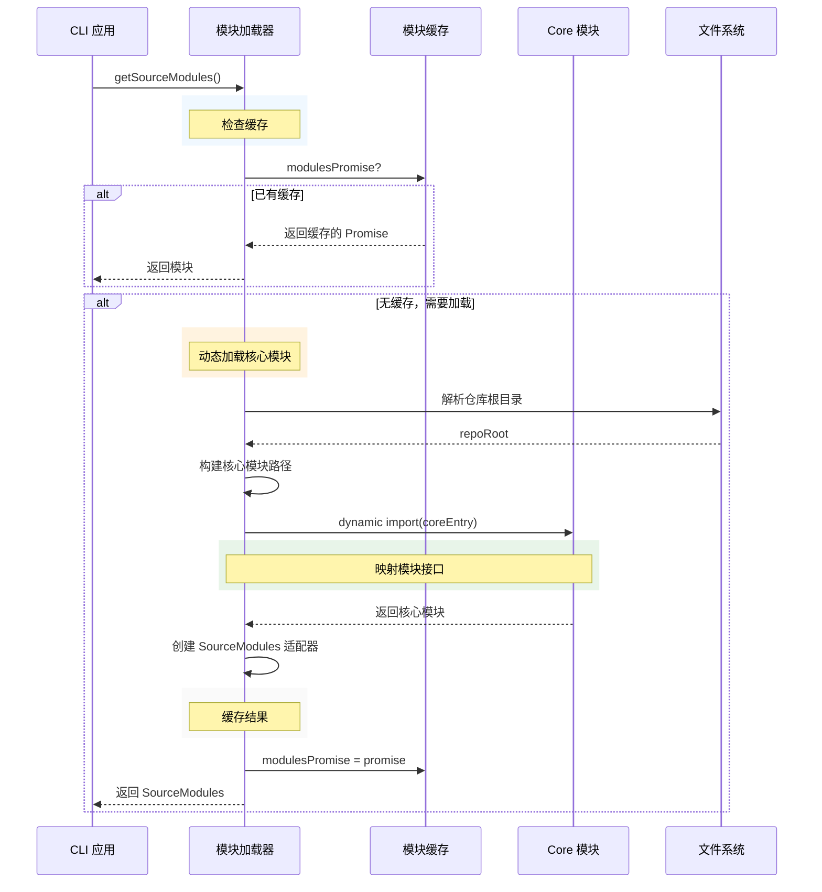

### B.2 模块接口映射

```typescript
// 核心模块加载器实现
const loadSourceModules = async (): Promise<SourceModules> => {
  // 1. 解析仓库根目录
  const repoRoot = resolveRepoRoot();
  
  // 2. 构建核心模块的入口路径
  const coreEntry = pathToFileURL(
    path.join(repoRoot, 'packages/core/src/index.ts')
  ).href;
  
  // 3. 动态导入核心模块
  const core = await import(coreEntry);

  // 4. 创建模块适配器，映射核心功能
  return {
    // 路径解析
    repoRoot,
    
    // 系统提示构建
    buildSystemPrompt: core.buildSystemPrompt as SourceModules['buildSystemPrompt'],
    
    // 模型注册表
    ProviderRegistry: core.ProviderRegistry as ProviderRegistryLike,
    
    // 环境配置
    loadEnvFiles: core.loadEnvFiles as SourceModules['loadEnvFiles'],
    loadConfigToEnv: core.loadConfigToEnv as SourceModules['loadConfigToEnv'],
    
    // 路径解析
    resolveRenxDatabasePath: core.resolveRenxDatabasePath as SourceModules['resolveRenxDatabasePath'],
    resolveRenxTaskDir: core.resolveRenxTaskDir as SourceModules['resolveRenxTaskDir'],
    resolveRenxSkillsDir: core.resolveRenxSkillsDir as SourceModules['resolveRenxSkillsDir'],
    
    // 技能管理
    listAvailableSkills: core.listAvailableSkills as SourceModules['listAvailableSkills'],
    formatAvailableSkillsForBootstrap: core.formatAvailableSkillsForBootstrap as SourceModules['formatAvailableSkillsForBootstrap'],
    
    // 日志系统
    createLoggerFromEnv: core.createLoggerFromEnv as SourceModules['createLoggerFromEnv'],
    createAgentLoggerAdapter: core.createAgentLoggerAdapter as SourceModules['createAgentLoggerAdapter'],
    
    // 核心类
    StatelessAgent: core.StatelessAgent as StatelessAgentCtor,
    AgentAppService: core.AgentAppService as AgentAppServiceCtor,
    createSqliteAgentAppStore: core.createSqliteAgentAppStore as SourceModules['createSqliteAgentAppStore'],
    
    // 企业级工具系统
    createEnterpriseAgentAppService: core.createEnterpriseAgentAppService as SourceModules['createEnterpriseAgentAppService'],
    createEnterpriseToolSystemV2WithSubagents: core.createEnterpriseToolSystemV2WithSubagents as SourceModules['createEnterpriseToolSystemV2WithSubagents'],
    
    // 策略配置
    SHELL_POLICY_PROFILES: core.SHELL_POLICY_PROFILES as SourceModules['SHELL_POLICY_PROFILES'],
    EnterpriseToolExecutor: core.EnterpriseToolExecutor as ToolExecutorCtor,
    
    // 状态管理
    getTaskStateStoreV2: core.getTaskStateStoreV2 as SourceModules['getTaskStateStoreV2'],
  };
};
```

---

## 附录C：工具确认对话框实现

### C.1 对话框内容构建

```typescript
// 确认对话框内容构建器
export const buildToolConfirmDialogContent = (
  event: AgentToolPromptEvent,
  options?: {
    selectedScope?: 'turn' | 'session';
  }
): ToolConfirmDialogContent => {
  const metadata =
    event.kind === 'approval' 
      ? asRecord(event.metadata) 
      : ({} as Record<string, unknown>);
  
  const { summary, detail } = buildSummary(event, options?.selectedScope);

  return {
    summary,                      // 操作摘要
    detail,                        // 详细信息
    reason: readString(event.reason), // 调用原因
    requestedPath: readString(metadata.requestedPath), // 请求路径
    allowedDirectories: readStringArray(metadata.allowedDirectories), // 允许目录
    permissionItems: buildPermissionItems(event), // 权限项目
    argumentItems: buildArgumentItems(event), // 参数项目
  };
};

// 根据工具类型构建摘要
const buildSummary = (
  event: AgentToolPromptEvent,
  selectedScope?: 'turn' | 'session'
): { summary: string; detail?: string } => {
  if (event.kind === 'permission') {
    const displayName = getToolDisplayName(event.toolName);
    const scope = selectedScope ?? event.requestedScope;
    const scopeLabel = scope === 'session' ? 'this session' : 'this turn';
    return {
      summary: `Grant additional permissions for ${displayName}`,
      detail: `Selected scope: ${scopeLabel}`,
    };
  }

  const args = asRecord(event.args);

  // 根据工具类型生成不同格式的摘要
  switch (event.toolName) {
    case 'local_shell': {
      const command = readString(args.command) ?? '(empty command)';
      const description = readString(args.description);
      return {
        summary: description ? `Run shell: ${description}` : 'Run shell command',
        detail: `$ ${command}`,
      };
    }
    case 'read_file':
      return { summary: `Read ${formatPathTarget(args.path)}` };
    case 'file_edit':
      return { summary: `Edit ${formatPathTarget(args.path)}` };
    case 'write_file':
      return { summary: `Write ${formatPathTarget(args.path)}` };
    case 'glob':
      return {
        summary: `Glob ${readString(args.pattern) ?? '*'}`,
        detail: `Path: ${formatPathTarget(args.path)}`,
      };
    case 'grep':
      return {
        summary: `Grep ${readString(args.pattern) ?? ''}`,
        detail: `Path: ${formatPathTarget(args.path)}`,
      };
    case 'spawn_agent': {
      const displayName = getToolDisplayName(event.toolName);
      return {
        summary: `Run ${displayName} ${(readString(args.role) ?? 'agent').trim()}`,
        detail: readString(args.description),
      };
    }
    case 'cancel_agent':
      return { summary: `Cancel ${readString(args.agentId) ?? 'agent run'}` };
    default:
      return { summary: `Call ${event.toolName}` };
  }
};
```

### C.2 确认队列管理

```typescript
// 确认请求队列管理
type PendingToolConfirmQueueEntry = {
  prompt: PendingToolConfirm;       // 待确认的请求
  resolver: PendingToolConfirmResolver; // 解析器
};

// 入队处理
const enqueuePendingToolConfirm = useCallback((entry: PendingToolConfirmQueueEntry) => {
  // 如果没有正在等待的解析器，直接设置当前确认
  if (!pendingToolConfirmResolverRef.current) {
    pendingToolConfirmResolverRef.current = entry.resolver;
    setPendingToolConfirm(entry.prompt);
    return;
  }

  // 否则加入队列等待
  pendingToolConfirmQueueRef.current.push(entry);
}, []);

// 解决确认请求
const resolvePendingToolConfirm = useCallback(
  (decision: AgentToolConfirmDecision | AgentToolPermissionGrant) => {
    const resolver = pendingToolConfirmResolverRef.current;
    pendingToolConfirmResolverRef.current = null;
    
    if (resolver) {
      // 根据类型调用对应的解析函数
      if (resolver.kind === 'permission' && 'granted' in decision) {
        resolver.resolve(decision);
      }
      if (resolver.kind === 'approval' && 'approved' in decision) {
        resolver.resolve(decision);
      }
    }

    // 处理队列中的下一个请求
    const next = pendingToolConfirmQueueRef.current.shift() ?? null;
    if (!next) {
      setPendingToolConfirm(null);
      return;
    }

    pendingToolConfirmResolverRef.current = next.resolver;
    setPendingToolConfirm(next.prompt);
  },
  []
);

// 取消所有待处理的确认
const cancelAllPendingToolConfirms = useCallback(
  (message: string) => {
    // 获取当前和队列中的所有请求
    const currentPrompt = pendingToolConfirmRef.current;
    const currentResolver = pendingToolConfirmResolverRef.current;
    const queued = pendingToolConfirmQueueRef.current.splice(0);

    // 清空状态
    pendingToolConfirmResolverRef.current = null;
    setPendingToolConfirm(null);

    // 为每个请求返回取消结果
    const cancelled = buildCancelledToolPromptResult(currentPrompt, message);
    
    if (currentResolver) {
      if (currentResolver.kind === 'permission' && 'granted' in cancelled) {
        currentResolver.resolve(cancelled);
      }
      if (currentResolver.kind === 'approval' && 'approved' in cancelled) {
        currentResolver.resolve(cancelled);
      }
    }

    for (const entry of queued) {
      const entryCancelled = buildCancelledToolPromptResult(entry.prompt, message);
      if (entry.resolver.kind === 'permission' && 'granted' in entryCancelled) {
        entry.resolver.resolve(entryCancelled);
      }
      if (entry.resolver.kind === 'approval' && 'approved' in entryCancelled) {
        entry.resolver.resolve(entryCancelled);
      }
    }
  },
  [buildCancelledToolPromptResult]
);
```

---

## 附录D：工具调用解析与显示

### D.1 工具调用解析

```typescript
// 从数据中解析工具调用信息
const parseToolUseFromData = (value: unknown): ParsedToolUse | null => {
  const toolCall = asObjectLike(value);
  const toolFunction = asObjectLike(toolCall?.function);
  if (!toolFunction) {
    return null;
  }
  
  const name = typeof toolFunction.name === 'string' ? toolFunction.name : undefined;
  const callId = typeof toolCall?.id === 'string' ? toolCall.id : undefined;
  if (!name || !callId) {
    return null;
  }

  const rawArguments =
    typeof toolFunction.arguments === 'string' ? toolFunction.arguments : undefined;
  const args = parseToolArgumentsObject(rawArguments);
  
  // 特殊处理 shell 命令
  const command =
    name === 'local_shell' && typeof args?.command === 'string' 
      ? args.command 
      : undefined;

  return {
    name,
    callId,
    command,
    details: rawArguments,
    args,
  };
};

// 从内容字符串解析工具调用
const parseToolUse = (content?: string, data?: unknown): ParsedToolUse | null => {
  // 首先尝试从结构化数据解析
  const structured = parseToolUseFromData(data);
  if (structured) {
    return structured;
  }
  
  // 回退到文本解析
  if (!content) {
    return null;
  }
  
  const lines = content.split('\n');
  const header = lines[0]?.trim();
  if (!header) {
    return null;
  }
  
  // 匹配 "# Tool: toolName (callId)" 格式
  const match = header.match(/^# Tool:\s+(.+?)\s+\(([^)]+)\)$/);
  if (!match || !match[1] || !match[2]) {
    return null;
  }

  const [_, name, callId] = match;
  const bodyLines = lines.slice(1);
  
  // 提取命令
  const commandLine = bodyLines.find((line) => line.trim().startsWith('$ '));
  const command = commandLine ? commandLine.trim().slice(2).trim() : undefined;
  
  // 其他参数
  const details = bodyLines
    .filter((line) => !line.trim().startsWith('$ '))
    .join('\n')
    .trim();

  return {
    name,
    callId,
    command: command || undefined,
    details: details || undefined,
    args: parseJsonObject(details),
  };
};
```

### D.2 工具结果显示

```typescript
// 从数据中解析工具结果
const parseToolResultFromData = (value: unknown): ParsedToolResult | null => {
  const event = asObjectLike(value);
  const toolCall = asObjectLike(event?.toolCall);
  const toolFunction = asObjectLike(toolCall?.function);
  const result = asObjectLike(event?.result);
  const data = asObjectLike(result?.data);
  
  const name = typeof toolFunction?.name === 'string' ? toolFunction.name : undefined;
  const callId = typeof toolCall?.id === 'string' ? toolCall.id : undefined;
  if (!name || !callId) {
    return null;
  }

  const successValue = result?.success;
  const status = successValue === true ? 'success' : successValue === false ? 'error' : 'unknown';
  const summary = typeof data?.summary === 'string' ? data.summary : undefined;
  const output = typeof data?.output === 'string' ? data.output : undefined;
  const error = typeof result?.error === 'string' ? result.error : undefined;

  return {
    name,
    callId,
    status,
    details: output || summary || error,
    summary,
    output,
    payload: data?.payload,
    metadata: data?.metadata,
    error,
  };
};

// 合并输出行
const mergeOutputLines = (
  group: ToolSegmentGroup,
  parsedResult: ParsedToolResult | null
): string => {
  // 流式文本
  const streamText = group.streams
    .map((segment) => segment.content)
    .join('')
    .trim();
    
  // 回退文本
  const fallbackText = resolveToolResultFallbackText(parsedResult)?.trim();
  
  // 结果输出
  const resultText = parsedResult?.output?.trim() 
    || parsedResult?.details?.trim() 
    || fallbackText;
    
  // 去重
  if (streamText && resultText && streamText === resultText) {
    return streamText;
  }
  
  if (streamText && resultText) {
    return `${streamText}\n${resultText}`;
  }
  
  return streamText || resultText || parsedResult?.summary?.trim() || '';
};
```

---

## 附录E：特殊工具处理

### E.1 Agent 相关工具

```typescript
// Agent 运行信息汇总
const summarizeAgentRun = (
  run: Record<string, unknown>,
  extras?: Record<string, unknown>
): { lines: string[]; output?: string } => {
  const agentId = readString(run.agentId);
  const status = readString(run.status);
  const role = readString(run.role) ?? readString(run.subagentType);
  const description = readString(run.description);
  const linkedTaskId = readString(run.linkedTaskId);
  const progress = readNumber(run.progress);
  const error = readString(run.error);
  const output = readString(run.output);

  const headline = description ?? agentId ?? 'agent run';
  const lines = [`${formatTaskStatusIcon(status)} ${truncate(headline)}`];
  
  // 构建元信息
  const meta = formatSummaryMeta([
    agentId,
    formatStatusLabel(status),
    role,
    progress !== undefined ? `${Math.round(progress)}%` : null,
    linkedTaskId ? `task ${linkedTaskId}` : null,
    readBoolean(extras?.completed) === false ? 'still running' : null,
    readBoolean(extras?.timeoutHit) === true ? 'timeout hit' : null,
    readNumber(extras?.waitedMs) !== undefined
      ? `${Math.round((readNumber(extras?.waitedMs) ?? 0) / 1000)}s waited`
      : null,
  ]);
  
  if (meta) {
    lines.push(meta);
  }
  
  if (error && !output) {
    lines.push(`error: ${truncate(error, 96)}`);
  }

  return {
    lines,
    output: output?.trim() ? output : undefined,
  };
};

// Agent 任务信息汇总
const summarizeTaskRecord = (
  task: Record<string, unknown>,
  options?: { canStart?: Record<string, unknown> | null }
): string[] => {
  const subject =
    readString(task.subject) ?? readString(task.activeForm) ?? readString(task.id) ?? 'task';
  const id = readString(task.id);
  const status = readString(task.status);
  const priority = readString(task.priority);
  const progress = readNumber(task.effectiveProgress) ?? readNumber(task.progress);
  const owner = readString(task.owner);
  const blockers = readArray(task.blockers).length || readArray(task.blockedBy).length;
  const blocks = readArray(task.blockedTasks).length || readArray(task.blocks).length;

  const lines = [`${formatTaskStatusIcon(status)} ${truncate(subject)}`];
  
  const meta = formatSummaryMeta([
    id,
    formatStatusLabel(status),
    priority,
    progress !== undefined ? `${Math.round(progress)}%` : null,
    owner ? `owner ${owner}` : null,
    blockers > 0 ? `${blockers} blocker${blockers === 1 ? '' : 's'}` : null,
    blocks > 0 ? `blocks ${blocks}` : null,
  ]);
  
  if (meta) {
    lines.push(meta);
  }

  const canStart = options?.canStart;
  if (canStart && readBoolean(canStart.canStart) === false) {
    const reason = readString(canStart.reason);
    if (reason) {
      lines.push(`blocked: ${truncate(reason, 96)}`);
    }
  }

  return lines;
};
```

### E.2 搜索工具处理

```typescript
// 搜索头部详情构建
const buildSearchHeaderDetail = (
  toolName: string,
  args: Record<string, unknown> | null
): string | null => {
  if (!args) {
    return null;
  }

  if (toolName === 'grep') {
    const pattern = readString(args.pattern);
    if (!pattern) {
      return null;
    }

    return formatSummaryMeta([
      JSON.stringify(pattern),
      readString(args.path) ? `in ${readString(args.path)}` : null,
      readString(args.glob) ? `glob ${readString(args.glob)}` : null,
      readNumber(args.maxResults) !== undefined
        ? `limit ${Math.round(readNumber(args.maxResults) ?? 0)}`
        : null,
      readNumber(args.timeoutMs) !== undefined
        ? `${Math.round(readNumber(args.timeoutMs) ?? 0) / 1000)}s timeout`
        : null,
    ]);
  }

  if (toolName === 'glob') {
    const pattern = readString(args.pattern);
    if (!pattern) {
      return null;
    }

    return formatSummaryMeta([
      pattern,
      readString(args.path) ? `in ${readString(args.path)}` : null,
      readBoolean(args.includeHidden) ? 'include hidden' : null,
      readNumber(args.maxResults) !== undefined
        ? `limit ${Math.round(readNumber(args.maxResults) ?? 0)}`
        : null,
    ]);
  }

  return null;
};

// 搜索结果构建
const buildSearchResultSections = (result: ParsedToolResult | null): ToolSection[] => {
  const summary = result?.summary?.trim();
  const output = result?.output?.trim() || result?.details?.trim();
  const metadata = readObject(result?.metadata) ?? readObject(result?.payload);

  if (!summary && !output && !metadata) {
    return [];
  }

  // 提取元数据信息
  if (metadata) {
    const matchCount = readNumber(metadata.countMatches);
    const fileCount = readNumber(metadata.countFiles);
    const path = readString(metadata.path);
    const flags = formatSummaryMeta([
      matchCount !== undefined ? `${matchCount} matches` : null,
      fileCount !== undefined ? `${fileCount} files` : null,
      path ? `in ${path}` : null,
      readBoolean(metadata.truncated) ? 'truncated' : null,
      readBoolean(metadata.timed_out) ? 'timed out' : null,
    ]);
    
    if (summary && output && summary !== output && flags) {
      return [
        { label: 'result', content: summary, tone: 'body' },
        { label: 'details', content: `${flags}\n${output}`, tone: 'body' },
      ];
    }
  }

  return [
    {
      label: 'result',
      content: output || summary || '',
      tone: 'body',
    },
  ];
};
```

---

## 附录F：完整配置选项

### F.1 环境变量配置

| 变量名 | 类型 | 默认值 | 说明 |
|--------|------|--------|------|
| `AGENT_MODEL` | string | 'qwen3.5-plus' | 使用的 AI 模型 |
| `AGENT_MAX_STEPS` | number | 10000 | 最大执行步数 |
| `AGENT_MAX_RETRY_COUNT` | number | 10 | 最大重试次数 |
| `AGENT_CONVERSATION_ID` | string | auto-generated | 对话 ID |
| `AGENT_SESSION_ID` | string | auto-generated | 会话 ID |
| `AGENT_REPO_ROOT` | string | auto-detect | 仓库根目录 |
| `AGENT_WORKDIR` | string | cwd | 工作目录 |
| `AGENT_FULL_ACCESS` | boolean | false | 启用全访问模式 |
| `AGENT_PROMPT_CACHE_KEY` | string | - | 提示缓存键 |
| `AGENT_PROMPT_CACHE_RETENTION` | string | - | 缓存保留时间 |
| `AGENT_SHOW_EVENTS` | boolean | false | 显示事件调试信息 |

### F.2 工具执行器选项

```typescript
// 工具执行器配置选项
type ToolExecutorOptions = {
  workingDirectory: string;           // 工作目录
  fileSystemPolicy?: FileSystemPolicy; // 文件系统策略
  networkPolicy?: NetworkPolicy;      // 网络策略
  approvalPolicy?: ApprovalPolicy;    // 审批策略
  trustLevel?: TrustLevel;            // 信任级别
};

// 文件系统策略
type FileSystemPolicy = {
  mode: 'unrestricted' | 'restricted' | 'readonly';
  readRoots?: string[];               // 允许读取的根目录
  writeRoots?: string[];              // 允许写入的根目录
};

// 网络策略
type NetworkPolicy = {
  mode: 'enabled' | 'disabled';
  allowedHosts?: string[];            // 允许访问的主机
  deniedHosts?: string[];            // 拒绝访问的主机
};

// 审批策略
type ApprovalPolicy = 'on-request' | 'always-deny' | 'always-allow' | 'unless-trusted';

// 信任级别
type TrustLevel = 'trusted' | 'untrusted' | 'session-only';
```

---

## 附录G：错误处理与恢复

### G.1 运行时错误处理

```typescript
// 安全调用辅助函数 - 防止异常中断事件流
const safeInvoke = (fn: (() => void) | undefined): void => {
  if (!fn) {
    return;
  }
  try {
    fn();
  } catch {
    // 静默捕获所有异常，保持事件流继续
  }
};

// 在事件处理中的使用
safeInvoke(() => handlers.onTextDelta?.(event));
safeInvoke(() => handlers.onToolUse?.(toolCall));
safeInvoke(() => handlers.onToolResult?.(toolResultEvent));
```

### G.2 Promise 错误处理

```typescript
// 运行时实例错误处理
const createRuntime = async (): Promise<RuntimeCore> => {
  // ... 创建逻辑
  
  // 错误时清空缓存，允许重新尝试
  promise.catch(() => {
    runtimePromise = null;
  });
  
  return runtimeComposition;
};

// Agent 运行错误处理
const onError = (error: unknown) => {
  const message = error instanceof Error ? error.message : String(error);
  if (message) {
    streamedState.latestErrorMessage = message;
  }
};
```

---

本分析文档全面深入地探讨了 Renx Code Agent 系统中 Agent 与 Tool 配置执行的完整机制，涵盖了从运行时初始化、工具注册、事件处理、权限控制到 UI 交互的各个方面。通过详细的代码分析和流程图，读者可以全面理解这一复杂系统的工作原理。

文档包含的 Mermaid 流程图涵盖了：
- 整体系统架构
- 运行时初始化流程
- 工具系统创建流程
- Agent 执行循环
- 事件处理流程
- 权限确认流程
- UI 交互流程
- 确认队列管理
- 模块加载机制

这些流程图与详细的代码分析相结合，为理解系统提供了全面的视角。

---

*文档完成 - 共约 20,000 字*
