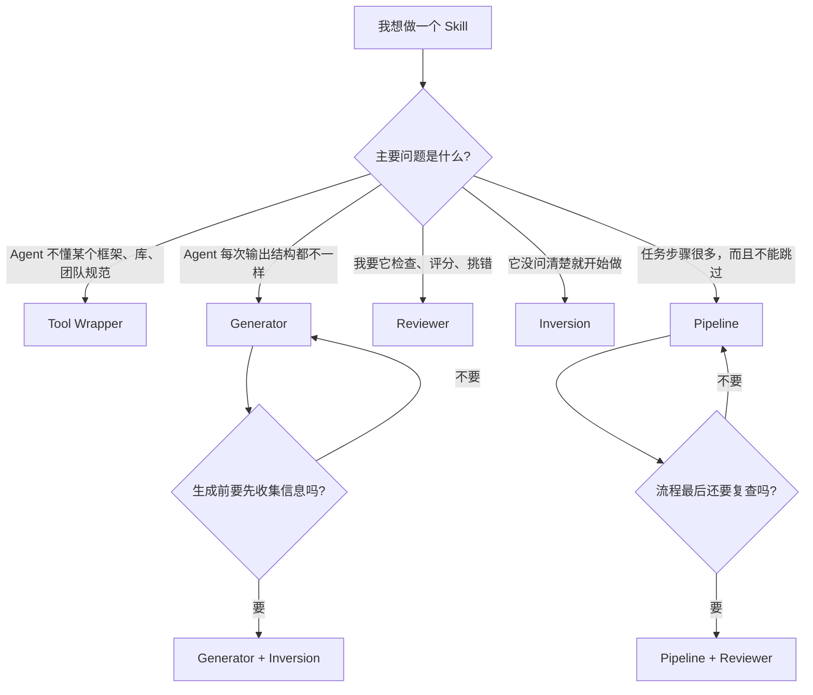
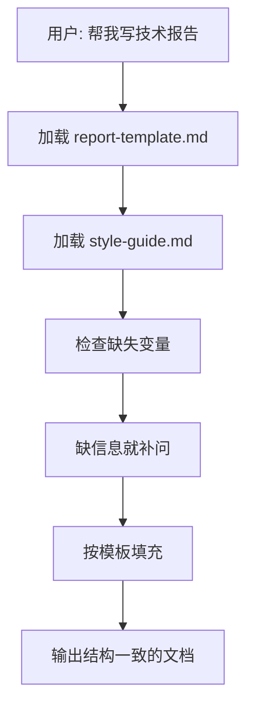
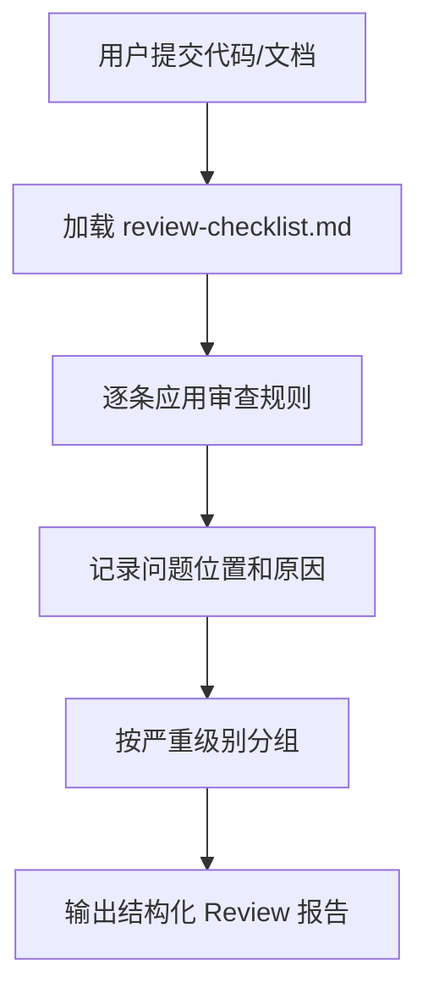
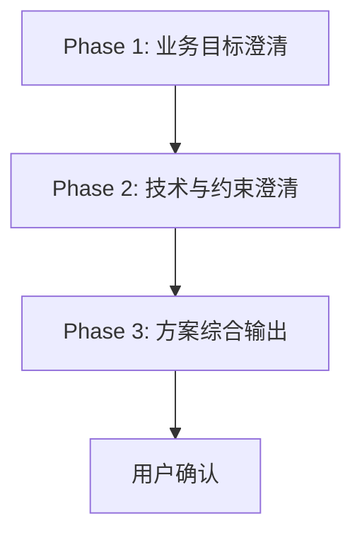
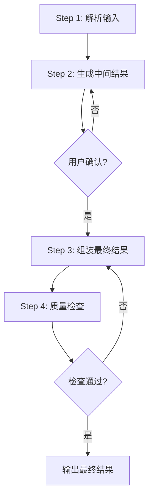
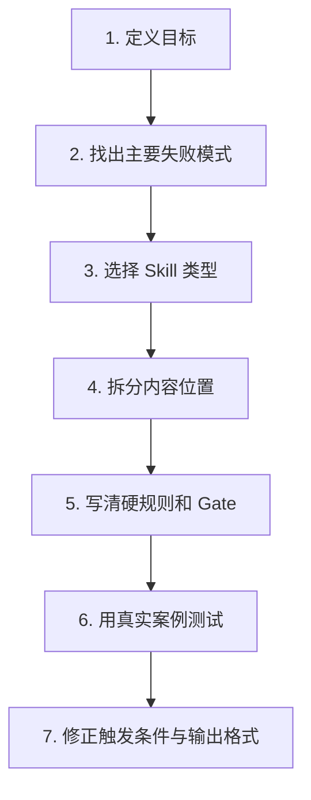

# Agent Skill 设计与写作深度指南

## 文档说明

这是一份面向初学者的中文指南，目标是把下面几件事讲清楚：

- Skill 到底是什么，为什么它不只是“多写一点提示词”
- 面对一个新需求，应该如何选择 Skill 类型
- 五种常见 Skill 模式分别适合什么场景，应该怎么写
- 为什么同样叫 `SKILL.md`，内部行为逻辑却可能完全不同
- 如何把 `SKILL.md`、`references/`、`assets/`、流程关卡拆分清楚
- 新手最容易踩哪些坑，怎样测试 Skill 是否真的稳定

这份文档吸收了 Google Cloud Tech 关于 ADK Agent Skills 设计模式的思路，并结合当前仓库中的真实 Skill 示例做了扩展和落地化整理。

## 一句话先讲明白

Skill 不是“更长的 prompt”，而是“把 Agent 的工作方式做成可复用模块”。

换句话说：

- Prompt 更像一句临时口头指令
- Skill 更像一份结构化工作手册

一个设计良好的 Skill，应该让 Agent：

- 在该加载知识的时候加载知识
- 在该提问的时候先提问
- 在该按模板输出的时候按模板输出
- 在该停下来等待确认的时候停下来
- 在该做质量检查的时候做质量检查

所以，Skill 的本质不是文档堆砌，而是行为控制。

---

## 1. Skill 的核心结构

无论你写的是哪种 Skill，它大致都由下面几个部分组成。

### 1.1 `SKILL.md`

这是总控文件，负责定义：

- 这个 Skill 什么时候触发
- 触发后应该读哪些资料
- 应该按什么顺序做事
- 遇到哪些条件必须暂停、追问、确认或中止
- 最终输出应该长成什么样

你可以把它理解成“任务调度器”。

### 1.2 `references/`

这里放“稳定规则”或“知识源”。

常见内容包括：

- 框架规范
- 团队编码约定
- 审查清单
- 领域知识
- 输出风格指南

你可以把它理解成“外置脑库”。

### 1.3 `assets/`

这里放“固定模板”或“产出骨架”。

常见内容包括：

- 报告模板
- API 文档模板
- 方案模板
- 表格或表单结构

你可以把它理解成“输出模具”。

### 1.4 Gates 或 Checkpoints

这是很多人第一次写 Skill 时最容易漏掉的部分。

Gate 的作用是：

- 让 Agent 不能跳步
- 让 Agent 不能在信息不足时直接编结果
- 让 Agent 必须等待用户确认
- 让 Agent 在进入下一阶段前先做检查

你可以把它理解成“流程关卡”。

---

## 2. 为什么 Skill 比“一个大 Prompt”更强

很多初学者会问：

“我直接把所有要求都写进 system prompt，不行吗？”

短期可以，长期往往不稳。原因通常有五个。

### 2.1 角色、规则、模板、流程会混在一起

一个大 Prompt 常见的问题是把下面这些全混了：

- 角色设定
- 领域规范
- 输出模板
- 审查标准
- 交互顺序

混在一起后，模型会更容易：

- 遗漏某条要求
- 在不该回答的时候提前回答
- 输出结构飘动
- 在复杂任务里跳步

### 2.2 不可复用

如果你每次都手写一大段规则，那么：

- 别人很难复用
- 你自己过几周也未必记得版本差异
- 多个任务之间很难共用同一套知识

### 2.3 很难维护

如果规范变化了：

- Skill 只要改 `references/`
- 大 Prompt 往往要整段重写

### 2.4 很难局部加载

有些知识不是每次都需要。

例如：

- 用户问 React 时，不需要加载 FastAPI 规范
- 用户做代码审查时，不一定需要加载报告模板

Skill 的价值之一，就是把上下文按需加载，而不是长期塞在主提示里。

### 2.5 很难做阶段控制

如果任务是多阶段的，例如：

1. 先收集需求
2. 再生成中间稿
3. 用户确认
4. 再组装最终稿
5. 最后做质量检查

那么单个大 Prompt 很难稳定地防止模型跳步。

Skill 更适合表达这种“结构化工作流”。

---

## 3. 先别急着写，先学会选类型

写 Skill 时最常见的误区，是一上来就研究 frontmatter 或 YAML。

真正应该先回答的问题是：

`你到底想控制 Agent 的哪一种失败模式？`

下面是最重要的决策图。



### 3.1 选型口诀

- 教 Agent 规矩：`Tool Wrapper`
- 让输出稳定：`Generator`
- 让它会检查：`Reviewer`
- 让它先采访：`Inversion`
- 让它按流程走：`Pipeline`

### 3.2 再简单一点的判断法

如果你的需求更像下面这些句子，通常对应如下：

| 需求表达方式                        | 更适合的 Skill 类型 |
| ----------------------------------- | ------------------- |
| “让 Agent 懂我们团队的 React 规范”  | Tool Wrapper        |
| “让 Agent 每次都按固定报告结构输出” | Generator           |
| “让 Agent 按标准做 Code Review”     | Reviewer            |
| “让 Agent 先问清需求，再给方案”     | Inversion           |
| “让 Agent 严格分阶段执行任务”       | Pipeline            |

---

## 4. 五种 Skill 模式深度解析

下面按“适合什么场景、核心思想、目录结构、写法骨架、常见错误”来逐个拆解。

---

## 5. Tool Wrapper

### 5.1 它解决什么问题

Tool Wrapper 用来解决：

“Agent 有通用能力，但不懂某个特定领域的规则或最佳实践。”

最典型的场景是：

- 某个框架的开发规范
- 某个 SDK 的正确用法
- 团队内部的编码规则
- 业务特定的限制条件

### 5.2 它的本质

不是直接把全部知识写进主提示，而是在需要时：

1. 识别任务是否属于该领域
2. 加载相关规则文件
3. 把这些规则当作当前任务的事实依据
4. 按这些规则写、改、评审内容

### 5.3 典型目录

```text
skills/
  react-expert/
    SKILL.md
    references/
      conventions.md
```

### 5.4 流程图


### 5.5 最小可用写法

```md
---
name: react-expert
description: Use when building, reviewing, or refactoring React code.
---

You are an expert React assistant.

When the user's request involves React, JSX, TSX, components, hooks, or frontend refactoring:

1. Load `references/conventions.md`
2. Treat that file as the source of truth
3. Apply those conventions when writing, reviewing, or editing code
4. If the user's code violates the conventions, explain the issue and suggest a fix
5. Do not invent patterns that conflict with the conventions
```

### 5.6 `references/conventions.md` 应该写什么

这个文件不要写成长篇大论，应该尽量规则化。

示例：

```md
# React Conventions

## Component Rules

- Prefer function components
- Use TypeScript for props
- Keep components focused on one responsibility

## Hooks Rules

- Do not call hooks conditionally
- Extract repeated stateful logic into custom hooks

## Review Rules

- Flag duplicated logic
- Flag unnecessary state
- Suggest splitting oversized components
```

### 5.7 什么时候最适合用它

如果你最痛的问题是：

- Agent “不会写”
- Agent “写得不符合团队规范”
- Agent “缺少领域知识”

那么优先考虑 Tool Wrapper。

### 5.8 新手最常犯的错

- 把全部规则都直接写进 `SKILL.md`
- 没写触发条件，导致 Skill 乱触发
- 只说“参考规范”，没说“必须遵守”
- 规范写成散文，导致模型难以执行

### 5.9 仓库里的真实参考

可以参考下面这些现有 Skill 的组织方式：

- `packages/core/src/skills/pdf/SKILL.md`
- `packages/core/src/skills/agent-browser/SKILL.md`

这类 Skill 的特点是：

- 重点在“能力说明”和“操作规范”
- 会在需要时引导模型读取额外参考资料
- 更偏向“知识和工具使用指导”

---

## 6. Generator

### 6.1 它解决什么问题

Generator 解决的是：

“Agent 能写东西，但每次写出来的结构、章节、格式都不稳定。”

适用场景：

- 技术报告
- 会议纪要
- API 文档
- 方案文档
- 提交说明
- 固定格式的分析报告

### 6.2 它的本质

Generator 不是让 Agent 自由发挥，而是让它像在“填模板”。

通常会分成三部分：

- `assets/` 放结构模板
- `references/` 放风格指南
- `SKILL.md` 定义执行顺序和补问逻辑

### 6.3 典型目录

```text
skills/
  report-generator/
    SKILL.md
    assets/
      report-template.md
    references/
      style-guide.md
```

### 6.4 流程图



### 6.5 最小可用写法

```md
---
name: report-generator
description: Generate structured technical reports in Markdown.
---

Follow these steps:

1. Load `assets/report-template.md`
2. Load `references/style-guide.md`
3. Ask the user for any missing information
4. Fill every section in the template
5. Return one complete Markdown document
```

### 6.6 模板示例

`assets/report-template.md`

```md
# Title

## Background

## Problem

## Analysis

## Recommendation

## Risks

## Next Steps
```

### 6.7 风格示例

`references/style-guide.md`

```md
# Style Guide

- Write in clear, simple Chinese
- Explain terms for beginners
- Use short paragraphs
- Include practical recommendations
- Avoid vague conclusions
```

### 6.8 什么时候最适合用它

如果你最痛的是：

- 输出结构不统一
- 每次章节都不同
- 很难交付给其他人复用

那么优先考虑 Generator。

### 6.9 新手最常犯的错

- 没有模板，只有“请写详细一点”
- 模板和风格混在一起
- 缺信息时不补问，直接瞎填
- 没要求“每个章节必须存在”

### 6.10 它和 Tool Wrapper 的区别

很多新手容易混淆这两个。

核心区别是：

- Tool Wrapper 控制“知识正确性”
- Generator 控制“输出一致性”

如果你是想让 Agent “懂规矩”，更像 Tool Wrapper。
如果你是想让 Agent “按一个稳定骨架产出”，更像 Generator。

---

## 7. Reviewer

### 7.1 它解决什么问题

Reviewer 解决的是：

“我不想让 Agent 只是泛泛点评，而是要按标准审查、分级、给出问题和建议。”

适用场景：

- Code Review
- 安全审计
- 架构检查
- 文档质量审查
- 合规核查

### 7.2 它的本质

Reviewer 的核心不是“会点评”，而是“照 checklist 审查”。

它把下面两件事分开：

- 审什么：放进 `references/review-checklist.md`
- 怎么输出：写在 `SKILL.md`

### 7.3 典型目录

```text
skills/
  code-reviewer/
    SKILL.md
    references/
      review-checklist.md
```

### 7.4 流程图



### 7.5 最小可用写法

```md
---
name: code-reviewer
description: Review code against a checklist and report findings by severity.
---

1. Load `references/review-checklist.md`
2. Read the user input carefully
3. Apply each checklist rule
4. For every issue, provide:
   - location
   - severity
   - why it matters
   - suggested fix
5. Group findings by severity
```

### 7.6 Checklist 应该怎么写

好的 Checklist 应该像审计表，不应该像散文。

示例：

```md
# Review Checklist

## Correctness

- Are all user inputs validated?
- Are edge cases handled?
- Are errors surfaced clearly?

## Security

- Are secrets hardcoded?
- Is authorization enforced?
- Are unsafe shell commands possible?

## Maintainability

- Is duplicated logic present?
- Are names clear?
- Is the function too large?
```

### 7.7 什么时候最适合用它

如果你的任务不是“创造内容”，而是“判断质量”，就优先考虑 Reviewer。

### 7.8 新手最常犯的错

- 没有 checklist，只说“帮我 review 一下”
- 没有严重级别
- 只说哪里错，不说为什么有风险
- 没给修复建议

### 7.9 Reviewer 的关键价值

它非常适合复用。

因为你只要替换 Checklist，就能从：

- Python 风格审查

切换到：

- OWASP 安全审查
- PR 提交质量审查
- API 设计审查

而 `SKILL.md` 的工作流几乎不需要大改。

---

## 8. Inversion

### 8.1 它解决什么问题

Inversion 解决的是：

“Agent 在信息不完整的时候，总是急着开始回答、开始设计、开始写代码。”

这类任务的失败根源，不是模型不会做，而是太早做。

### 8.2 为什么叫 Inversion

通常是：

- 用户提问
- Agent 回答

Inversion 把这个关系反过来：

- Agent 先提问
- 用户补全需求
- Agent 最后再输出

### 8.3 适用场景

- 项目规划
- 需求访谈
- 架构设计前澄清
- 高不确定性的咨询型场景

### 8.4 流程图



### 8.5 最小可用写法

```md
---
name: project-planner
description: Gather requirements through structured questions before producing a plan.
---

You are conducting a structured interview.

Rules:

- Ask one question at a time
- Do not skip phases
- Do not generate the final plan until all answers are collected

Phase 1: Problem discovery
Phase 2: Technical constraints
Phase 3: Synthesis
```

### 8.6 写好 Inversion 的关键

重点不是“多问几个问题”，而是“建立严格顺序”。

常见硬规则包括：

- `Ask one question at a time`
- `Wait for the user's answer before continuing`
- `Do NOT produce the final output until all phases are complete`

### 8.7 为什么它很重要

很多失败的 Agent 交互，其实并不是因为模型能力不够，而是因为：

- 问题定义不清
- 输入不完整
- 技术约束没说明
- 用户没有明确优先级

Inversion 可以把这些风险前置。

### 8.8 新手最常犯的错

- 一边问，一边已经开始给解决方案
- 问题顺序混乱
- 问得太泛，用户不好回答
- 没写“什么时候才允许输出最终结果”

### 8.9 什么时候最适合用它

如果误解需求的代价很大，就优先用 Inversion。

例如：

- 新项目方案
- 大型重构规划
- 复杂自动化流程设计

---

## 9. Pipeline

### 9.1 它解决什么问题

Pipeline 用来解决：

“任务是多阶段的，而且每一步都不能随意跳过。”

这通常出现在复杂任务中。

例如：

- 先解析输入
- 再生成中间结果
- 然后用户确认
- 最后组装成最终产物
- 再跑一轮质量检查

### 9.2 它的本质

Pipeline 不是“列几个步骤”而已。

它真正的价值是：

- 把步骤显式化
- 把阶段边界显式化
- 把放行条件显式化

### 9.3 适用场景

- 文档生成流水线
- 多阶段内容制作
- 需要人工确认的中间产物
- 风险较高、不能跳步的自动化任务

### 9.4 流程图



### 9.5 最小可用写法

```md
---
name: doc-pipeline
description: Generate documentation through a strict multi-step workflow.
---

Execute every step in order.
Do NOT skip steps.
Do NOT proceed if a step fails.

Step 1: Parse and inventory
Step 2: Generate intermediate artifacts
Step 3: Ask for approval
Step 4: Assemble final output
Step 5: Run quality check
```

### 9.6 写好 Pipeline 的关键

新手最容易漏的是 Gate，也就是“什么情况下允许进入下一步”。

一个完整的 Pipeline 设计，最好明确：

- 这一步的输入是什么
- 这一步的输出是什么
- 用户是否必须确认
- 如果失败要回到哪里
- 哪种情况下必须暂停

### 9.7 常见 Gate 示例

- 未获得用户确认，不得进入下一步
- 缺失关键变量，必须先追问
- 检查不通过，必须返工
- 中间产物不完整，不允许组装最终结果

### 9.8 新手最常犯的错

- 只有步骤，没有放行条件
- 步骤写得太宽泛，模型还是会跳步
- 不定义失败后的回退路径
- 中间产物没有明确格式

### 9.9 什么时候最适合用它

如果你的脑子里已经有一条明确 SOP，并且任何一步出错都会影响后续结果，就优先考虑 Pipeline。

### 9.10 仓库里的真实参考

可以参考：

- `packages/core/src/skills/dogfood/SKILL.md`

这个 Skill 虽然不是教科书式的 “Pipeline” 标签，但它已经体现出强流程化思路：

- 明确初始化、认证、探索、记录、收尾阶段
- 明确每一阶段的动作
- 明确证据采集要求
- 明确何时结束、何时写入报告

这正是 Pipeline 思维在真实项目中的落地方式。

---

## 10. 五种类型的对比表

| 类型         | 核心目标       | 最常见素材                | 最适合解决的问题         |
| ------------ | -------------- | ------------------------- | ------------------------ |
| Tool Wrapper | 注入领域规则   | `references/`             | Agent 不懂某个技术或规范 |
| Generator    | 固定输出结构   | `assets/` + `references/` | 输出不稳定               |
| Reviewer     | 按清单审查     | Checklist                 | 需要检查和评分           |
| Inversion    | 先提问再行动   | 分阶段提问脚本            | 需求不清晰               |
| Pipeline     | 严格多步骤执行 | 分步骤流程 + Gate         | 复杂任务不能跳步         |

---

## 11. 这些类型可以组合，不是只能单选

这也是原始文章中一个非常重要的结论。

五种模式不是互斥关系，而是可以组合的。

### 11.1 常见组合

#### Tool Wrapper + Reviewer

先加载某个框架或规范，再按审查清单 review。

适合：

- 按团队 React 规范做代码审查
- 按内部 API 规范审查后端代码

#### Generator + Inversion

先提问收集变量，再用模板生成结果。

适合：

- 方案文档生成
- 招聘 JD 生成
- 项目立项说明生成

#### Pipeline + Reviewer

流程做完后，最后再来一轮质量审查。

适合：

- API 文档流水线
- 自动报告生成流程

#### Tool Wrapper + Pipeline

流程的每一步都要遵守某个领域规范。

适合：

- 带规范约束的代码生成流程
- 带合规约束的文档生成流程

### 11.2 新手建议

先学单一模式，再学组合模式。

推荐顺序：

1. Tool Wrapper
2. Generator
3. Reviewer
4. Inversion
5. Pipeline
6. 组合模式

原因很简单：

- 前三者先让你学会拆职责
- 后两者才开始真正进入流程控制

---

## 12. 小白如何从零写一个 Skill

下面给你一条通用流程，几乎所有 Skill 都可以用。



### 12.1 第一步：定义目标

不要说“我要写个 Skill”。

应该说：

- 我要让 Agent 写 React 代码更稳定
- 我要让 Agent 自动生成统一格式的报告
- 我要让 Agent 先问清需求再做方案

目标必须和“行为改进”有关。

### 12.2 第二步：找出主要失败模式

问自己：

- 它是不懂某个领域
- 还是输出不一致
- 还是不会审查
- 还是爱瞎猜
- 还是爱跳步

这一步决定类型。

### 12.3 第三步：选择 Skill 类型

根据前面的决策图选择一类主模式。

### 12.4 第四步：拆分内容位置

把东西放对位置非常重要。

通用原则：

- 稳定规则放 `references/`
- 模板放 `assets/`
- 流程控制放 `SKILL.md`
- 关卡条件写进步骤里

### 12.5 第五步：写清硬规则和 Gate

这是 Skill 能否稳定的关键。

你应该明确：

- 什么时候必须停
- 什么时候必须问
- 什么时候必须等确认
- 什么时候可以继续
- 什么时候必须返回上一步

### 12.6 第六步：用真实案例测试

至少测试三类输入：

- 正常输入
- 信息缺失输入
- 模糊输入

### 12.7 第七步：修正触发条件与输出格式

观察它是否出现下面这些问题：

- 乱触发
- 不触发
- 该提问时没提问
- 该停时没停
- 输出结构漂移
- 漏掉关键章节

---

## 13. Skill 写作通用模板

下面给一个可迁移的通用骨架。

```md
---
name: your-skill-name
description: What this skill does and when to use it.
---

When this skill is relevant:

1. Load the required references or assets
2. Follow the required workflow
3. Ask for missing information if needed
4. Produce the output in the required format
5. Do not skip constraints or gates
```

这个骨架虽然简单，但你要学会问五个问题：

1. 什么情况下相关
2. 需要加载什么
3. 顺序是什么
4. 缺信息怎么办
5. 哪些规则绝不能破

---

## 14. 不同类型的“写作重点”清单

### 14.1 Tool Wrapper 写作重点

- 触发条件要清晰
- 领域关键词要明确
- 外部规则文件要可执行
- 明确“以规则为准”

### 14.2 Generator 写作重点

- 模板与风格分离
- 每个章节必须出现
- 缺变量必须补问
- 输出必须完整而不是片段

### 14.3 Reviewer 写作重点

- Checklist 要模块化
- 输出要有严重级别
- 必须说明风险原因
- 最好给建议或修复方向

### 14.4 Inversion 写作重点

- 一次只问一个问题
- 阶段顺序固定
- 没问完不准生成最终结果
- 问题设计要具体、可回答

### 14.5 Pipeline 写作重点

- 每步输入输出明确
- Gate 条件明确
- 失败后的处理路径明确
- 中间产物要可检查

---

## 15. 新手最容易踩的坑

这是最值得反复看的一节。

### 15.1 先研究 frontmatter，不先想类型

很多人会把精力放在：

- `name` 怎么写
- `description` 怎么写
- YAML 怎么排版

这些不是最重要的问题。

最重要的是：

`你的 Skill 到底想控制哪种行为失败模式。`

### 15.2 把所有内容都塞进 `SKILL.md`

后果通常是：

- 文件过长
- 规则难维护
- 模板和流程混在一起
- 模型更容易漏要求

### 15.3 不写触发边界

如果不写清“什么时候该用这个 Skill”，常见结果是：

- 该触发的时候不触发
- 不该触发的时候乱触发

### 15.4 不写 Gate

很多人写了步骤，却没写：

- “什么时候才能进入下一步”
- “用户未确认时怎么办”
- “检查失败时怎么办”

这会让步骤流于形式。

### 15.5 试图一开始就写最复杂的 Pipeline

这对新手很容易造成挫败。

更好的顺序是：

1. 先学会外置规则
2. 再学会外置模板
3. 再学会审查流程
4. 最后再做复杂编排

### 15.6 Prompt 写得很温柔，但没有硬约束

比如：

- “最好先问一下用户”
- “建议确认后再继续”

这类措辞太软，模型可能会忽略。

如果你真的需要流程控制，应该更像：

- `Do NOT continue until the user confirms`
- `Ask one question at a time`
- `Do not produce the final output before all phases are complete`

---

## 16. 怎么判断一个 Skill 写得好不好

可以用下面这份检查表。

### 16.1 触发性

- 这个 Skill 何时触发是否明确
- 是否容易误触发
- 是否容易漏触发

### 16.2 结构性

- `SKILL.md`、`references/`、`assets/` 的职责是否拆清楚
- 有没有把不该放在一起的内容混在一起

### 16.3 可预测性

- 同样输入是否能稳定走同样流程
- 缺信息时是否能稳定补问
- 是否会无故跳步

### 16.4 可维护性

- 规则更新时是否只需改一个地方
- 模板更新是否容易
- Checklist 是否容易替换

### 16.5 可复用性

- 别人能不能看懂并复用
- 它是不是只服务于一次性任务
- 目录结构是否清晰

如果一个 Skill 很大程度仍然依赖模型“自己悟”，那通常还不够成熟。

---

## 17. 测试一个 Skill 是否生效的实用方法

Skill 写完后，不要只测一次成功案例。

建议至少做下面三类测试。

### 17.1 正常输入测试

目的：

- 验证主路径是否顺畅
- 验证结果是否符合预期

### 17.2 缺信息测试

目的：

- 验证它会不会主动补问
- 验证它会不会在信息不足时瞎猜

### 17.3 模糊输入测试

目的：

- 验证触发条件是否合理
- 验证是否会误触发

### 17.4 对不同类型的观察重点

#### Tool Wrapper

- 是否真的加载并遵守规范
- 是否引用了规则中的关键约束

#### Generator

- 是否缺章节
- 是否在缺信息时主动追问

#### Reviewer

- 是否按 checklist 审查
- 是否有严重级别

#### Inversion

- 是否先问后做
- 是否会中途偷跑结论

#### Pipeline

- 是否每一步都执行
- 是否真的受 Gate 控制

---

## 18. 从仓库中的真实 Skill 学什么

这份文档不只是理论，也可以从当前仓库已有 Skill 中学设计方法。

### 18.1 `packages/core/src/skills/pdf/SKILL.md`

你可以从它学到：

- 如何写面向具体能力域的 Skill
- 如何把大量操作规范组织成参考手册
- 如何让 Skill 同时服务“读 PDF、写 PDF、处理 PDF”等多个子任务

更偏：

- Tool Wrapper
- 参考手册型 Skill

### 18.2 `packages/core/src/skills/agent-browser/SKILL.md`

你可以从它学到：

- 如何围绕一个工具构建高密度操作说明
- 如何用“核心工作流 + 常见模式 + 命令参考”组织内容
- 如何在 Skill 中表达工具使用边界和最佳实践

更偏：

- Tool Wrapper
- 操作手册型 Skill

### 18.3 `packages/core/src/skills/dogfood/SKILL.md`

你可以从它学到：

- 如何把复杂任务拆成明确阶段
- 如何写出清晰的操作流程
- 如何把证据收集、输出物、质量要求写成硬性步骤

更偏：

- Pipeline
- 流程执行型 Skill

### 18.4 `packages/core/src/skills/find-skills/SKILL.md`

你可以从它学到：

- 如何写清楚适用场景
- 如何把“什么时候使用这个 Skill”写明白
- 如何组织一个带决策逻辑的帮助型 Skill

更偏：

- 发现型、引导型 Skill
- Tool Wrapper 与轻量流程控制结合

---

## 19. 面向初学者的推荐练习路径

如果你是第一次系统学 Skill，建议按下面顺序动手。

### 19.1 第一阶段：Tool Wrapper

目标：

- 学会把规则外置到 `references/`
- 学会写触发条件

练习题：

- `react-expert`
- `fastapi-expert`
- `sql-review-rules`

### 19.2 第二阶段：Generator

目标：

- 学会把模板外置到 `assets/`
- 学会让输出结构稳定

练习题：

- `report-generator`
- `meeting-summary-generator`
- `api-doc-generator`

### 19.3 第三阶段：Reviewer

目标：

- 学会用 checklist 驱动质量审查
- 学会按严重级别输出

练习题：

- `code-reviewer`
- `security-reviewer`
- `doc-quality-reviewer`

### 19.4 第四阶段：Inversion

目标：

- 学会让 Agent 先提问
- 学会限制“没问完不准输出”

练习题：

- `project-planner`
- `requirements-interviewer`

### 19.5 第五阶段：Pipeline

目标：

- 学会做多阶段编排
- 学会设计 Gate

练习题：

- `doc-pipeline`
- `release-note-pipeline`

---

## 20. 给初学者的“先做什么”建议

如果你现在就想开始写第一个 Skill，我建议选下面两个之一。

### 20.1 起步题目 A：React 规范 Skill

为什么适合：

- 简单
- 反馈快
- 很容易看到效果

核心目标：

- 让 Agent 写 React 代码时遵守你的项目规范

推荐类型：

- Tool Wrapper

### 20.2 起步题目 B：技术报告生成 Skill

为什么适合：

- 很容易理解模板和风格分离
- 很容易验证输出是否稳定

核心目标：

- 让 Agent 每次都按固定结构产出分析文档

推荐类型：

- Generator

---

## 21. 最后给你的三条设计原则

### 21.1 先控制失败模式，再考虑语法

不要先问：

- frontmatter 怎么写
- 标题怎么写

先问：

- 我到底在修 Agent 的什么问题

### 21.2 让职责分离

始终记住：

- `SKILL.md` 是调度器
- `references/` 是知识库
- `assets/` 是模板库
- Gate 是流程控制器

### 21.3 对复杂任务，宁可显式，不要隐式

如果某一步真的很重要，就不要只靠“模型大概会懂”。

应当显式写出来：

- 何时加载
- 何时提问
- 何时停止
- 何时等待确认
- 何时继续

---

## 22. 一页总结

如果你只记住这几句话，也足够开始动手了。

- Skill 不是“更长的 prompt”，而是“可复用的工作方式”
- 先选类型，再写文件
- Tool Wrapper 管知识
- Generator 管结构
- Reviewer 管审查
- Inversion 管提问顺序
- Pipeline 管多步骤流程
- `SKILL.md` 不该承担全部内容
- 规则放 `references/`
- 模板放 `assets/`
- 复杂任务一定要写 Gate

最后，再把最关键的问题重复一遍：

`你写这个 Skill，到底想控制 Agent 的哪一种失败模式？`

只要这个问题想清楚，Skill 的设计就会顺很多。

---

## 23. 延伸阅读与仓库参考

- [README](../README.md)
- [packages/core/src/skills/pdf/SKILL.md](../packages/core/src/skills/pdf/SKILL.md)
- [packages/core/src/skills/agent-browser/SKILL.md](../packages/core/src/skills/agent-browser/SKILL.md)
- [packages/core/src/skills/dogfood/SKILL.md](../packages/core/src/skills/dogfood/SKILL.md)
- [packages/core/src/skills/find-skills/SKILL.md](../packages/core/src/skills/find-skills/SKILL.md)

如果你要继续往下实践，最好的下一步不是继续看概念，而是亲手写一个最小可用 Skill，然后用真实任务测它三轮。
