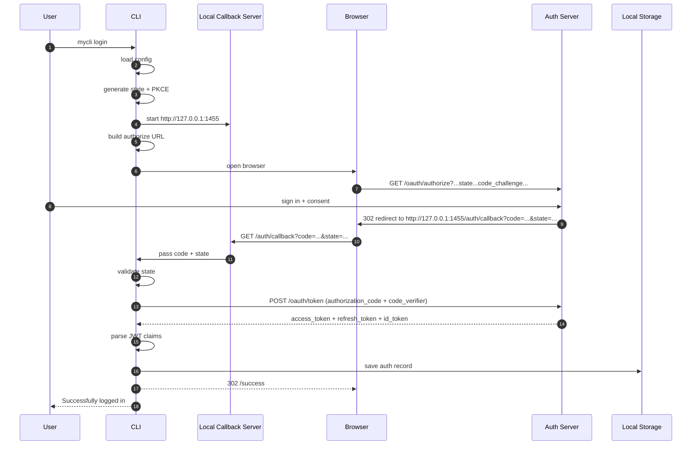
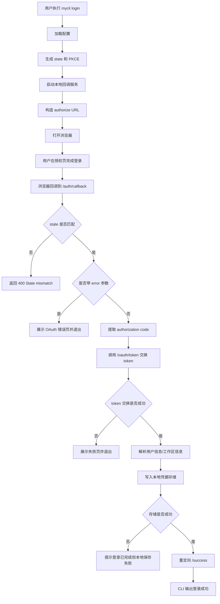
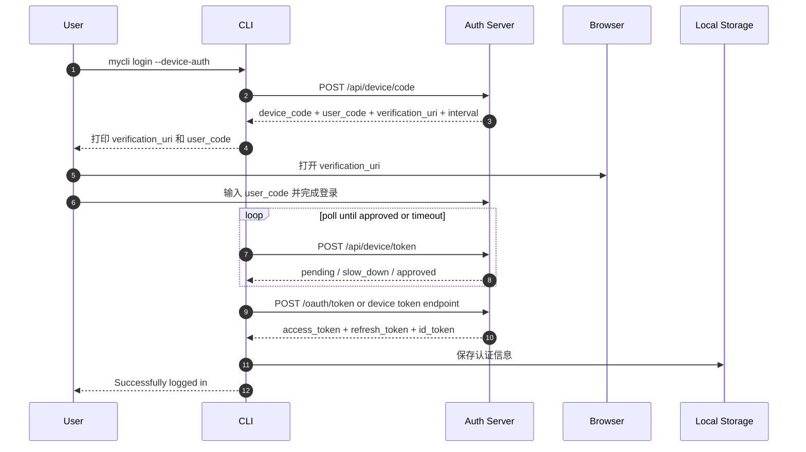
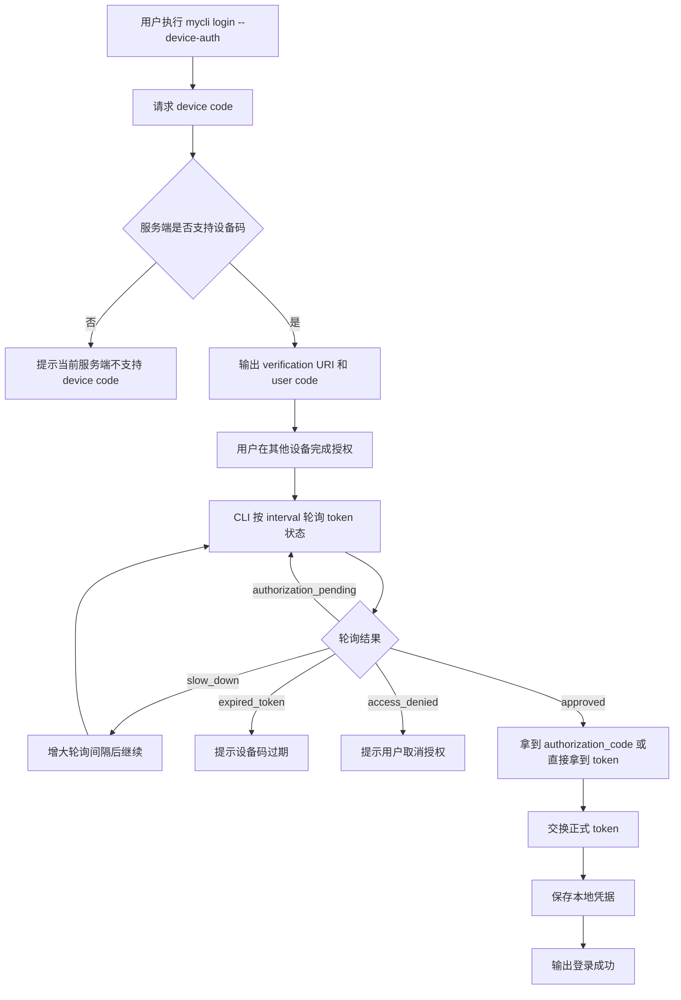
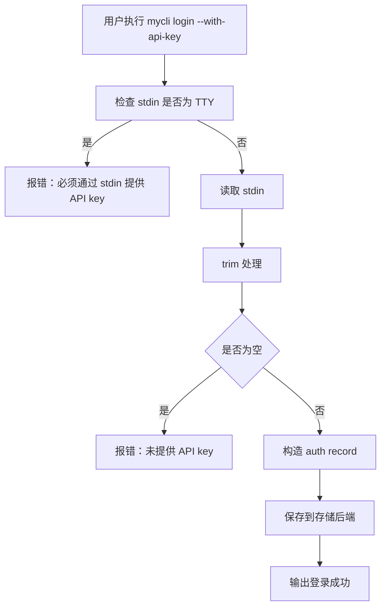
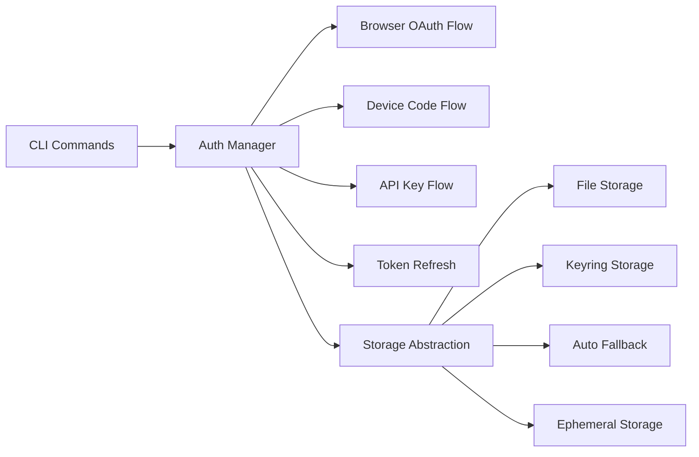
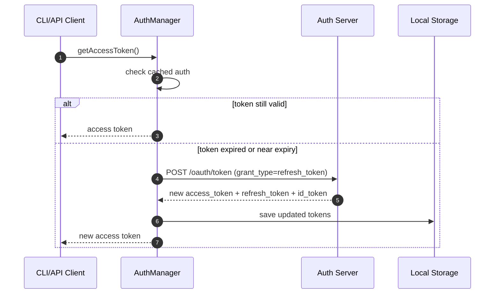
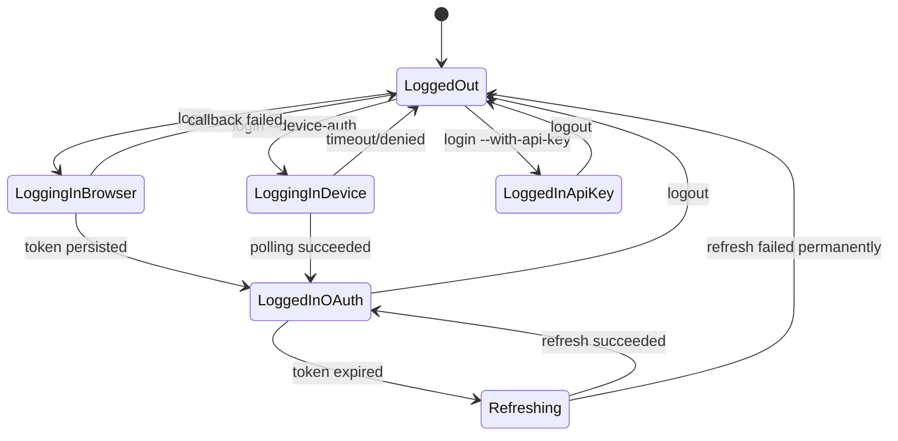

# Node.js CLI 登录流程实现方案

## 1. 目标

本文给出一套基于 Node.js/TypeScript 的 CLI 登录实现方案，目标是实现与当前仓库类似的三种登录能力：

1. 浏览器登录：OAuth 2.0 Authorization Code + PKCE + 本地回调服务。
2. 设备码登录：OAuth 2.0 Device Authorization Grant，适配远程机器/无头环境。
3. API Key 登录：从 `stdin` 读取密钥并安全保存。

同时覆盖以下工程要求：

- 支持 `login`、`login --device-auth`、`login --with-api-key`、`login status`、`logout`。
- 支持文件存储、系统 keychain/keyring 存储、自动回退存储、进程内临时存储。
- 支持 token 持久化、过期判断、按需刷新、状态展示。
- 支持本地回调端口占用处理、错误页/成功页、日志脱敏、安全设计。
- 文档可直接作为开发蓝图使用。

## 2. 推荐技术栈

推荐使用 TypeScript 实现，Node.js 版本建议 `>= 20`。

### 2.1 依赖建议

```txt
commander        CLI 参数解析
open             打开浏览器
express          本地回调 HTTP 服务
axios            HTTP 请求
zod              配置与响应校验
keytar           系统 keychain/keyring 存储
conf             简单配置目录管理（可选）
chalk            终端彩色输出
pino             日志
pino-pretty      开发期日志美化
jose             JWT 解析（仅做 claims 读取，不做信任校验时也可）
node:crypto      PKCE、随机 state、hash
node:fs/promises 文件存储
```

如果你更希望最少依赖，也可以把 `express` 替换为原生 `http`，把 `axios` 替换为全局 `fetch`。

## 3. CLI 命令设计

建议命令设计如下：

```bash
mycli login
mycli login --device-auth
mycli login --with-api-key
mycli login status
mycli logout
```

### 3.1 参数语义

- `mycli login`
  - 默认走浏览器登录。
- `mycli login --device-auth`
  - 显式走设备码登录。
- `mycli login --with-api-key`
  - 从 `stdin` 读取 API key，不允许明文参数直接出现在 shell history。
- `mycli login status`
  - 展示当前登录方式、当前账号、token 有效性。
- `mycli logout`
  - 清除本地认证数据。

### 3.2 可选高级参数

```bash
mycli login --issuer https://auth.example.com
mycli login --client-id my-cli-client
mycli login --credential-store auto
mycli login --no-browser
mycli login --port 1455
```

建议配置优先级：

1. CLI 参数
2. 环境变量
3. 配置文件
4. 默认值

## 4. 认证模式定义

建议统一定义认证模式：

```ts
export type AuthMode = 'apiKey' | 'chatgpt' | 'externalTokens';
```

说明：

- `apiKey`
  - 使用 API key 访问后端。
- `chatgpt`
  - 使用完整 OAuth token 集合：`id_token`、`access_token`、`refresh_token`。
- `externalTokens`
  - 令牌由外部系统管理，CLI 只消费外部传入的 access token。若第一阶段不需要，可先不实现。

## 5. 目录结构建议

```txt
src/
  cli/
    commands/
      login.ts
      logout.ts
      status.ts
  auth/
    auth-manager.ts
    auth-types.ts
    auth-storage.ts
    auth-file-storage.ts
    auth-keyring-storage.ts
    auth-auto-storage.ts
    auth-ephemeral-storage.ts
    oauth-browser.ts
    oauth-device.ts
    oauth-refresh.ts
    oauth-pkce.ts
    oauth-local-server.ts
    oauth-errors.ts
    token-utils.ts
    api-key-login.ts
  config/
    config.ts
  logging/
    logger.ts
  utils/
    stdin.ts
    browser.ts
    url-redaction.ts
    env.ts
  index.ts
```

## 6. 数据模型设计

### 6.1 本地认证文件结构

建议本地使用 `~/.mycli/auth.json`，结构如下：

```json
{
  "authMode": "chatgpt",
  "apiKey": null,
  "tokens": {
    "accessToken": "...",
    "refreshToken": "...",
    "idToken": "...",
    "expiresAt": "2026-03-31T15:22:01.000Z",
    "accountId": "acc_xxx",
    "email": "user@example.com",
    "workspaceId": "ws_xxx",
    "plan": "pro"
  },
  "lastRefreshAt": "2026-03-31T07:22:01.000Z",
  "version": 1
}
```

### 6.2 TypeScript 类型

```ts
export interface TokenSet {
  accessToken: string;
  refreshToken: string;
  idToken: string;
  expiresAt?: string;
  accountId?: string;
  email?: string;
  workspaceId?: string;
  plan?: string;
}

export interface AuthRecord {
  authMode: 'apiKey' | 'chatgpt' | 'externalTokens';
  apiKey?: string | null;
  tokens?: TokenSet | null;
  lastRefreshAt?: string | null;
  version: number;
}
```

## 7. 存储策略设计

### 7.1 存储模式

建议支持以下 4 种模式：

```ts
export type CredentialStoreMode = 'file' | 'keyring' | 'auto' | 'ephemeral';
```

- `file`
  - 明确存储在 `auth.json`。
- `keyring`
  - 通过 `keytar` 存储在系统钥匙串/凭据管理器中。
- `auto`
  - 优先 `keyring`，失败则降级为 `file`。
- `ephemeral`
  - 只在当前进程内存中存在，不落盘。

### 7.2 存储接口

```ts
export interface AuthStorage {
  load(): Promise<AuthRecord | null>;
  save(record: AuthRecord): Promise<void>;
  delete(): Promise<boolean>;
}
```

### 7.3 文件存储要求

- 目录默认：`~/.mycli/`
- 文件默认：`~/.mycli/auth.json`
- 权限：Unix 下建议 `0600`
- 写入方式：原子写入
  - 先写 `auth.json.tmp`
  - `fs.rename()` 覆盖目标文件
- 不在普通日志中打印 token 内容

### 7.4 Keyring 设计

建议 keyring service name：

```txt
MyCLI Auth
```

account 字段建议使用：

```txt
cli|<hash-of-config-home>
```

这样可以支持多个不同 profile 或不同 home 目录的隔离。

## 8. 浏览器登录方案

浏览器登录采用 OAuth 2.0 Authorization Code + PKCE。

### 8.1 参与对象

- CLI 进程
- 本地浏览器
- 本地回调 HTTP server
- OAuth 授权服务
- 业务 API / token exchange 服务
- 本地凭据存储

### 8.2 推荐端点约定

以下端点是通用示例，你可以映射到自己的服务：

```txt
GET  /oauth/authorize
POST /oauth/token
POST /oauth/token            (refresh_token)
POST /api/device/code        (设备码申请)
POST /api/device/token       (轮询设备码结果)
```

如果你完全复刻当前仓库风格，也可以采用类似：

```txt
GET  {issuer}/oauth/authorize
POST {issuer}/oauth/token
POST {issuer}/api/accounts/deviceauth/usercode
POST {issuer}/api/accounts/deviceauth/token
```

## 9. 浏览器登录时序图



## 10. 浏览器登录流程图



## 11. 浏览器登录详细实现步骤

### 11.1 生成 PKCE

需要生成：

- `code_verifier`
- `code_challenge = BASE64URL(SHA256(code_verifier))`

示例实现：

```ts
import { createHash, randomBytes } from 'node:crypto';

function base64url(input: Buffer) {
  return input
    .toString('base64')
    .replace(/\+/g, '-')
    .replace(/\//g, '_')
    .replace(/=+$/g, '');
}

export function generatePkce() {
  const codeVerifier = base64url(randomBytes(32));
  const codeChallenge = base64url(
    createHash('sha256').update(codeVerifier).digest(),
  );

  return { codeVerifier, codeChallenge, method: 'S256' as const };
}
```

### 11.2 生成 state

```ts
export function generateState(): string {
  return base64url(randomBytes(32));
}
```

### 11.3 启动本地回调服务

建议监听：

```txt
127.0.0.1:1455
```

回调路径：

```txt
/auth/callback
```

成功页：

```txt
/success
```

取消页：

```txt
/cancel
```

服务行为：

- 只监听 `127.0.0.1`，不监听 `0.0.0.0`
- 仅接受当前登录会话的 state
- 成功处理一次后立即关闭 server
- 所有错误页中不回显敏感 token

### 11.4 authorize URL 参数

建议参数：

```txt
response_type=code
client_id=<client_id>
redirect_uri=http://127.0.0.1:1455/auth/callback
scope=openid profile email offline_access
code_challenge=<code_challenge>
code_challenge_method=S256
state=<state>
```

可选扩展参数：

- `allowed_workspace_id`
- `originator`
- `prompt=select_account`

### 11.5 回调参数处理

回调处理逻辑：

1. 解析 query。
2. 校验 `state`。
3. 如果包含 `error`，直接返回失败页。
4. 如果缺少 `code`，返回失败页。
5. 拿 `code` 去换 token。
6. 持久化成功后返回成功页。

### 11.6 token 交换请求

```http
POST /oauth/token
Content-Type: application/x-www-form-urlencoded

grant_type=authorization_code
&code=xxx
&redirect_uri=http%3A%2F%2F127.0.0.1%3A1455%2Fauth%2Fcallback
&client_id=my-cli-client
&code_verifier=xxx
```

期望响应：

```json
{
  "access_token": "...",
  "refresh_token": "...",
  "id_token": "...",
  "token_type": "Bearer",
  "expires_in": 3600
}
```

### 11.7 JWT claims 提取

从 `id_token` 中读取：

- `sub`
- `email`
- `workspace_id`
- `plan`
- `exp`

注意：

- 若只是为本地 UI 展示解析 claims，可以只解码 payload。
- 若涉及安全决策，必须校验签名和 issuer/audience。

## 12. 设备码登录方案

设备码登录用于：

- SSH 到远程 Linux
- CI 调试环境
- 没有 GUI 的服务器
- 浏览器无法自动打开的环境

## 13. 设备码登录时序图



## 14. 设备码登录流程图



## 15. 设备码登录详细实现步骤

### 15.1 申请设备码

示例请求：

```http
POST /api/device/code
Content-Type: application/json

{
  "client_id": "my-cli-client"
}
```

示例响应：

```json
{
  "device_code": "dev_xxx",
  "user_code": "ABCD-EFGH",
  "verification_uri": "https://auth.example.com/device",
  "verification_uri_complete": "https://auth.example.com/device?user_code=ABCD-EFGH",
  "expires_in": 900,
  "interval": 5
}
```

### 15.2 终端展示

建议终端展示格式：

```txt
Follow these steps to sign in:

1. Open this URL in your browser:
   https://auth.example.com/device

2. Enter this code:
   ABCD-EFGH

This code expires in 15 minutes.
Never share this code.
```

### 15.3 轮询逻辑

轮询间隔使用服务端返回的 `interval`，并处理这些标准错误码：

- `authorization_pending`
- `slow_down`
- `expired_token`
- `access_denied`

轮询上限建议：

- 总时长 `15 minutes`
- 收到 `slow_down` 时每次额外增加 `5s`

### 15.4 两种设备码服务端模式

你的后端可能是以下两种设计之一：

#### 模式 A：设备码接口直接返回最终 token

轮询成功后，直接得到：

```json
{
  "access_token": "...",
  "refresh_token": "...",
  "id_token": "..."
}
```

#### 模式 B：设备码接口先返回临时 authorization code

轮询成功后得到：

```json
{
  "authorization_code": "...",
  "code_verifier": "...",
  "code_challenge": "..."
}
```

然后 CLI 再调用 `/oauth/token` 完成正式交换。

建议优先实现模式 A，后端和 CLI 都更简单。

## 16. API Key 登录方案

API Key 登录最简单，但要避免明文出现在 shell 历史里。

### 16.1 推荐交互

```bash
printenv MYCLI_API_KEY | mycli login --with-api-key
```

或：

```bash
echo "$MYCLI_API_KEY" | mycli login --with-api-key
```

### 16.2 API Key 登录流程图



### 16.3 API Key 登录记录

```json
{
  "authMode": "apiKey",
  "apiKey": "sk-...",
  "tokens": null,
  "lastRefreshAt": null,
  "version": 1
}
```

## 17. 总体架构图



## 18. AuthManager 设计

`AuthManager` 是核心门面，负责：

- 加载当前认证状态
- 发起登录
- 保存/删除认证记录
- 刷新 token
- 对外提供 `getAccessToken()`
- 提供 `status()` 和 `logout()`

### 18.1 接口设计

```ts
export class AuthManager {
  constructor(
    private readonly storage: AuthStorage,
    private readonly config: AuthConfig,
  ) {}

  async loginWithBrowser(): Promise<void> {}
  async loginWithDeviceCode(): Promise<void> {}
  async loginWithApiKey(apiKey: string): Promise<void> {}
  async logout(): Promise<boolean> {}
  async status(): Promise<LoginStatus> {}
  async getAccessToken(): Promise<string> {}
  async refreshIfNeeded(): Promise<void> {}
}
```

### 18.2 LoginStatus 类型

```ts
export interface LoginStatus {
  loggedIn: boolean;
  authMode?: 'apiKey' | 'chatgpt' | 'externalTokens';
  email?: string;
  accountId?: string;
  expiresAt?: string;
  expired?: boolean;
}
```

## 19. Token 刷新策略

如果是 OAuth 登录，建议支持 refresh token。

### 19.1 刷新触发条件

当满足以下任一条件时触发刷新：

- access token 已过期
- access token 将在 5 分钟内过期
- 主请求返回 `401 Unauthorized`

### 19.2 刷新时序图



### 19.3 刷新请求示例

```http
POST /oauth/token
Content-Type: application/x-www-form-urlencoded

grant_type=refresh_token
&refresh_token=xxx
&client_id=my-cli-client
```

### 19.4 刷新失败处理

- `invalid_grant`
  - 提示用户重新登录。
- 网络错误
  - 返回可重试错误。
- 账户切换/工作区不匹配
  - 清理本地状态并要求重新登录。

## 20. 本地回调服务设计

### 20.1 路由建议

- `GET /auth/callback`
  - 接收 OAuth 回调。
- `GET /success`
  - 返回成功 HTML。
- `GET /cancel`
  - 用于主动取消旧 server 或用户取消。
- `GET /healthz`
  - 可选，仅用于调试。

### 20.2 端口占用处理

推荐默认端口：`1455`。

若端口被占用：

方案一：直接随机端口。

- 优点：最简单。
- 缺点：如果授权服务只白名单固定回调地址，会失败。

方案二：固定端口优先，失败时尝试主动取消旧实例，然后重试。

更接近当前仓库实现，步骤如下：

1. 先尝试绑定 `127.0.0.1:1455`。
2. 若 `EADDRINUSE`：
   - 向 `http://127.0.0.1:1455/cancel` 发送请求。
   - 等待 200ms。
   - 重试最多 10 次。
3. 仍失败则报错。

### 20.3 回调服务关闭策略

成功/失败/取消后都应关闭：

- HTTP server
- 浏览器回调 promise
- 定时器
- 所有轮询逻辑

## 21. 错误模型设计

建议统一错误码：

```ts
export type AuthErrorCode =
  | 'state_mismatch'
  | 'missing_authorization_code'
  | 'oauth_callback_error'
  | 'token_exchange_failed'
  | 'device_code_unsupported'
  | 'device_code_expired'
  | 'device_code_denied'
  | 'persist_failed'
  | 'not_logged_in'
  | 'refresh_failed';
```

统一错误结构：

```ts
export class AuthError extends Error {
  constructor(
    public readonly code: AuthErrorCode,
    message: string,
    public readonly cause?: unknown,
  ) {
    super(message);
  }
}
```

## 22. 安全设计

这是实现里最关键的部分之一。

### 22.1 必做项

- 使用 PKCE。
- 使用随机 `state` 防止 CSRF。
- 本地 server 只监听 `127.0.0.1`。
- 日志中脱敏：
  - `access_token`
  - `refresh_token`
  - `id_token`
  - `code`
  - `code_verifier`
  - `api_key`
  - URL 中的敏感 query 参数
- 不通过命令行明文传 API key。
- 文件权限尽量限制为当前用户可读写。
- 刷新 token 失败时不要无限重试。
- 浏览器错误页不要展示底层异常堆栈。

### 22.2 URL 脱敏规则

建议对以下 query key 统一脱敏：

```txt
access_token
refresh_token
id_token
code
code_verifier
api_key
token
state
client_secret
```

### 22.3 设备码安全提醒

设备码是高风险凭据，应在 CLI 中明确提醒：

```txt
Device codes are a common phishing target. Never share this code.
```

## 23. 日志设计

### 23.1 日志文件

建议将登录日志单独落盘：

```txt
~/.mycli/logs/mycli-login.log
```

### 23.2 日志内容

可记录：

- 登录方式
- 本地回调端口
- authorize URL 的脱敏版本
- token exchange 状态码
- 存储后端类型
- 错误码

不要记录：

- 原始 token
- 原始授权码
- 原始 API key
- 原始 refresh token

## 24. status 命令设计

`mycli login status` 输出建议：

### 24.1 API Key 模式

```txt
Logged in using an API key - sk-proj-***ABCDE
```

### 24.2 OAuth 模式

```txt
Logged in using OAuth
Email: user@example.com
Account ID: acc_xxx
Expires At: 2026-03-31T15:22:01.000Z
```

### 24.3 未登录

```txt
Not logged in
```

## 25. logout 命令设计

流程：

1. 调用当前 storage backend 的 `delete()`。
2. 清空进程内缓存。
3. 输出：
   - `Successfully logged out`
   - 或 `Not logged in`

## 26. 状态机设计



## 27. 关键实现伪代码

### 27.1 login 命令分发

```ts
async function handleLoginCommand(opts: LoginOptions) {
  const authManager = await createAuthManager(opts);

  if (opts.status) {
    return printStatus(await authManager.status());
  }

  if (opts.withApiKey) {
    const apiKey = await readApiKeyFromStdin();
    await authManager.loginWithApiKey(apiKey);
    console.error('Successfully logged in');
    return;
  }

  if (opts.deviceAuth) {
    await authManager.loginWithDeviceCode();
    console.error('Successfully logged in');
    return;
  }

  await authManager.loginWithBrowser();
  console.error('Successfully logged in');
}
```

### 27.2 浏览器登录

```ts
async function loginWithBrowser(config: AuthConfig, storage: AuthStorage) {
  const pkce = generatePkce();
  const state = generateState();
  const server = await startLocalCallbackServer({
    host: '127.0.0.1',
    port: config.port,
    expectedState: state,
  });

  const redirectUri = `http://127.0.0.1:${server.port}/auth/callback`;
  const authorizeUrl = buildAuthorizeUrl({
    issuer: config.issuer,
    clientId: config.clientId,
    redirectUri,
    state,
    codeChallenge: pkce.codeChallenge,
  });

  if (config.openBrowser) {
    await open(authorizeUrl);
  } else {
    console.error(`Open this URL in your browser:\n\n${authorizeUrl}`);
  }

  const callback = await server.waitForCallback();
  if (callback.state !== state) {
    throw new AuthError('state_mismatch', 'State mismatch');
  }

  const tokens = await exchangeAuthorizationCode({
    issuer: config.issuer,
    clientId: config.clientId,
    redirectUri,
    code: callback.code,
    codeVerifier: pkce.codeVerifier,
  });

  const record = buildAuthRecordFromTokens(tokens);
  await storage.save(record);
  await server.respondSuccessAndClose();
}
```

### 27.3 设备码登录

```ts
async function loginWithDeviceCode(config: AuthConfig, storage: AuthStorage) {
  const device = await requestDeviceCode({
    issuer: config.issuer,
    clientId: config.clientId,
  });

  printDeviceInstructions(device);

  const pollResult = await pollDeviceToken({
    issuer: config.issuer,
    deviceCode: device.deviceCode,
    interval: device.interval,
    expiresIn: device.expiresIn,
  });

  const tokens = pollResult.tokens ?? await exchangeAuthorizationCode({
    issuer: config.issuer,
    clientId: config.clientId,
    redirectUri: config.deviceRedirectUri,
    code: pollResult.authorizationCode,
    codeVerifier: pollResult.codeVerifier,
  });

  const record = buildAuthRecordFromTokens(tokens);
  await storage.save(record);
}
```

### 27.4 刷新 token

```ts
async function refreshIfNeeded(storage: AuthStorage, config: AuthConfig) {
  const record = await storage.load();
  if (!record || record.authMode !== 'chatgpt' || !record.tokens) return;

  const expiresAt = record.tokens.expiresAt
    ? new Date(record.tokens.expiresAt).getTime()
    : 0;

  const shouldRefresh = !expiresAt || expiresAt - Date.now() < 5 * 60 * 1000;
  if (!shouldRefresh) return;

  const refreshed = await refreshToken({
    issuer: config.issuer,
    clientId: config.clientId,
    refreshToken: record.tokens.refreshToken,
  });

  await storage.save(buildAuthRecordFromTokens(refreshed));
}
```

## 28. 最小可用代码骨架

### 28.1 `src/auth/oauth-local-server.ts`

```ts
import express from 'express';
import http from 'node:http';

export interface CallbackResult {
  code?: string;
  state?: string;
  error?: string;
  errorDescription?: string;
}

export async function startLocalCallbackServer(opts: {
  host: string;
  port: number;
  expectedState: string;
}) {
  const app = express();

  let resolveCallback!: (value: CallbackResult) => void;
  let rejectCallback!: (reason?: unknown) => void;

  const callbackPromise = new Promise<CallbackResult>((resolve, reject) => {
    resolveCallback = resolve;
    rejectCallback = reject;
  });

  app.get('/auth/callback', (req, res) => {
    const state = String(req.query.state ?? '');
    const code = String(req.query.code ?? '');
    const error = req.query.error ? String(req.query.error) : undefined;
    const errorDescription = req.query.error_description
      ? String(req.query.error_description)
      : undefined;

    if (state !== opts.expectedState) {
      res.status(400).send('State mismatch');
      rejectCallback(new Error('state mismatch'));
      return;
    }

    if (error) {
      res.status(403).send('Login failed');
      resolveCallback({ error, errorDescription, state });
      return;
    }

    if (!code) {
      res.status(400).send('Missing authorization code');
      rejectCallback(new Error('missing authorization code'));
      return;
    }

    res.redirect('/success');
    resolveCallback({ code, state });
  });

  app.get('/success', (_req, res) => {
    res.type('html').send('<html><body><h1>Login successful</h1></body></html>');
  });

  app.get('/cancel', (_req, res) => {
    res.status(200).send('Login cancelled');
    rejectCallback(new Error('login cancelled'));
  });

  const server = http.createServer(app);

  await new Promise<void>((resolve, reject) => {
    server.once('error', reject);
    server.listen(opts.port, opts.host, () => resolve());
  });

  return {
    port: opts.port,
    waitForCallback: () => callbackPromise,
    close: () => new Promise<void>((resolve, reject) => {
      server.close(err => (err ? reject(err) : resolve()));
    }),
  };
}
```

### 28.2 `src/auth/oauth-browser.ts`

```ts
import open from 'open';

export async function openBrowserOrPrint(url: string, autoOpen: boolean) {
  if (autoOpen) {
    await open(url);
  } else {
    console.error(`Open this URL in your browser:\n\n${url}`);
  }
}
```

### 28.3 `src/auth/api-key-login.ts`

```ts
export async function readApiKeyFromStdin(): Promise<string> {
  if (process.stdin.isTTY) {
    throw new Error('Use stdin to provide API key');
  }

  const chunks: Buffer[] = [];
  for await (const chunk of process.stdin) {
    chunks.push(Buffer.from(chunk));
  }

  const apiKey = Buffer.concat(chunks).toString('utf8').trim();
  if (!apiKey) {
    throw new Error('No API key provided');
  }

  return apiKey;
}
```

## 29. 测试方案

### 29.1 单元测试

覆盖点：

- PKCE 生成正确
- state 生成随机且非空
- authorize URL 构造正确
- 敏感 URL 脱敏正确
- `auth.json` 序列化/反序列化正确
- token 过期判断正确
- `status` 输出逻辑正确

### 29.2 集成测试

覆盖点：

- 本地 callback 服务收到 `code` 正确完成登录
- 回调 `state` 不匹配时失败
- 设备码 `authorization_pending` 能持续轮询
- 设备码 `slow_down` 能退避
- refresh token 过期后返回重新登录提示
- `logout` 能清理存储

### 29.3 端到端测试

方式：

- 使用 mock OAuth server
- 启动 CLI 进程
- 驱动浏览器回调或模拟设备码授权
- 检查 auth 文件/keyring 是否正确落地

## 30. 开发阶段建议

### 第一阶段：MVP

先实现：

- `login`
- `login --device-auth`
- `login --with-api-key`
- `login status`
- `logout`
- 文件存储
- refresh token

### 第二阶段：增强

增加：

- keyring 存储
- auto fallback
- 账户/工作区限制
- 更完整的错误页
- 日志文件脱敏
- 旧登录 server 取消机制

### 第三阶段：企业能力

增加：

- 外部托管 token 模式
- SSO/组织限制
- 多 profile
- 审计日志
- 代理与自定义 CA

## 31. 与当前仓库登录流程的映射关系

如果你是按当前仓库思路复刻，Node.js 中可以这样映射：

- `run_login_with_chatgpt(...)`
  - 对应 `AuthManager.loginWithBrowser()`
- `run_device_code_login(...)`
  - 对应 `AuthManager.loginWithDeviceCode()`
- `login_with_api_key(...)`
  - 对应 `AuthManager.loginWithApiKey()`
- `run_login_status(...)`
  - 对应 `AuthManager.status()`
- `logout(...)`
  - 对应 `AuthManager.logout()`
- `persist_tokens_async(...)`
  - 对应 `storage.save(buildAuthRecordFromTokens(...))`

## 32. 落地建议

如果你准备实际开工，我建议按下面顺序实现：

1. 定义 `AuthRecord`、`AuthStorage`、`AuthManager`。
2. 完成文件存储。
3. 完成 API key 登录。
4. 完成本地 callback server。
5. 完成浏览器登录。
6. 完成设备码登录。
7. 完成 refresh token。
8. 完成 `status/logout`。
9. 完成 keyring 和日志脱敏。
10. 补充集成测试与 e2e 测试。

## 33. 最终建议结论

如果你的目标是做一个生产可用的 Node.js CLI 登录系统，推荐采用下面的最终组合：

- 浏览器登录：`OAuth Authorization Code + PKCE + localhost callback`
- 无头环境：`Device Authorization Grant`
- API key：`stdin 输入 + 本地安全存储`
- 存储：`auto(keyring -> file fallback)`
- 刷新：`refresh_token + 401 fallback refresh`
- 保护：`state + PKCE + localhost only + 日志脱敏 + 不在 argv 传 secret`

这套设计兼顾了：

- 用户体验
- 远程环境兼容性
- CLI 工程可维护性
- 安全性
- 与现有仓库思路的一致性

如果你愿意，我下一步可以继续直接给你生成一套可运行的 Node.js/TypeScript 代码骨架，包含：

- `commander` 命令入口
- `AuthManager`
- `express` 本地回调 server
- 文件存储实现
- 浏览器登录和设备码登录的完整 TS 代码
