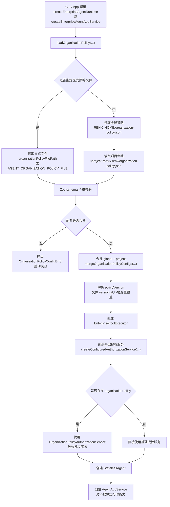
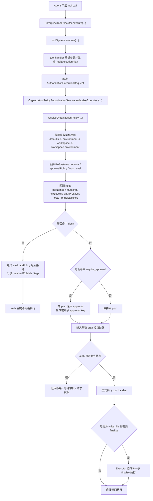

# 组织级策略配置说明

## 1. 文档目标

本文档说明 `renx-code` 当前组织级策略能力如何配置、如何加载、如何生效，方便团队后续把 `workspace / environment / tenant-style governance` 真正落到工程里。

当前能力已经支持：

- 组织策略文件加载
- 全局策略与项目策略合并
- 组织策略版本绑定到执行链 `policyVersion`
- 在不修改 `auth` 基线实现的前提下，把组织策略接入 `tool-v2 -> executor -> authorization`
- 策略文件 schema 严格校验，非法配置直接失败

## 2. 设计原则

组织级策略遵循下面几个原则：

- `auth` 目录作为授权基线实现，不再承载业务级组织策略拼装
- `tool handler` 只负责声明执行计划，不负责决定组织是否允许执行
- 组织策略在高层组合入口装配，再传给 executor
- 配置错误必须显式失败，不能静默忽略
- 策略版本必须可审计，能够进入执行期事件和审计链路

### 2.1 已移除的旧权限入口

为了避免企业级系统长期维护中出现“双入口治理”，当前架构已经明确不再把下面这些旧配置当作权限主入口：

- `AGENT_TOOL_APPROVAL_POLICY`
- `AGENT_TOOL_TRUST_LEVEL`
- `AGENT_TOOL_FILESYSTEM_MODE`
- `AGENT_TOOL_NETWORK_MODE`
- `AGENT_TOOL_CONFIRMATION_MODE`
- `config.json` 中旧的 `agent.confirmationMode`
- `config.json` 中旧的 `agent.toolRuntime.*`

现在的统一原则是：

- tool 是否允许执行，由 `organization policy + auth` 主链路决定
- CLI 不再通过旧 env/config 在运行前偷偷改写 tool executor 权限基线
- 如果需要治理差异，统一进入 `.renx/organization-policy.json` 或显式 organization policy 文件

### 2.2 一键 Full Access 模式

如果是本地完全可信环境，需要临时关闭所有企业治理限制，可以使用新的总开关：

```text
AGENT_FULL_ACCESS=true
```

这个模式下系统会统一做下面几件事：

- 跳过 organization policy 文件加载与命中
- `fileSystem` 切到 `unrestricted`
- `network` 切到 `enabled`
- `approvalPolicy` 使用 `unless-trusted`
- `trustLevel` 使用 `trusted`
- `local_shell` 切到 `full-access` shell profile

也就是说，这不是旧式的多环境变量拼装，而是一个显式、单入口、可审计的全开放运行模式。

推荐只在下面场景使用：

- 本地个人开发机
- 已确认隔离边界的内部调试环境
- 临时排查权限系统本身的问题

不建议在下面场景使用：

- 生产环境
- 多租户共享环境
- 需要组织级审计约束的企业工作区

## 3. 加载路径优先级

当前支持三种来源：

### 3.1 显式文件路径

优先级最高。

可通过以下方式传入：

- 工厂参数 `organizationPolicyFilePath`
- 环境变量 `AGENT_ORGANIZATION_POLICY_FILE`

### 3.2 项目级策略文件

当没有显式文件路径时，系统会尝试读取：

```text
<projectRoot>/.renx/organization-policy.json
```

其中 `projectRoot` 通常来自：

- `createEnterpriseAgentRuntime({ projectRoot })`
- 或 `toolExecutorOptions.workingDirectory`

### 3.3 全局策略文件

当没有显式文件路径时，系统还会尝试读取：

```text
RENX_HOME/organization-policy.json
```

如果没有设置 `RENX_HOME`，则默认是：

```text
~/.renx/organization-policy.json
```

## 4. 合并规则

当同时存在全局策略与项目策略时，当前合并规则如下：

- `version`：项目级覆盖全局级
- `defaults`：做结构合并
- `environments`：同名环境做结构合并
- `workspaces`：同 `workspaceId` 或同 `rootPath` 的策略做合并
- `rules`：按顺序拼接，后面的规则可以通过更高 `priority` 获得更高优先级
- `fileSystem.readRoots / writeRoots`：去重合并
- `network.allowedHosts / deniedHosts`：去重合并

一句话理解：

`全局策略定义基础约束，项目策略定义局部强化。`

## 5. 生效链路

当前完整链路如下：

1. 工厂加载组织策略文件
2. 解析并校验 JSON schema
3. 合并全局与项目策略
4. 解析 `version`
5. 创建 `EnterpriseToolExecutor`
6. executor 用组织策略包装现有授权服务
7. tool 执行前先应用组织级策略
8. 命中 `deny` 时直接拒绝
9. 命中 `require_approval` 时注入审批要求
10. 再进入现有 `auth` 主链路执行

为了便于研发、平台、审计三方统一理解，建议把生效链路拆成两段看：

- 启动期：如何加载并装配 organization policy
- 执行期：一次 tool call 进入 executor 后如何完成组织策略校验、审批注入与最终执行

### 5.1 启动期装配流程图



### 5.2 单次 Tool 执行流程图



### 5.3 一句话理解

可以把当前实现理解成两层治理串联：

- 第一层是 `organization policy`，负责企业级环境/工作区/规则治理
- 第二层是 `auth` 基线能力，负责真正的授权、审批、权限请求与执行放行

也就是说，组织策略不是替代 `auth`，而是在 `tool` 真正执行前，先把企业治理规则折叠进授权请求，再统一走主授权链路。

## 6. 配置文件结构

配置文件主结构如下：

```json
{
  "version": "org-policy-v1",
  "defaults": {},
  "environments": {},
  "workspaces": []
}
```

### 6.1 version

用于标识组织策略版本。

建议规则：

- 每次组织治理规则发布时都显式更新
- 与审计系统中的 `policyVersion` 对齐
- 例如：
  - `org-policy-v1`
  - `org-policy-2026-03-18`
  - `tenant-a-policy-v7`

### 6.2 defaults

定义全局默认策略。

适合放：

- 默认 network 限制
- 默认 approvalPolicy
- 默认 trustLevel
- 全局高风险规则

### 6.3 environments

定义环境级策略。

当前常见建议：

- `production` 更严格
- `staging` 介于生产与开发之间
- `development` 可适当放宽

### 6.4 workspaces

定义工作区级策略。

建议使用下面两种标识之一：

- `workspaceId`
- `rootPath`

最好同时配置，便于长期治理与未来外部系统映射。

## 7. 支持的字段

### 7.1 scope 级字段

每个策略作用域支持：

- `fileSystem`
- `network`
- `approvalPolicy`
- `trustLevel`
- `rules`

### 7.2 fileSystem

示例：

```json
{
  "fileSystem": {
    "mode": "restricted",
    "readRoots": ["D:/work/renx-code"],
    "writeRoots": ["D:/work/renx-code"]
  }
}
```

当前支持：

- `mode`: `restricted | unrestricted`
- `readRoots`
- `writeRoots`

### 7.3 network

示例：

```json
{
  "network": {
    "mode": "restricted",
    "allowedHosts": ["api.github.com"],
    "deniedHosts": ["example.com"]
  }
}
```

当前支持：

- `mode`: `restricted | enabled`
- `allowedHosts`
- `deniedHosts`

### 7.4 approvalPolicy

当前支持：

- `never`
- `on-request`
- `on-failure`
- `unless-trusted`

### 7.5 trustLevel

当前支持：

- `trusted`
- `untrusted`

## 8. 规则结构

单条规则结构示例：

```json
{
  "id": "prod-deploy-deny",
  "effect": "deny",
  "reason": "生产环境禁止直接部署",
  "priority": 100,
  "approvalKey": "production:deploy",
  "match": {
    "toolNames": ["deploy_release"]
  },
  "tags": ["production", "deploy"]
}
```

### 8.1 effect

当前支持：

- `deny`
- `require_approval`

### 8.2 priority

值越大，优先级越高。

建议：

- `90+` 用于硬性治理规则
- `50-80` 用于工作区或环境强化规则
- `10-40` 用于默认规则

### 8.3 match

当前支持的匹配条件：

- `toolNames`
- `mutating`
- `riskLevels`
- `sensitivities`
- `pathPrefixes`
- `hosts`
- `principalRoles`

## 9. 常见治理场景

### 9.1 禁止生产环境直接部署

```json
{
  "id": "prod-deploy-deny",
  "effect": "deny",
  "reason": "生产环境禁止直接执行 deploy_release",
  "priority": 100,
  "match": {
    "toolNames": ["deploy_release"]
  }
}
```

### 9.2 生产环境 shell 需要审批

```json
{
  "id": "prod-shell-approval",
  "effect": "require_approval",
  "reason": "生产环境执行 shell 命令需要审批",
  "priority": 90,
  "approvalKey": "production:shell",
  "match": {
    "toolNames": ["local_shell"]
  }
}
```

### 9.3 敏感目录禁止访问

```json
{
  "id": "secrets-path-deny",
  "effect": "deny",
  "reason": "禁止访问 secrets 目录",
  "priority": 95,
  "match": {
    "pathPrefixes": ["D:/work/backend-service/secrets"]
  }
}
```

### 9.4 高风险操作默认审批

```json
{
  "id": "default-high-risk-approval",
  "effect": "require_approval",
  "reason": "高风险操作默认需要审批",
  "priority": 10,
  "match": {
    "riskLevels": ["high", "critical"]
  }
}
```

## 10. 严格校验说明

当前组织策略文件使用严格 schema 校验。

这意味着：

- JSON 语法错误会直接抛错
- 未知字段会直接抛错
- 枚举值拼错会直接抛错
- 类型不匹配会直接抛错

例如下面这种配置不会被接受：

```json
{
  "environments": {
    "production": {
      "rules": [
        {
          "id": "prod-deny",
          "effect": "deny",
          "reason": "blocked",
          "unexpectedField": true
        }
      ]
    }
  }
}
```

系统会抛出 `OrganizationPolicyConfigError`，并指向具体配置文件。

## 11. 推荐落地方式

建议团队按下面方式落地：

1. 在全局策略文件里定义通用基础约束
2. 在项目 `.renx/organization-policy.json` 里定义项目强化规则
3. 每次组织策略发布时更新 `version`
4. 先用 `deny` 保护硬性禁区
5. 再用 `require_approval` 管控高风险但允许的动作
6. 不要把一次性临时规则写进默认全局策略，避免后期污染

## 12. 配套文件

仓库中已经提供一份示例文件：

- `doc/organization-policy.example.json`

建议使用方式：

1. 复制为项目级 `.renx/organization-policy.json`
2. 按工作区、环境、工具名称进行裁剪
3. 明确填写团队自己的 `version`

## 13. 当前限制

当前实现已经够企业级接入使用，但还有一些后续可增强点：

- 还没有 tenant 独立配置源
- 还没有策略热更新
- 还没有 UI 级策略管理台
- 还没有把 `matched workspace policy` 单独落审计字段
- 规则当前仍以 JSON 配置表达，不是 DSL

## 14. 推荐下一步

建议后续继续做这三件事：

- 把命中的组织策略来源落到审计字段
- 增加 tenant 级配置源
- 补一个策略文件生成器或初始化命令

这样组织级策略就会从“可用”进一步升级到“可运营、可治理、可审计”。
