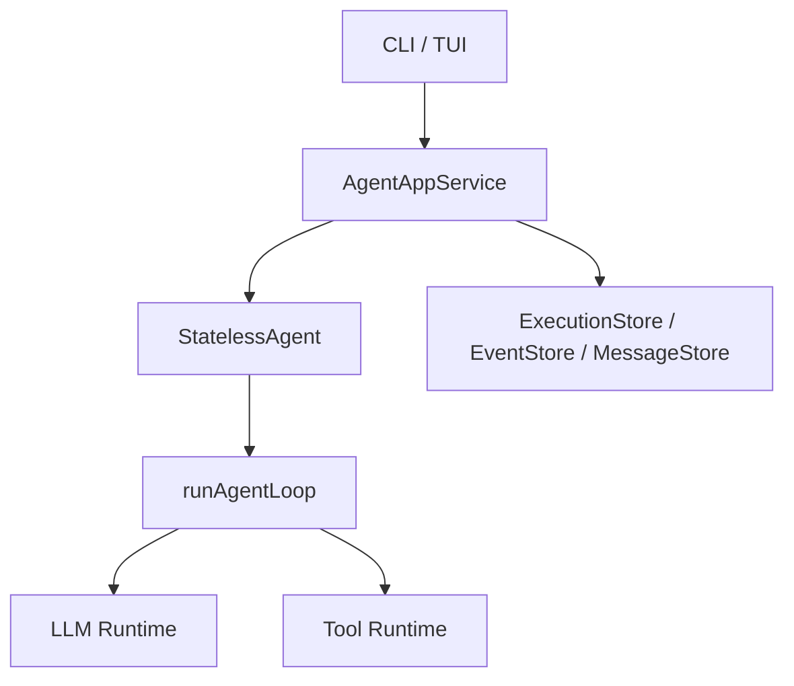
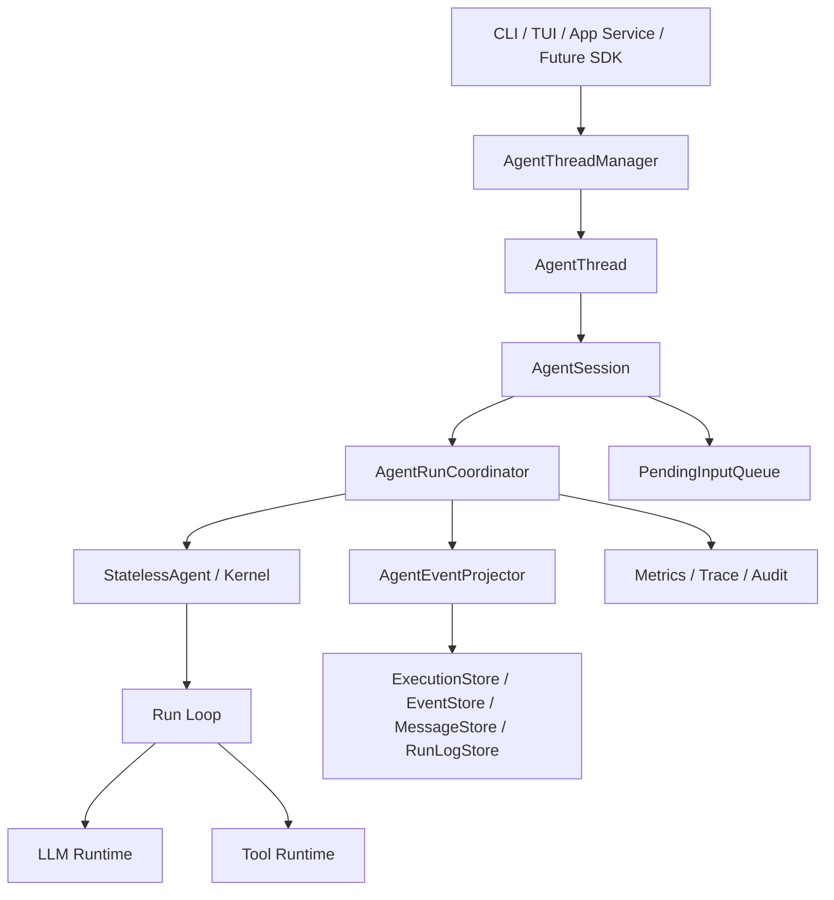
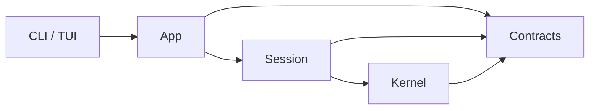
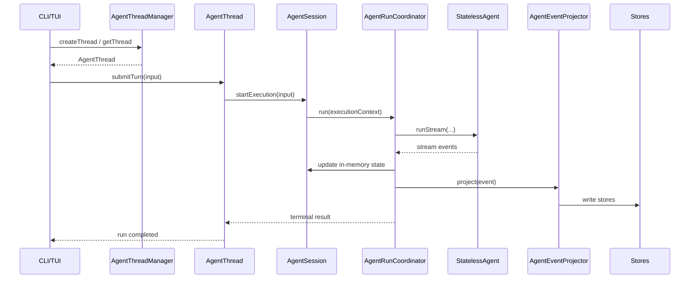

# Renx 架构图与模块边界设计

## 1. 文档目的

本文档用于说明 `renx-code` 在企业级演进过程中的目标架构、模块边界、依赖方向和类职责分配。

这份文档重点回答四个问题：

1. 当前架构的核心问题是什么
2. 目标架构应该长成什么样
3. 每一层分别应该负责什么
4. 后续代码迁移时，应该先拆哪里、后拆哪里

本文档是 [renx-enterprise-roadmap.md](D:/work/renx-code/doc/renx-enterprise-roadmap.md) 的配套文档。

## 2. 设计原则

### 2.1 总原则

`renx` 的目标不是做一个“所有东西都塞进 Agent 里”的系统。

目标是：

- 用小而清晰的 kernel 负责单次执行
- 用 session 层负责 thread / conversation 生命周期
- 用 app 层负责 projection、store、外部集成
- 用 contracts 层统一运行时共享结构

### 2.2 必须坚持的架构原则

- execution kernel 只做执行，不做持久化
- session 层只做运行协调和长生命周期状态，不做 store schema 细节
- app 层只做 projection 和外部集成，不决定 kernel 控制流
- contracts 统一管理共享 shapes，不承载业务逻辑
- 新功能必须先确定层归属，再决定代码放置位置

### 2.3 目标风格

整体风格应保持：

- 边界明确
- 依赖单向
- 状态有主
- 事件可回放
- 失败可诊断

## 3. 当前架构简图

当前项目里，主要结构可以简化理解为：



这个结构的优点是执行链路不复杂，比较容易看懂。

当前主要问题是：

- `AgentAppService` 同时承担了 session 协调、active run 管理、pending input、事件投影、store 写入等职责
- 缺少 thread / session 抽象，导致长生命周期状态没有正式 owner
- kernel 与 app 之间缺少一层 session boundary

## 4. 目标架构总图

目标架构建议如下：



这个结构体现了 3 个关键信号：

- 外部入口不再直接面向 `AgentAppService`
- `StatelessAgent` 不再承担 thread / session 的含义
- store / projection / audit 被显式放在执行链路之外

## 5. 四层架构定义

## 5.1 Kernel 层

### 定位

Kernel 层是整个系统最小、最稳定的执行核心。

它的职责是：

- 接收一次 execution 的输入
- 在 step 边界驱动 LLM 和 tools
- 处理 retry、timeout、abort、compaction
- 发出 stream events

### 当前对应代码

- `packages/core/src/agent/agent/index.ts`
- `packages/core/src/agent/agent/run-loop.ts`
- `packages/core/src/agent/agent/run-loop-control.ts`
- `packages/core/src/agent/agent/run-loop-stages.ts`
- `packages/core/src/agent/agent/runtime-composition.ts`
- `packages/core/src/agent/agent/llm-stream-runtime.ts`
- `packages/core/src/agent/agent/tool-runtime.ts`

### 它应该做的事

- 定义一次 execution 的控制流
- 处理 step 级失败
- 处理 context compaction
- 在 step 边界消费 pending input adapter
- 发出 `progress`、`checkpoint`、`done`、`error` 等事件

### 它不应该做的事

- 创建或管理 conversation / thread
- 直接落 event store
- 直接更新 message projection
- 直接管理 run registry
- 直接做 UI 适配

### 建议目标目录

```text
packages/core/src/agent/kernel/
  index.ts
  run-loop.ts
  run-loop-control.ts
  run-loop-stages.ts
  runtime-composition.ts
  llm/
  tool/
  observability/
```

## 5.2 Session 层

### 定位

Session 层是未来最重要的新层。

它的意义是：
把“单轮执行”和“多轮会话”分开。

### 核心职责

- 管理 thread / conversation
- 管理 active execution
- 管理 pending input queue
- 管理 session config snapshot
- 管理执行期间的内存态
- 负责与 kernel 对接

### 建议核心对象

#### `AgentThreadManager`

职责：

- 创建 thread
- 恢复 thread
- 获取 thread
- 列出 threads
- 关闭 thread

它是整个系统中 thread 容器的 owner。

#### `AgentThread`

职责：

- 提交 turn
- 追加运行中输入
- 订阅事件
- 查询 thread 状态

它是外部调用方最稳定的接入对象。

#### `AgentSession`

职责：

- 持有 session state
- 持有 active execution
- 管理 pending input queue
- 调用 kernel
- 协调 checkpoint / resume

它是 thread 内部真正的运行协调者。

#### `SessionState`

建议包含：

- `threadId`
- `conversationId`
- `status`
- `activeExecutionId`
- `lastCompletedExecutionId`
- `configSnapshot`
- `pendingInputStats`
- `lastCheckpoint`

#### `ExecutionContext`

建议包含：

- `executionId`
- `startedAt`
- `stepIndex`
- `abortController`
- `terminalReason`
- `errorCode`
- `traceId`

### Session 层边界

Session 层可以拥有“运行态”；
但不应拥有“持久化实现细节”。

例如：

- 可以知道当前有哪些 pending inputs
- 可以知道当前 active execution 是哪个
- 不应该自己关心 sqlite 表结构怎么设计

## 5.3 App 层

### 定位

App 层负责把 session 与外部世界连接起来。

### 当前对应代码

- `packages/core/src/agent/app/agent-app-service.ts`
- `packages/core/src/agent/app/sqlite-agent-app-store.ts`

### 目标职责

- store 写入
- event projection
- run log
- CLI / TUI integration
- audit fan-out
- metrics / trace fan-out

### 建议拆分对象

#### `AgentAppService`

仅保留 façade 能力：

- 面向 CLI / TUI 暴露简洁接口
- 组合 session 和 app components

#### `AgentRunCoordinator`

职责：

- 触发一次 execution
- 连接 kernel stream
- 协调 event 生命周期

#### `AgentEventProjector`

职责：

- 把 stream event 投影为 event store / message store / execution store 记录

#### `AgentRunRegistry`

职责：

- 管理 active runs
- 提供 run lookup
- 管理运行状态切换

### App 层反模式

下面这些情况应当避免：

- 运行逻辑、projection、store 写入、active run 管理全部继续堆在一个类里
- CLI 特定逻辑直接进入 kernel
- UI 层控制流反向决定 kernel 行为

## 5.4 Contracts 层

### 定位

Contracts 层负责统一所有跨层共享的结构定义。

### 为什么一定要单独收口

如果 contracts 不单独收口，常见问题会很快出现：

- 事件结构在不同层各自长出一版
- execution 状态在不同层拥有不同解释
- session 和 app 各自定义 message shape
- replay 与 online path 使用不同结构

### 建议收口内容

- `Message`
- `StreamEvent`
- `RunRecord`
- `ExecutionStatus`
- `TerminalReason`
- `SessionSnapshot`
- `CheckpointRecord`
- `PendingInputRecord`

## 6. 依赖方向图

理想的依赖方向应是单向的。



应避免的反向依赖：

- Kernel 依赖 App
- Kernel 依赖 Store
- Session 依赖具体 UI
- Contracts 依赖 runtime 实现

## 7. 模块职责矩阵

| 模块                     | 当前问题                    | 目标职责                | 后续动作         |
| ------------------------ | --------------------------- | ----------------------- | ---------------- |
| `StatelessAgent`         | 容易被继续塞入 session 语义 | 单次 execution façade   | 保持纯内核       |
| `run-loop.ts`            | 无明显架构问题              | 单轮主循环              | 保持中心地位     |
| `runtime-composition.ts` | 命名仍偏 runtime 工具箱     | kernel composition root | 保持显式依赖     |
| `AgentAppService`        | mixed ownership 过重        | app façade              | 拆解             |
| event / store projection | 与运行协调过近              | app 层专属职责          | 抽出 projector   |
| active run registry      | 位置不稳定                  | session 或独立 registry | 收口到专属 owner |
| pending input            | 逻辑存在但 owner 不清晰     | session queue owner     | 提升为一等能力   |

## 8. 迁移优先级

迁移必须按顺序做，不能同时从所有方向开刀。

### 优先级 1：先立 Session 层

原因：

- 这是现在最大的结构空洞
- 不补这一层，后续所有 enterprise 能力都会继续挤进 app service

### 优先级 2：再拆 App 层

原因：

- 当前 app 层已经过重
- 但如果先拆 app、后补 session，很容易拆完还是没边界

### 优先级 3：最后搬目录

原因：

- 边界未定前先搬目录，收益小、风险高
- 正确顺序应该是“先定 contracts，后定 ownership，再迁移目录”

## 9. 未来推荐的类交互图



## 10. 推荐的代码落地顺序

### 第一步

定义以下空壳与 contracts：

- `AgentThreadManager`
- `AgentThread`
- `AgentSession`
- `SessionState`
- `ExecutionContext`

要求：

- 先不改变 `StatelessAgent` 行为
- 先只做 ownership 收口

### 第二步

把 `AgentAppService` 中这些内容迁出：

- active run registry
- pending input owner
- foreground run orchestration

### 第三步

新增并接入：

- `AgentRunCoordinator`
- `AgentEventProjector`

### 第四步

把 stores 的写入路径统一从 projector 进入，避免在多个协作类中散落写入逻辑。

## 11. 架构评审检查清单

后续任何新设计或重构，都建议先过下面这份 checklist。

### 设计前检查

- 这个功能属于 kernel、session、app 还是 contracts
- 它是否引入了新的长生命周期状态
- 它是否需要 replay / recovery 支持
- 它是否会改变 event shape

### 设计后检查

- kernel 是否仍然不依赖 app
- session 是否仍然不依赖具体 store schema
- app 是否仍然不控制 kernel 控制流
- contracts 是否仍然不包含业务逻辑

### 上线前检查

- 是否增加了直接测试
- 是否增加了 replay 场景
- 是否增加了 failure path 覆盖
- 是否更新了架构文档

## 12. 最终建议

未来的正确方向不是：

- 把更多能力继续堆到 `AgentAppService`
- 把 thread / session 含义继续隐含在 app service 或 CLI runtime 里
- 把 persistence 反向塞回 kernel

未来的正确方向是：

- 保住现有 kernel 的干净边界
- 引入正式的 session 层
- 把 app 层变成真正的 projection / integration 层
- 用 contracts 统一共享结构

这条路径走对之后，`renx` 才会真正具备像 `codex` 一样优秀的企业级架构承载力。
