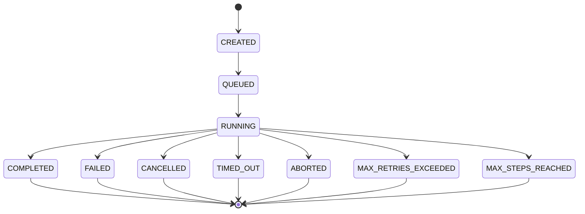
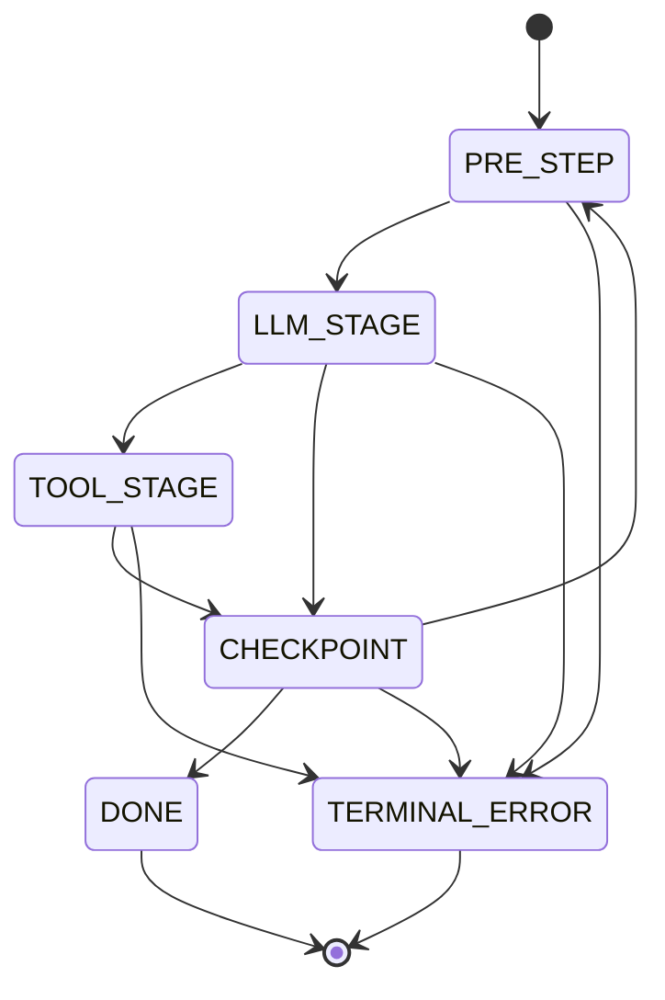
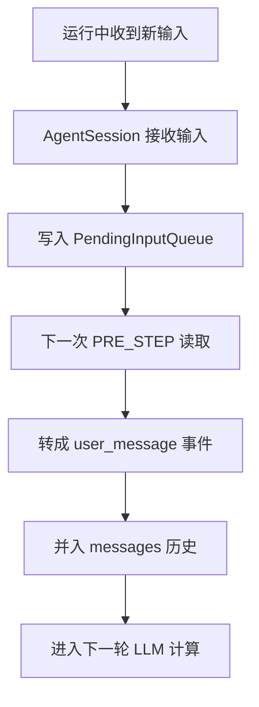
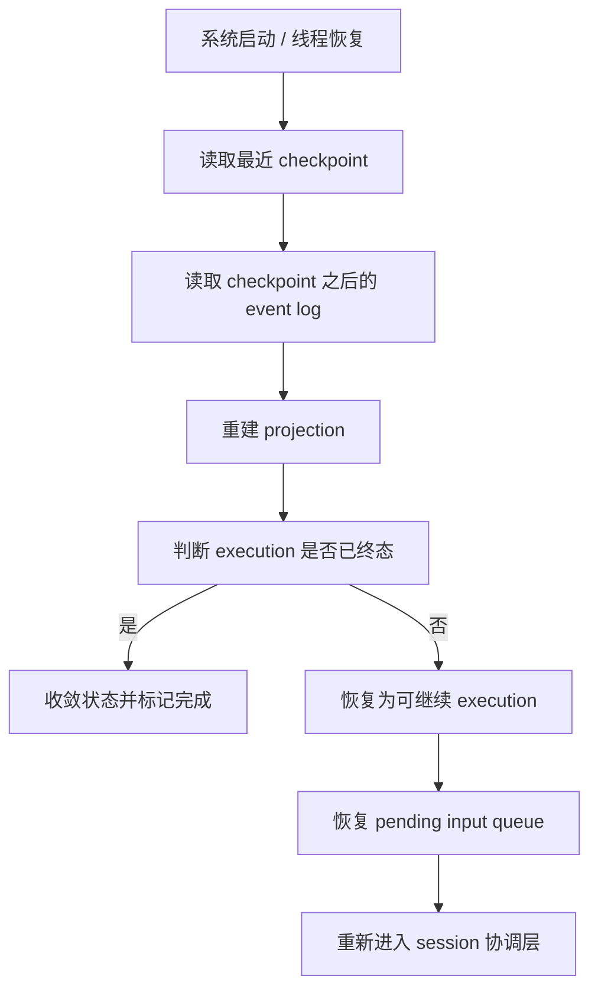

# Renx Execution 状态机与恢复机制设计

## 1. 文档目的

本文档用于定义 `renx-code` 在未来企业级演进中，execution 的状态机、事件流、checkpoint 策略、pending input 行为和恢复机制。

本文档重点回答以下问题：

1. 一次 execution 从开始到结束应经历哪些状态
2. 每个状态的进入条件、退出条件、事件输出是什么
3. 运行中插入的用户输入应该如何处理
4. checkpoint 在哪些时点落
5. 进程中断后如何恢复

本文档是以下文档的配套设计：

- [renx-enterprise-roadmap.md](D:/work/renx-code/doc/renx-enterprise-roadmap.md)
- [renx-architecture-diagram.md](D:/work/renx-code/doc/renx-architecture-diagram.md)

## 2. 基本定义

### 2.1 什么是 Execution

Execution 表示一次具体的运行实例。

它通常对应：

- 某个 conversation / thread 下的一次 turn 处理
- 一次带 executionId 的 `runStream(...)`
- 一次从输入到终态的完整控制流

Execution 不是 conversation 本身，也不是整个 thread。

### 2.2 什么是 Session

Session 表示长生命周期会话容器。

它负责：

- 管理 active execution
- 管理 pending input
- 管理 config snapshot
- 协调 kernel 与 app 层

一个 session 在时间上可以对应多次 execution。

### 2.3 什么是 Terminal Reason

Terminal reason 表示 execution 结束的语义结果，而不是仅仅表示“停了”。

建议统一 vocabulary：

- `stop`
- `max_steps`
- `error`
- `aborted`
- `timeout`
- `max_retries`
- `cancelled`

## 3. Execution 高层状态机

建议的 execution 生命周期状态如下：

说明：

- `CREATED` 表示 execution record 已创建，但尚未进入运行队列
- `QUEUED` 表示已准备执行，但还未真正进入 kernel loop
- `RUNNING` 表示已经进入主循环
- 剩余状态都属于终态

## 4. Execution 详细状态定义

## 4.1 CREATED

### 含义

execution 已分配 `executionId`，基础记录已建立，但尚未开始运行。

### 进入条件

- 外部通过 `AgentThread` / `AgentSession` 发起一次新的 run
- execution record 被创建

### 输出事件

- 可选 `execution_created`

### 可转移到

- `QUEUED`
- 极端异常下直接 `FAILED`

## 4.2 QUEUED

### 含义

execution 已准备执行，但还未真正开始 kernel 主循环。

### 进入条件

- coordinator 接收执行请求
- run registry 已标记该 execution 为待运行

### 输出事件

- 可选 `execution_queued`

### 可转移到

- `RUNNING`
- `CANCELLED`
- `FAILED`

## 4.3 RUNNING

### 含义

execution 已经进入主循环，处于 step 级推进过程中。

### 内部子阶段

建议将 `RUNNING` 进一步细化为逻辑子阶段：

- `pre_step`
- `llm`
- `tool`
- `checkpoint`
- `waiting_pending_input`
- `retry_sleep`

这几个子阶段不一定都需要作为顶层持久化状态，但在 trace / metrics 中应可区分。

## 4.4 终态定义

### COMPLETED

含义：

- 正常结束
- terminal reason 为 `stop`

### MAX_STEPS_REACHED

含义：

- 到达最大步数阈值
- terminal reason 为 `max_steps`

### FAILED

含义：

- 遇到不可恢复错误
- terminal reason 为 `error`

### ABORTED

含义：

- 外部 abort signal 生效
- terminal reason 为 `aborted`

### TIMED_OUT

含义：

- timeout budget 已耗尽
- terminal reason 为 `timeout`

### MAX_RETRIES_EXCEEDED

含义：

- 达到 retry 上限
- terminal reason 为 `max_retries`

### CANCELLED

含义：

- 被 session 或管理器主动取消
- terminal reason 为 `cancelled`

## 5. Step 级状态机

单个 execution 进入 `RUNNING` 后，内部 step 应按如下状态推进：

### PRE_STEP

职责：

- 检查 abort
- 检查 timeout budget
- 检查 retry limit
- 取出 pending input
- 进行 compaction / context usage 计算

### LLM_STAGE

职责：

- 发起 LLM 请求
- 消费流式返回
- 汇总 assistant message
- 收集 tool calls

### TOOL_STAGE

职责：

- 执行 tool calls
- 汇总 tool result message
- 推送 tool stream

### CHECKPOINT

职责：

- 更新 stepIndex
- 写 checkpoint
- 发出 checkpoint event
- 判断是否继续下一步或结束

## 6. 事件流设计

建议 execution 事件至少包含以下类型：

- `user_message`
- `assistant_message`
- `tool_call`
- `tool_result`
- `tool_stream`
- `progress`
- `checkpoint`
- `compaction`
- `metric`
- `trace`
- `done`
- `error`

### 事件发出原则

原则 1：
事件必须描述事实，不直接承担 UI 解释职责。

原则 2：
事件必须足够稳定，支持 replay 和 projection rebuild。

原则 3：
terminal 事件必须有明确 terminal reason。

### 建议的 event envelope 字段

- `executionId`
- `conversationId`
- `seq`
- `eventType`
- `createdAt`
- `stepIndex`
- `payload`
- `traceId`

## 7. Pending Input 机制

Pending input 是企业级多轮交互能力的核心。

### 7.1 行为目标

当 execution 正在运行时，用户新输入的消息不应被丢失，也不应粗暴打断当前内部状态。

正确做法是：

- session 接收输入
- 放入 pending input queue
- kernel 在 step 边界消费

### 7.2 推荐状态流

### 7.3 必须保证的语义

- pending input 只能在 step 边界被消费
- pending input 消费顺序必须稳定
- pending input 必须支持恢复后继续消费
- 追加输入与当前 active execution 必须正确绑定

### 7.4 不应采用的做法

- 直接把运行中输入粗暴插入当前 LLM request
- 让 UI 直接改写 kernel state
- 让 pending input 只存在内存中而无法恢复

## 8. Checkpoint 设计

Checkpoint 的目标不是“多存一点数据”，而是：

- 让 execution 可恢复
- 让 projection 可重建
- 让 state convergence 有锚点

### 8.1 推荐 checkpoint 写入时机

建议至少在这些时点写 checkpoint：

1. 初始 user message 已记录后
2. 每次 step 完成后
3. tool 阶段完成后
4. terminal 事件发出前

### 8.2 Checkpoint 建议字段

- `executionId`
- `conversationId`
- `checkpointSeq`
- `stepIndex`
- `lastMessageId`
- `lastEventSeq`
- `status`
- `terminalReason`
- `createdAt`

### 8.3 Checkpoint 使用原则

- checkpoint 只能描述已持久化确认的状态
- checkpoint 不应依赖内存态推断
- replay 应能从最近 checkpoint + 后续事件恢复

## 9. 恢复机制设计

## 9.1 恢复总原则

恢复机制必须以“事件历史 + checkpoint”为依据，不能以模糊的内存猜测为依据。

### 9.2 恢复流程

建议恢复流程如下：

### 9.3 必须处理的恢复场景

#### 场景 A：tool 执行期间进程退出

恢复时应：

- 检查最后成功持久化的 checkpoint
- 检查 tool 结果是否已落 event log
- 如果未落地，则按幂等策略决定是否重试或标记不确定状态

#### 场景 B：LLM 已返回但 assistant message 未完全投影

恢复时应：

- 依据 event log 是否已有 assistant message 相关事件来判断
- 避免重复插入 assistant message

#### 场景 C：pending input 已接收但主循环尚未消费

恢复时应：

- 重新加载 pending input queue
- 保证顺序不丢失

#### 场景 D：terminal 逻辑已开始但终态记录未落地

恢复时应：

- 以 event log 与 checkpoint 一致性判断当前 execution 最终状态
- 保证 terminal reason 最终收敛唯一

## 10. 失败处理策略

失败不是一个状态点，而是整个系统的一类核心路径，必须系统化。

### 10.1 可恢复失败

例如：

- provider 短暂错误
- tool 暂时不可用
- 短暂网络抖动

应走：

- `error` 事件
- retry policy
- retry sleep
- 回到下一次 step

### 10.2 不可恢复失败

例如：

- schema 严重不一致
- 关键投影不可恢复
- 核心依赖违反不变量

应走：

- terminal `FAILED`
- 明确 errorCode
- 明确 audit / diagnostics

### 10.3 失败处理原则

- 所有失败都要有 errorCode
- 所有终态都要有 terminal reason
- retry 是显式决策，不是隐式副作用
- 恢复后失败语义不能改变

## 11. App 层与状态机的协作要求

虽然状态机主要服务于 kernel 与 session，但 app 层必须遵守这些规则。

### 规则 1

App 层不得自行推断 execution 状态，必须以 session 或 checkpoint 为准。

### 规则 2

Projection 必须幂等。

### 规则 3

Terminal 事件只能收敛一次，不能由多个 app 组件重复判定。

### 规则 4

App 层失败不应直接篡改 kernel 控制流，应通过明确错误路径反馈给 session。

## 12. 实施建议

## 12.1 第一批需要先补的结构

建议先定义以下结构：

- `ExecutionStatus`
- `TerminalReason`
- `ExecutionContext`
- `CheckpointRecord`
- `PendingInputRecord`
- `SessionState`

### 12.2 第二批需要接入的机制

- pending input queue owner
- checkpoint write points
- replay rebuild path
- terminal reconciliation

### 12.3 第三批需要补齐的测试

- pending input 顺序测试
- checkpoint 正确性测试
- replay 一致性测试
- crash recovery 测试
- terminal reason 收敛测试

## 13. 验收清单

当以下条件全部成立时，可以认为 execution 状态机设计落地完成：

- execution 状态集合稳定
- 所有状态转移有明确进入与退出条件
- terminal reason 词汇表统一
- pending input 机制具备 owner、顺序与恢复能力
- checkpoint 有明确落点与消费策略
- replay 与 recovery 有测试覆盖
- app projection 与 kernel 状态机不再相互污染

## 14. 最终建议

如果没有一份正式 execution 状态机文档，项目后续最容易出现的问题是：

- 不同模块对 execution 状态理解不一致
- pending input 语义反复变化
- checkpoint 形同虚设
- recovery 只能靠“猜”

因此，企业级演进中最关键的事情之一，就是让 execution 从“代码里隐含存在”变成“文档和代码里都正式存在”的一等模型。
