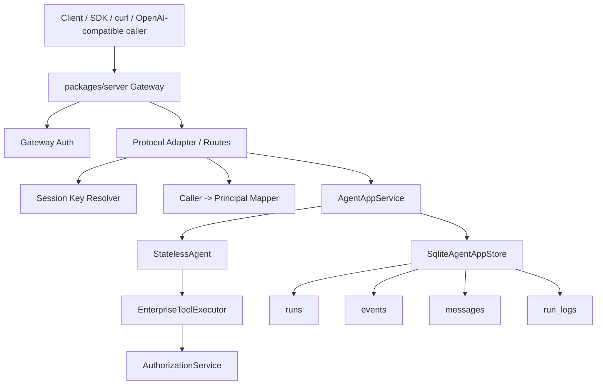
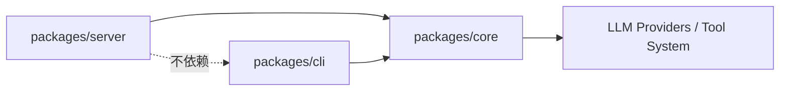
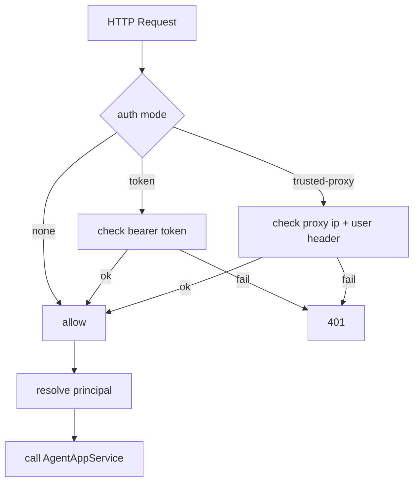
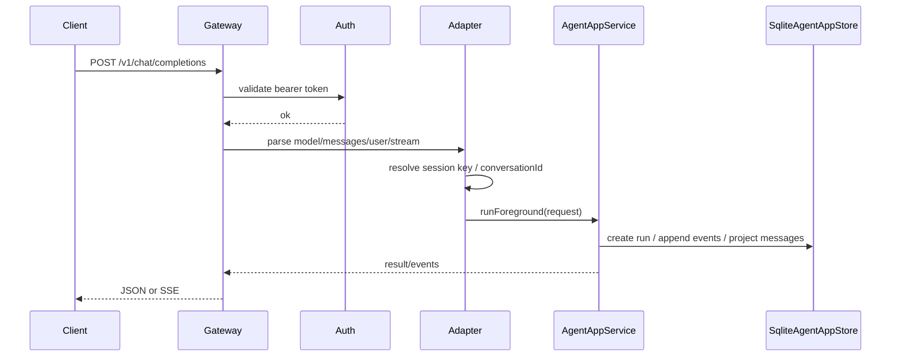
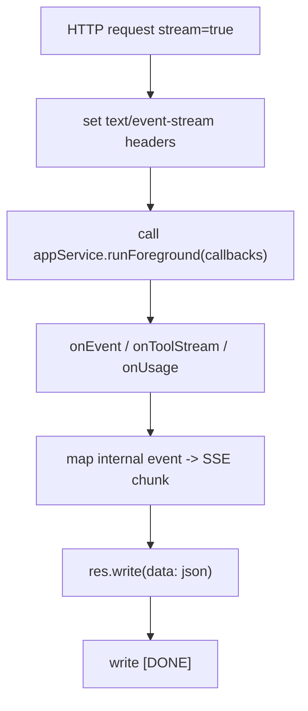
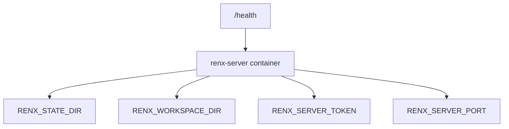
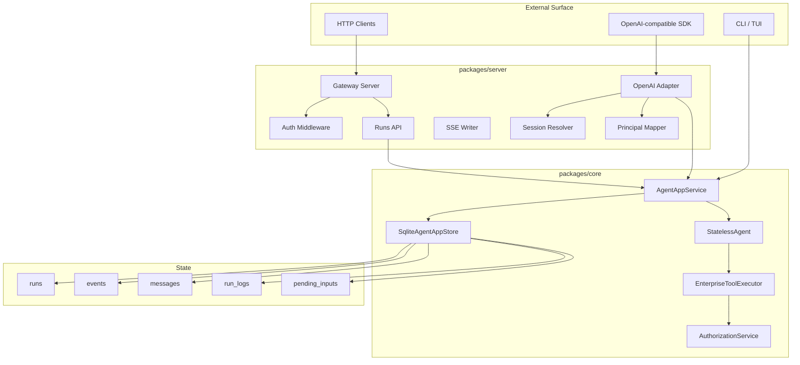

# Renx 对齐 OpenClaw 服务端实现方案

## 1. 文档目标

本文档用于回答一个非常具体的问题：

> 如果 `renx-code` 需要实现一个与 `D:\work\openclaw` 类似的服务端，应该如何设计、如何分阶段实现、每一步要落到哪些模块上。

这份方案强调两点：

- 不是泛泛而谈的架构讨论，而是可以直接指导实现的工程方案
- 不是机械复制 `openclaw`，而是基于 `renx-code` 当前已有能力，设计一条成本更低、可执行性更强的落地路径

本文档会覆盖：

- 当前 `renx-code` 已有能力
- `openclaw` 服务端的关键能力
- 两者差距
- 目标架构
- 模块设计
- API 设计
- 鉴权设计
- 会话与持久化设计
- 流式输出设计
- 分阶段实施步骤
- 测试与验收标准
- 风险与取舍

## 2. 结论先行

如果 `renx-code` 要实现一个和 `openclaw` 类似的服务端，**最正确的做法不是重写 Agent 内核**，而是：

- 保留现有 `packages/core` 里的执行内核、App Service、SQLite store、权限体系
- 新增一个独立的 `packages/server`，专门承担 HTTP Gateway / Server / Daemon 角色
- 以 `AgentAppService` 作为服务端执行入口
- 在外层补齐：
  - HTTP 路由
  - 网关鉴权
  - session key 路由
  - OpenAI 兼容接口
  - SSE 流式返回
  - 部署与运维模型

一句话概括：

> `renx-code` 已经有了“服务端内核”，缺的主要是“服务端外壳”。

## 3. 当前项目现状

### 3.1 当前项目已经具备的核心基础

`renx-code` 当前并不是一个“只有 CLI 的纯前端项目”，它已经有比较完整的 app-facing orchestration 和 persistence 基础。

关键事实：

- `packages/core/src/agent/app/agent-app-service.ts:118`
  - `AgentAppService` 已经是一个面向外部调用的应用服务层
  - 它负责 run orchestration、event append、message projection、run 状态更新、usage 回调、tool stream fan-out
- `packages/core/src/agent/app/contracts.ts:14`
  - 已有 `RunRecord`
- `packages/core/src/agent/app/contracts.ts:71`
  - 已有 `CliEvent`
- `packages/core/src/agent/app/contracts.ts:76`
  - 已有 `CliEventEnvelope`
- `packages/core/src/agent/app/contracts.ts:96`
  - 已有 `SessionSummaryRecord`
- `packages/core/src/agent/app/sqlite-agent-app-store.ts:117`
  - SQLite migration 已经覆盖 `runs`
- `packages/core/src/agent/app/sqlite-agent-app-store.ts:145`
  - SQLite migration 已经覆盖 `events`
- `packages/core/src/agent/app/sqlite-agent-app-store.ts:160`
  - SQLite migration 已经覆盖 `messages`
- `packages/core/src/agent/app/sqlite-agent-app-store.ts:185`
  - 已有 `context_messages`
- `packages/core/src/agent/app/sqlite-agent-app-store.ts:258`
  - 已有 `run_logs`
- `packages/core/src/agent/app/sqlite-agent-app-store.ts:108`
  - 已有 `pending_inputs`
- `packages/core/src/agent/app/enterprise-agent-factory.ts:128`
  - 已有 `createEnterpriseAgentAppService()` 工厂
- `packages/core/src/agent/auth/authorization-service.ts:33`
  - 已有工具执行授权服务 `AuthorizationService`

### 3.2 当前项目已经具备的服务端可复用能力

从“做服务端”这个目标出发，当前项目已经有以下可复用能力。

#### A. 执行编排能力

`AgentAppService.runForeground()` 已经具备一个服务端核心执行器需要的大部分能力：

- 创建 execution
- 写 run 状态
- 追加 event
- 投影 message
- 处理 tool stream
- 回调 usage
- 记录 terminal 状态

关键入口：

- `packages/core/src/agent/app/agent-app-service.ts:163`

这意味着：

> 未来的 HTTP 服务端不需要重新发明执行流程，只需要把 HTTP 请求转换成 `RunForegroundRequest`。

#### B. 持久化能力

当前项目已经有一个足够支撑单机服务端的 SQLite 持久化层。

核心事实：

- `packages/core/src/agent/app/sqlite-agent-app-store.ts:117`
  - `runs`
- `packages/core/src/agent/app/sqlite-agent-app-store.ts:145`
  - `events`
- `packages/core/src/agent/app/sqlite-agent-app-store.ts:160`
  - `messages`
- `packages/core/src/agent/app/sqlite-agent-app-store.ts:185`
  - `context_messages`
- `packages/core/src/agent/app/sqlite-agent-app-store.ts:207`
  - `compaction_dropped_messages`
- `packages/core/src/agent/app/sqlite-agent-app-store.ts:258`
  - `run_logs`

这套 schema 对服务端已经非常有价值，因为它天然支持：

- 会话可恢复
- 运行可查询
- 事件可回放
- 消息可投影
- 运行日志可诊断

#### C. 权限与审批能力

当前项目已经有企业化工具授权体系：

- `packages/core/src/agent/auth/authorization-service.ts:48`
- `packages/core/src/agent/auth/authorization-service.ts:129`
- `packages/core/src/agent/app/enterprise-agent-factory.ts:69`

这意味着服务端只需要补上：

- HTTP caller 的身份识别
- caller 到 `principal` 的映射

之后就可以复用现有工具授权逻辑。

#### D. 企业工具系统与运行时装配能力

当前工厂已经能够装配：

- LLM provider
- tool system
- tool executor
- agent
- app service
- sqlite store

证据：

- `packages/core/src/agent/app/enterprise-agent-factory.ts:69`
- `packages/core/src/agent/app/enterprise-agent-factory.ts:128`

也就是说，未来服务端启动时最核心的 bootstrapping 已经有了。

### 3.3 当前项目明确缺失的能力

当前项目还不是真正的常驻服务端，关键缺口主要有以下几类。

#### A. 缺 HTTP Gateway 层

仓库内未发现服务端 HTTP 入口实现；检索结果表明当前只有 provider 侧 HTTP client，而不是 HTTP server。

- `packages/core/src/providers/http/client.ts:1`

当前缺失：

- `GET /health`
- `POST /v1/chat/completions`
- `POST /api/runs`
- SSE streaming
- bearer auth middleware

#### B. 缺面向外部调用方的网关鉴权

当前 `AuthorizationService` 主要解决的是：

- tool execution authorization
- approval
- audit

它不是“HTTP API gateway auth”。

因此还缺：

- gateway token 校验
- trusted proxy 支持
- 认证失败限流
- caller identity 提取

#### C. 缺协议适配层

当前 `runForeground()` 接受的是内部对象：

- conversationId
- userInput
- principal
- tools
- config

证据：

- `packages/core/src/agent/app/agent-app-service.ts:37`

但是外部 API 传入的是：

- OpenAI messages
- stream flag
- model
- user
- headers

因此必须新增一个协议适配层，把外部协议转成内部 request。

#### D. 缺长期运行服务模型

当前项目更像：

- library + CLI/TUI app

还不像：

- daemon
- gateway
- web service

因此还缺：

- 服务启动入口
- 环境变量配置
- 状态目录约束
- workspace 路径约束
- health / readiness
- Docker / 持久化卷

## 4. OpenClaw 服务端值得借鉴的地方

### 4.1 OpenClaw 的定位

`openclaw` 的根描述明确表明它是一个多通道 AI gateway：

- `D:\work\openclaw\package.json:4`

其部署模型也明确是一个可长期运行的 web service：

- `D:\work\openclaw\render.yaml:1`

### 4.2 OpenClaw 的 OpenAI 兼容 HTTP 接口

`openclaw` 明确提供 OpenAI 兼容的 HTTP 接口：

- `D:\work\openclaw\docs\gateway\openai-http-api.md:10`
- `D:\work\openclaw\docs\gateway\openai-http-api.md:14`

并且文档明确说明：

- 请求走和正常 Gateway agent run 一样的代码路径

证据：

- `D:\work\openclaw\docs\gateway\openai-http-api.md:17`

对应实现入口：

- `D:\work\openclaw\src\gateway\openai-http.ts:408`

非流式执行调用 agent：

- `D:\work\openclaw\src\gateway\openai-http.ts:483`

流式执行调用 agent：

- `D:\work\openclaw\src\gateway\openai-http.ts:563`

这说明 `openclaw` 的核心设计思想是：

> HTTP endpoint 只是 gateway surface，真正执行仍然走统一的 agent runtime。

这点非常适合 `renx-code` 借鉴。

### 4.3 OpenClaw 的网关鉴权模型

`openclaw` 已有比较完整的 gateway auth 模型：

- `D:\work\openclaw\src\gateway\auth.ts:285`
  - 配置校验
- `D:\work\openclaw\src\gateway\auth.ts:369`
  - 统一 authorize 流程
- `D:\work\openclaw\src\gateway\auth.ts:439`
  - token 模式
- `D:\work\openclaw\src\gateway\auth.ts:457`
  - password 模式
- `D:\work\openclaw\src\gateway\auth.ts:382`
  - trusted-proxy 模式

同时它明确把这个 HTTP 接口视作高权限 operator access surface：

- `D:\work\openclaw\docs\gateway\openai-http-api.md:31`

这是一个非常关键的设计边界，`renx-code` 应该直接继承这个思路。

### 4.4 OpenClaw 的流式输出模型

OpenClaw 的 OpenAI 兼容接口支持 SSE：

- `D:\work\openclaw\docs\gateway\openai-http-api.md:97`
- `D:\work\openclaw\src\gateway\openai-http.ts:510`

说明它做了以下事情：

- 设置 `text/event-stream`
- 将内部 agent 事件转换为 SSE chunk
- 输出 `[DONE]`

对 `renx-code` 来说，这一层完全可以独立实现，不需要改动核心执行内核。

### 4.5 OpenClaw 的部署与运维模型

`render.yaml` 中的配置说明 OpenClaw 服务端有几个非常明确的运行时边界：

- `PORT`
- `OPENCLAW_STATE_DIR`
- `OPENCLAW_WORKSPACE_DIR`
- `OPENCLAW_GATEWAY_TOKEN`

证据：

- `D:\work\openclaw\render.yaml:7`

这对 `renx-code` 很有启发：

> 未来服务端一定要有明确的 state dir、workspace dir、gateway token，而不能依赖 CLI 默认行为。

## 5. 为什么不能直接复制 OpenClaw

虽然 `openclaw` 很值得借鉴，但不能直接整体复制，原因有三点。

### 5.1 范围过大

`openclaw` 的目标是多通道 gateway：

- 有大量 channel / extension / gateway / hook / browser relay 能力
- 有比当前 `renx-code` 更大的生态范围

如果机械复制，会把项目复杂度一次性拉高。

### 5.2 当前项目已有自己的强项

`renx-code` 当前的优势在于：

- 执行内核更清晰
- app service 已经存在
- SQLite run/event/message 投影已经比较集中
- 工具授权体系已经可复用

所以最优路径不是“照搬 openclaw 目录结构”，而是：

- 保留现有核心
- 在外围增建 gateway/server

### 5.3 当前真正缺的是外层，不是内核

服务端的主要新增工作应该放在：

- transport
- auth
- API surface
- SSE
- deployment

而不是：

- 重新设计 agent kernel
- 重新设计 tool executor
- 重新设计 store schema

## 6. 目标架构

### 6.1 总体架构图



这个图表达的核心思想是：

- 服务端是一个新 outer layer
- `AgentAppService` 仍然是执行入口
- store 和 auth 继续复用 `packages/core`
- HTTP server 不直接碰 agent 内部细节

### 6.2 推荐包结构

推荐新增 `packages/server`：

```text
packages/server/
  src/
    index.ts
    config/
      env.ts
      schema.ts
    gateway/
      server.ts
      auth.ts
      context.ts
      errors.ts
      sse.ts
      openai-http.ts
      routes/
        health.ts
        runs.ts
        sessions.ts
    runtime/
      app-service.ts
      principal.ts
      session-key.ts
      response-text.ts
    tests/
      auth.test.ts
      health.test.ts
      runs.test.ts
      openai-http.test.ts
      sse.test.ts
```

分工建议：

- `packages/core`
  - 保留内核、app service、store、auth、tools
- `packages/cli`
  - 继续做 TUI/CLI
- `packages/server`
  - 做 HTTP/Gateway/Daemon

### 6.3 依赖方向



约束原则：

- `server` 可以依赖 `core`
- `cli` 可以依赖 `core`
- `server` 不应该依赖 `cli`
- `core` 不应该反向依赖 `server`

这样可以保证服务端只是一个 transport surface，而不是把 CLI 逻辑嵌进去。

## 7. 目标能力清单

未来的 `renx` 服务端最小可用能力应该包含：

### 7.1 MVP 能力

- `GET /health`
- `POST /api/runs`
- `GET /api/runs/:executionId`
- `GET /api/sessions`
- bearer token 鉴权
- SQLite state dir
- 基于 `AgentAppService` 执行一次请求

### 7.2 第二阶段能力

- `POST /v1/chat/completions`
- 支持 OpenAI 兼容请求体
- 支持 `stream: true`
- SSE 输出
- 支持 `user -> session key`

### 7.3 第三阶段能力

- `GET /api/conversations/:conversationId/events`
- `POST /api/runs/:executionId/input`
- trusted-proxy auth
- rate limiting
- Docker / deployment support

## 8. 详细实现方案

## 8.1 服务启动与装配

### 目标

服务端启动时，需要完成以下装配：

1. 加载 env/config
2. 解析 state dir 和 workspace dir
3. 初始化 LLM provider
4. 初始化 sqlite store
5. 调用 `createEnterpriseAgentAppService()`
6. 启动 HTTP server

### 推荐实现

新增：

- `packages/server/src/index.ts`
- `packages/server/src/runtime/app-service.ts`

职责建议：

#### `index.ts`

负责：

- 读取配置
- 创建 app composition
- 创建 HTTP server
- 监听端口

#### `runtime/app-service.ts`

负责：

- 调 `createEnterpriseAgentAppService()`
- 统一封装服务端运行所需依赖

应复用的核心入口：

- `packages/core/src/agent/app/enterprise-agent-factory.ts:128`

### 推荐伪代码

```ts
const composition = createEnterpriseAgentAppService({
  llmProvider,
  storePath,
  toolExecutorOptions: {
    workingDirectory: workspaceDir,
  },
});

const server = createGatewayServer({
  appService: composition.appService,
  store: composition.store,
  config,
});
```

## 8.2 配置模型

### 目标

把服务端运行时需要的配置显式收口，而不是依赖 CLI 默认值。

### 建议环境变量

```text
RENX_SERVER_HOST=0.0.0.0
RENX_SERVER_PORT=8080
RENX_GATEWAY_AUTH_MODE=token
RENX_SERVER_TOKEN=...
RENX_STATE_DIR=/data/renx
RENX_WORKSPACE_DIR=/data/workspace
RENX_ENABLE_OPENAI_COMPAT=true
RENX_LOG_LEVEL=info
```

### 推荐实现

新增：

- `packages/server/src/config/env.ts`
- `packages/server/src/config/schema.ts`

职责：

- 解析 env
- 提供默认值
- 校验非法配置
- 统一返回 `ServerConfig`

### 配置接口建议

```ts
export interface ServerConfig {
  host: string;
  port: number;
  authMode: 'none' | 'token' | 'trusted-proxy';
  token?: string;
  stateDir: string;
  workspaceDir: string;
  enableOpenAiCompat: boolean;
  logLevel: 'debug' | 'info' | 'warn' | 'error';
}
```

## 8.3 网关鉴权

### 目标

把“谁可以调用服务端”与“调用后工具权限如何判定”分成两层：

- gateway auth：先判断能不能进服务端
- tool auth：进来以后，工具执行继续走现有授权体系

### 第一阶段建议

只做三种模式：

- `none`
- `token`
- `trusted-proxy`

不建议第一版就做：

- 复杂 password 模式
- OAuth
- 细粒度 end-user scope

### 推荐设计图



### 推荐实现文件

- `packages/server/src/gateway/auth.ts`
- `packages/server/src/gateway/context.ts`

### 与当前项目的衔接方式

鉴权成功后，生成内部 principal 并传给：

- `packages/core/src/agent/app/agent-app-service.ts:41`

### Principal 映射建议

```ts
export interface GatewayPrincipal {
  principalId: string;
  tenantId: string;
  workspaceId: string;
  displayName?: string;
  source: 'gateway-token' | 'trusted-proxy' | 'local';
}
```

默认映射建议：

- token 模式
  - `principalId = operator`
  - `tenantId = default`
  - `workspaceId = default`
- trusted proxy 模式
  - `principalId = proxyUser`
  - `tenantId = default`
  - `workspaceId = default`

## 8.4 Session / Conversation 路由

### 目标

外部调用通常不会直接知道内部 `conversationId`，因此服务端必须新增“请求上下文到会话 ID”的映射层。

### 当前项目现状

当前 `runForeground()` 需要显式传：

- `conversationId`

证据：

- `packages/core/src/agent/app/agent-app-service.ts:38`

### 推荐策略

#### 方案 A：MVP 简化方案

- 客户端显式传 `conversationId`
- 如果没传，服务端创建随机 `conversationId`

适合：

- `POST /api/runs`

#### 方案 B：OpenAI 兼容方案

- 如果请求包含 `user`
  - 将 `user` 转成稳定 session key
- 如果没有 `user`
  - 每次新建会话

这与 OpenClaw 文档思路一致：

- `D:\work\openclaw\docs\gateway\openai-http-api.md:91`
- `D:\work\openclaw\docs\gateway\openai-http-api.md:95`

### 推荐实现文件

- `packages/server/src/runtime/session-key.ts`

### 推荐做法

第一版可以直接：

- `conversationId = sha1(user)` 或 `conv_${hash}`

第二版再引入专门的 `session_key -> conversation_id` 映射表。

## 8.5 OpenAI 兼容接口

### 目标

提供一个与常见 AI SDK 兼容的最小 HTTP 接口：

- `POST /v1/chat/completions`

### 为什么优先做它

因为它能带来两个直接收益：

- 现成 SDK 和工具更容易接入
- 你能很快把 `renx` 服务端变成一个标准 AI endpoint

### 实现原则

像 OpenClaw 一样：

- HTTP endpoint 只是协议面
- 真正执行仍然走统一 app service

OpenClaw 对应事实：

- `D:\work\openclaw\src\gateway\openai-http.ts:408`
- `D:\work\openclaw\src\gateway\openai-http.ts:483`

### 请求处理流程图



### 推荐实现文件

- `packages/server/src/gateway/openai-http.ts`
- `packages/server/src/runtime/response-text.ts`

### 关键内部步骤

1. 解析 `messages`
2. 找到 active user message
3. 提取 prompt text
4. 解析 `stream`
5. 生成 `conversationId`
6. 构建 `RunForegroundRequest`
7. 调 `appService.runForeground()`
8. 把结果转换成 OpenAI 响应

### 非流式返回建议

```json
{
  "id": "chatcmpl_xxx",
  "object": "chat.completion",
  "created": 1710000000,
  "model": "renx",
  "choices": [
    {
      "index": 0,
      "message": {
        "role": "assistant",
        "content": "..."
      },
      "finish_reason": "stop"
    }
  ],
  "usage": {
    "prompt_tokens": 0,
    "completion_tokens": 0,
    "total_tokens": 0
  }
}
```

### 响应文本提取建议

新增 `response-text.ts`，统一从 message/event 中提取最终文本，避免 HTTP 层理解过多内部消息结构。

## 8.6 SSE 流式输出

### 目标

支持：

- `stream: true`
- `Content-Type: text/event-stream`
- 按 SSE chunk 返回
- 结束时输出 `[DONE]`

### 当前项目的可复用基础

`AgentAppService` 已经支持：

- `onEvent`
- `onToolStream`
- `onUsage`

证据：

- `packages/core/src/agent/app/agent-app-service.ts:66`

因此服务端只需要把内部事件转成 SSE，而不是改动 agent 内核。

### 推荐实现文件

- `packages/server/src/gateway/sse.ts`
- `packages/server/src/gateway/openai-http.ts`

### 推荐实现策略

#### 第一阶段

- assistant 结果一旦完整生成，就输出一个内容 chunk
- 不强求 token 级 delta

#### 第二阶段

- 如果内部 event 能更细粒度地区分 assistant 增量，则逐步输出 delta chunk

### SSE 流程图



### 注意点

- `tool_stream` 是否暴露给外部客户端，需要单独策略
- 第一版建议：
  - 只向 OpenAI 兼容接口暴露 assistant content
  - tool detail 留在内部 event store

## 8.7 Runs / Sessions 查询接口

### 目标

把现有已有的 run/event/message 持久化能力暴露为服务端可查询 API。

### 推荐接口

- `GET /api/runs`
- `GET /api/runs/:executionId`
- `GET /api/conversations/:conversationId/events`
- `GET /api/sessions`

### 为什么这部分适合先做

因为当前项目已有明确 contracts：

- `packages/core/src/agent/app/contracts.ts:58`
- `packages/core/src/agent/app/contracts.ts:85`
- `packages/core/src/agent/app/contracts.ts:96`
- `packages/core/src/agent/app/contracts.ts:110`

相比之下，这部分比 OpenAI 兼容还更接近你当前存储模型。

### 推荐实现文件

- `packages/server/src/gateway/routes/runs.ts`
- `packages/server/src/gateway/routes/sessions.ts`

## 8.8 Append Input / 长运行交互

### 目标

把当前已有的“向活动 run 追加用户输入”能力开放成服务端 API。

现有入口：

- `packages/core/src/agent/app/agent-app-service.ts:126`

### 推荐接口

- `POST /api/runs/:executionId/input`

请求体建议：

```json
{
  "conversationId": "conv_xxx",
  "userInput": "继续执行这个任务"
}
```

### 这一步的意义

有了它，服务端就不只是“一问一答 API”，而是具备：

- 运行中继续投喂输入
- 长时任务交互
- 半实时控制 run

这会让 `renx` 的服务端能力明显更接近真正的 agent service。

## 8.9 数据与存储演进策略

### 当前建议

第一阶段继续使用现有 SQLite store，不要过早切 Postgres。

原因：

- schema 已经比较完整
- store ports 已存在
- MVP 成本最低

### 中期建议

当出现以下需求时，再考虑引入 Postgres：

- 多实例部署
- 更高并发写入
- 跨实例会话查询
- 统一多租户持久化

### 当前最重要的原则

> 先复用 `SqliteAgentAppStore` 跑通服务端，再考虑替换底层存储。

## 8.10 部署模型

### 最小部署目标

新增服务端后，至少要支持：

- Docker 启动
- 持久卷挂载 state dir
- 明确的 workspace dir
- 明确的 gateway token
- `/health` 健康检查

### 推荐目录与环境边界

```text
/data/renx-state
/data/workspace
```

### 推荐运行模型



### 为什么这是必要的

如果没有明确 state/workspace/token，服务端就会退化成“把 CLI 放到网络上”，这在安全和运维上都不可接受。

## 9. 推荐实施顺序

## 9.1 Phase 0：架构落地准备

### 目标

明确服务端只做单租户 operator gateway，不做多用户平台。

### 要做的事

- 明确 `packages/server` 包结构
- 定义 `ServerConfig`
- 定义 `GatewayPrincipal`
- 定义 API error shape
- 定义 auth mode

### 交付物

- `packages/server` skeleton
- 基础 README / ADR

### 验收标准

- 能编译
- 目录清晰
- 不影响 `packages/cli`

## 9.2 Phase 1：最小 HTTP 服务

### 目标

先跑通最小服务端执行链路。

### 范围

- `GET /health`
- `POST /api/runs`
- `GET /api/runs/:executionId`

### 关键任务

- 建立 server bootstrap
- 用 `createEnterpriseAgentAppService()` 装配 app service
- 将 JSON 请求转成 `RunForegroundRequest`
- 返回 run 结果

### 验收标准

- curl 能调用
- SQLite 中可见 run/event/message
- 返回体结构稳定

## 9.3 Phase 2：Bearer Token 鉴权

### 目标

让服务端可安全暴露在受控网络中。

### 范围

- `Authorization: Bearer <token>`
- token mismatch -> `401`
- 缺 token -> `401`

### 验收标准

- 未授权请求无法执行 run
- 授权请求可正常执行 run

## 9.4 Phase 3：OpenAI 兼容接口

### 目标

接入主流 AI 生态。

### 范围

- `POST /v1/chat/completions`
- 解析 OpenAI `messages`
- 输出非流式 JSON

### 验收标准

- 使用 curl / SDK 可成功调用
- 相同 `user` 可复用会话

## 9.5 Phase 4：SSE 流式

### 目标

支持 `stream: true`。

### 范围

- SSE headers
- chunk 输出
- `[DONE]`

### 验收标准

- 客户端能实时收到增量或分段响应
- 连接关闭时服务端能正确清理

## 9.6 Phase 5：高级能力

### 范围

- trusted-proxy auth
- `POST /api/runs/:executionId/input`
- `GET /api/conversations/:conversationId/events`
- deployment / Docker
- rate limiting

### 验收标准

- 支持长时任务追加输入
- 支持运行事件查询
- 支持容器化部署

## 10. 文件级实施建议

## 10.1 新增文件

推荐新增以下文件：

```text
packages/server/src/index.ts
packages/server/src/config/env.ts
packages/server/src/config/schema.ts
packages/server/src/gateway/server.ts
packages/server/src/gateway/auth.ts
packages/server/src/gateway/context.ts
packages/server/src/gateway/errors.ts
packages/server/src/gateway/sse.ts
packages/server/src/gateway/openai-http.ts
packages/server/src/gateway/routes/health.ts
packages/server/src/gateway/routes/runs.ts
packages/server/src/gateway/routes/sessions.ts
packages/server/src/runtime/app-service.ts
packages/server/src/runtime/principal.ts
packages/server/src/runtime/session-key.ts
packages/server/src/runtime/response-text.ts
```

## 10.2 可能需要在 core 增补的点

建议优先新增 helper，而不是大改现有核心类：

### A. response text helper

动机：

- HTTP 层需要稳定获取 assistant 最终文本
- 不应该让 gateway 层理解太多内部 message 结构

建议位置：

- `packages/core/src/agent/app/` 或 `packages/server/src/runtime/response-text.ts`

### B. event projection facade

动机：

- 未来 HTTP 查询接口不应直接拼装太多 store 细节

### C. session key facade

动机：

- 为 OpenAI `user` / 自定义 session key / conversationId 提供统一解析逻辑

## 11. 测试计划

### 11.1 单元测试

必须覆盖：

- auth token 校验
- trusted-proxy user 提取
- session key 解析
- OpenAI request -> internal request 适配
- SSE chunk formatter
- response text 提取

### 11.2 集成测试

必须覆盖：

- `GET /health`
- `POST /api/runs`
- `GET /api/runs/:executionId`
- `POST /v1/chat/completions`
- `POST /v1/chat/completions` + `stream: true`

### 11.3 存储回归测试

必须验证：

- run 被写入 `runs`
- event 被写入 `events`
- message 被写入 `messages`
- usage / log 被正确记录

## 12. 风险与取舍

### 12.1 不要一开始就做多租户

原因：

- 当前项目的授权体系虽然有 principal / tenant / workspace 概念，但 HTTP caller 隔离模型还没成型
- 一开始做多租户会把问题从“服务端接入”升级成“平台设计”

建议：

- 第一阶段只做 operator gateway

### 12.2 不要一开始就做 WebSocket

原因：

- 当前已有 event callback，SSE 更容易落地
- WebSocket 会把订阅、重连、双向协议复杂度一起引入

建议：

- 先做 SSE

### 12.3 不要一开始就切数据库

原因：

- 现有 SQLite schema 已经能支撑 MVP
- 先做 Postgres 会显著扩大改动面

建议：

- Phase 1~3 继续用 SQLite

### 12.4 不要让 HTTP gateway 直接操作 tool runtime

原因：

- 这样会绕过现有 `AgentAppService` 的 event/store/projection 逻辑
- 容易出现 CLI 路径和服务端路径行为漂移

建议：

- 所有服务端执行都必须经过 `AgentAppService`

## 13. 推荐的最小落地蓝图

如果只允许做一版最小可用服务端，推荐如下：

### 第一步

实现：

- `packages/server`
- `GET /health`
- `POST /api/runs`

目标：

- 跑通 HTTP -> app service -> sqlite

### 第二步

实现：

- bearer token auth
- `GET /api/runs/:executionId`
- `GET /api/sessions`

目标：

- 让服务端具备安全入口和可观测查询

### 第三步

实现：

- `POST /v1/chat/completions`
- 非流式返回

目标：

- 快速接入外部生态

### 第四步

实现：

- SSE streaming
- `stream: true`

目标：

- 让服务端具备现代 AI endpoint 能力

### 第五步

实现：

- `POST /api/runs/:executionId/input`
- conversation events 查询
- trusted-proxy
- Docker

目标：

- 让服务端从“一次性 API”变成“长时运行 agent service”

## 14. 最终架构理解图



这个图背后的核心决策是：

- CLI 路径继续存在
- 新服务端只是新增一个外层入口
- `AgentAppService` 成为 CLI 和 HTTP 的共同执行中枢
- 所有状态继续落在统一 store

## 15. 一句话实施建议

最优实施路线是：

> 新建 `packages/server`，以 `AgentAppService` 为统一执行入口，补齐 HTTP 路由、gateway auth、session key、OpenAI 兼容接口和 SSE，而不是重写 Agent 内核或复制 OpenClaw 的全部 Gateway 生态。

---

如果你接下来要真正开始实现，最推荐的下一步不是直接开写全部代码，而是先输出两份更细的工程文档：

1. `packages/server` 文件级脚手架清单
2. Phase 1 的接口与函数签名设计文档

这样你就可以按文件逐个实现，而不是在大方案里来回跳转。
