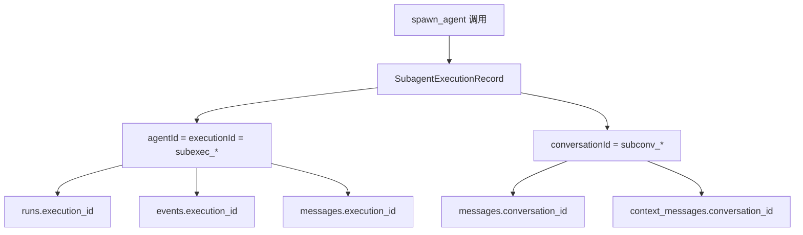
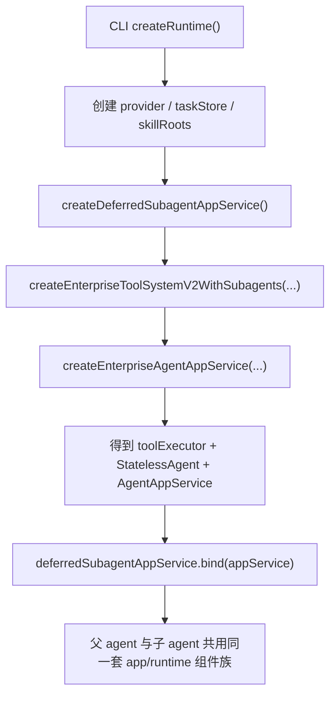
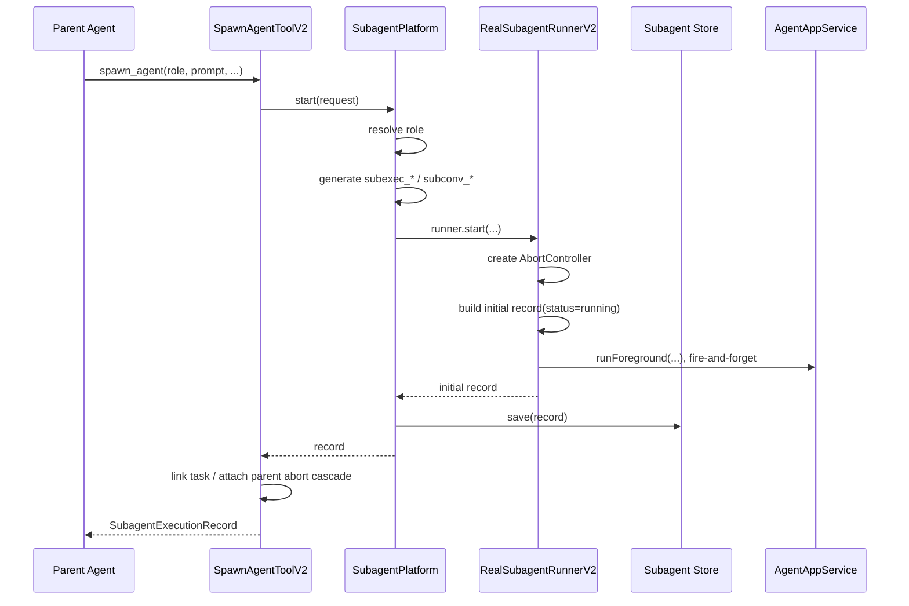
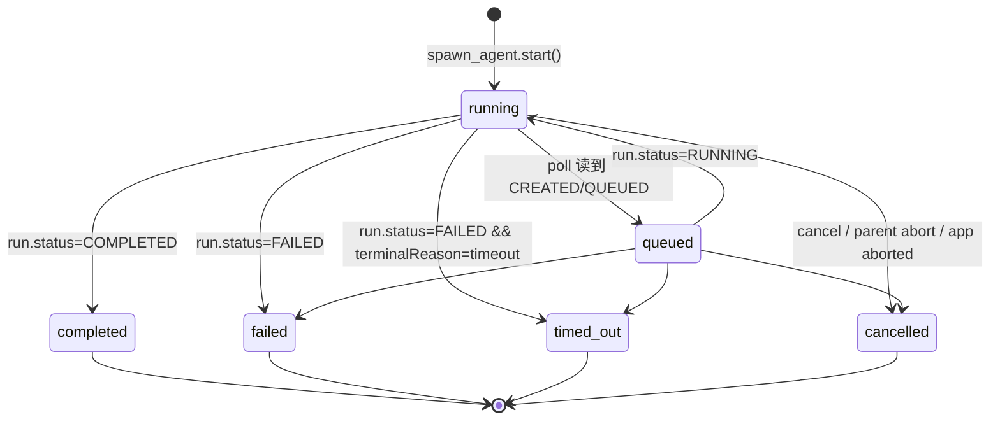
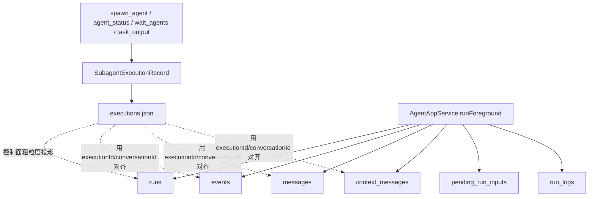
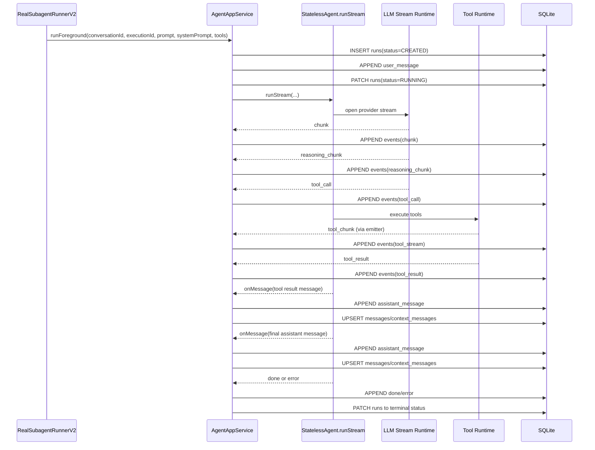
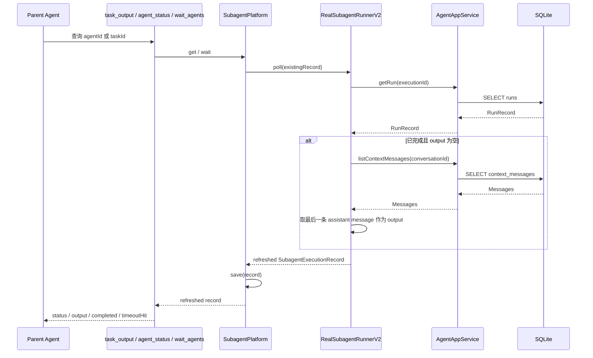
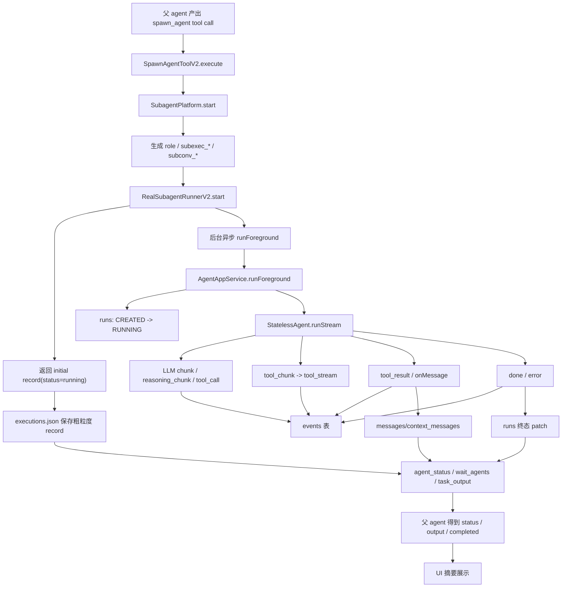

# 子 Agent 机制深度分析

## 1. 文档目的

本文针对当前仓库中的子 agent 实现做一次“代码级、运行时级、存储级、UI 级”的完整拆解，重点回答以下问题：

1. 子 agent 是如何创建的。
2. 子 agent 真正是如何执行的。
3. 子 agent 的生命周期状态如何流转。
4. 子 agent 的消息、事件、状态分别存储在哪里。
5. 子 agent 的消息在 UI 里是如何显示的。
6. 子 agent 是否支持实时流式输出，以及流式输出具体怎么走。
7. 外部如何获取子 agent 的执行 message。
8. 如何判断子 agent 已经执行完成。
9. 主 agent 如何拿到子 agent 的执行结果。
10. 当前实现有哪些边界、缺口和“表面看起来有、实际上还没真正接通”的能力。

本文基于当前仓库实现，不讨论外部产品形态，不推测未落地的未来设计。所有结论都以仓库代码为准。

---

## 2. 一句话结论

当前仓库里的子 agent 不是独立的一套运行时，而是 `tool-v2` 在工具层把同一套 `StatelessAgent + EnterpriseToolExecutor + AgentAppService + SQLite store` 递归复用了一次。

它有两套并行但职责不同的数据体系：

1. **控制面投影**
   - 由 `spawn_agent / agent_status / wait_agents / cancel_agent / task_output` 驱动。
   - 通过 `SubagentExecutionRecord` 表达子 agent 的粗粒度状态。
   - 默认存到 `~/.renx/tool-v2/agents/executions.json`。

2. **真实执行面**
   - 由 `AgentAppService.runForeground(...)` 驱动。
   - 真正的 run、event、message、tool stream、终态都落到 SQLite。
   - 默认存到 `~/.renx/data.db`。

这两套体系的关系是：

- `SubagentExecutionRecord` 负责“我有一个子 agent 运行中 / 已完成 / 失败了”
- SQLite 负责“这个子 agent 在运行过程中到底产生了哪些事件、哪些消息、哪些工具输出”

因此，**子 agent 的执行状态**和**子 agent 的真实消息流**并不在同一份存储里。

---

## 3. 核心结论先看

如果你只想先抓住最重要的事实，先看这一节。

### 3.1 子 agent 的本质

子 agent 并不是一个额外的服务，不是独立进程，不是单独的线程管理器，也不是另一套“专门为 delegation 做的 runtime”。

它的真实本质是：

1. 父 agent 通过 `spawn_agent` 发起一个工具调用。
2. `tool-v2` 创建一个新的 `conversationId` 和 `executionId`。
3. `RealSubagentRunnerV2` 在后台调用同一个 `AgentAppService.runForeground(...)`。
4. 这次新的 `runForeground(...)` 拥有自己的 conversation、run、events、messages。
5. 父 agent 之后通过 `agent_status` / `wait_agents` / `task_output` 去轮询和读取结果。

### 3.2 当前实现不是“父子实时流式串流”

这一点非常关键。

**父 agent 当前不会实时收到子 agent 的内部 token 流、chunk 流、tool stream 流。**

父 agent 在当前对话里看到的是：

1. `spawn_agent` 这个工具调用本身的启动结果。
2. 随后通过 `agent_status` / `wait_agents` / `task_output` 查询出来的状态和最终 output 摘要。

父 agent 当前不会自动看到：

1. 子 agent 的 `chunk`
2. 子 agent 的 `reasoning_chunk`
3. 子 agent 的 `tool_stream`
4. 子 agent 的完整中间事件序列

这些真实流都在子 agent 自己的 run 里，被 `AgentAppService` 写入 SQLite，但没有桥接回父会话 UI。

### 3.3 `runInBackground` 目前基本是“展示字段”

`spawn_agent` 的 schema 里有 `runInBackground`，UI 展示里也会显示 `background` 或 `foreground`。

但是当前代码路径里：

- 没有发现 `runInBackground` 改变实际执行方式的逻辑
- `RealSubagentRunnerV2.start(...)` 一律都是“立即返回 initial record + 后台 fire-and-forget 调 `runForeground(...)`”

因此在当前实现中，`runInBackground` 更像是：

- 输入 schema 的一部分
- metadata / UI 摘要的一部分

而不是一个真正改变子 agent 调度语义的开关。

### 3.4 当前仓库没有完整的“子 agent 交互协议”

当前实现里有：

- `spawn_agent`
- `agent_status`
- `wait_agents`
- `cancel_agent`
- `task_output`
- `task_stop`

但没有在 `tool-v2` 层提供：

- `send_input`
- `resume_agent`
- `close_agent`
- “父会话直接订阅子会话事件流”

底层 `AgentAppService` 是有 `appendUserInputToRun(...)` 的，但并没有暴露成一套完整的子 agent 会话交互工具。

---

## 4. 关键源码地图

下面是理解整套子 agent 机制最关键的文件。

| 角色                         | 文件                                                        |
| ---------------------------- | ----------------------------------------------------------- |
| 子 agent 创建工具入口        | `packages/core/src/agent/tool-v2/handlers/spawn-agent.ts`   |
| 子 agent 平台抽象            | `packages/core/src/agent/tool-v2/agent-runner.ts`           |
| 子 agent 真实 runner         | `packages/core/src/agent/tool-v2/agent-real-runner.ts`      |
| 子 agent 粗粒度 store        | `packages/core/src/agent/tool-v2/agent-store.ts`            |
| 子 agent 状态 / 输出查询工具 | `packages/core/src/agent/tool-v2/handlers/agent-status.ts`  |
| 子 agent 等待工具            | `packages/core/src/agent/tool-v2/handlers/wait-agents.ts`   |
| 子 agent 取消工具            | `packages/core/src/agent/tool-v2/handlers/cancel-agent.ts`  |
| 兼容任务视图输出             | `packages/core/src/agent/tool-v2/handlers/task-output.ts`   |
| linked task 状态同步         | `packages/core/src/agent/tool-v2/task-orchestration.ts`     |
| parent abort 级联取消        | `packages/core/src/agent/tool-v2/task-parent-abort.ts`      |
| 子 agent role 定义           | `packages/core/src/agent/tool-v2/agent-roles.ts`            |
| tool-v2 builtins 注册        | `packages/core/src/agent/tool-v2/builtins.ts`               |
| tool-v2 registry             | `packages/core/src/agent/tool-v2/registry.ts`               |
| CLI 运行时组装入口           | `packages/cli/src/agent/runtime/runtime.ts`                 |
| app service 前台执行入口     | `packages/core/src/agent/app/agent-app-service.ts`          |
| SQLite store                 | `packages/core/src/agent/app/sqlite-agent-app-store.ts`     |
| LLM 流处理                   | `packages/core/src/agent/agent/llm-stream-runtime.ts`       |
| agent 主循环                 | `packages/core/src/agent/agent/run-loop.ts`                 |
| tool 执行期事件桥接          | `packages/core/src/agent/agent/tool-runtime-execution.ts`   |
| UI 流式事件转 segment        | `packages/cli/src/hooks/agent-event-handlers.ts`            |
| UI turn/segment 更新         | `packages/cli/src/hooks/turn-updater.ts`                    |
| UI 工具分组展示              | `packages/cli/src/components/chat/segment-groups.ts`        |
| UI 子 agent 结果摘要展示     | `packages/cli/src/components/chat/assistant-tool-group.tsx` |

---

## 5. 术语与 ID 关系

理解 ID 关系非常重要，否则后面看存储和查询路径会混乱。

### 5.1 `agentId`

`SubagentExecutionRecord` 里的主键型字段。

当前实现里，`agentId` 实际上等于 `executionId`，因为 `RealSubagentRunnerV2.start(...)` 直接写成：

```ts
agentId: request.executionId,
executionId: request.executionId,
```

所以在当前仓库里：

- `agentId === executionId`

这不是抽象层面必须如此，而是当前实现选择如此。

### 5.2 `executionId`

代表一次 agent run 的唯一执行 ID。

对子 agent 来说，`SubagentPlatform.start(...)` 会生成：

- `subexec_${uuid}`

它用于：

- SQLite `runs` 主键
- SQLite `events.execution_id`
- SQLite `messages.execution_id`
- SQLite `context_messages.execution_id`
- `RealSubagentRunnerV2.liveRuns` map key

### 5.3 `conversationId`

代表子 agent 自己那条对话上下文链。

对子 agent 来说，`SubagentPlatform.start(...)` 会生成：

- `subconv_${uuid}`

它用于：

- 隔离子 agent 的上下文消息
- 从 `context_messages` 回读子 agent 的最终 assistant 输出
- 区分父会话和子会话

### 5.4 三者关系

在当前实现里，一次子 agent 运行可以理解为：

- 一个 `SubagentExecutionRecord`
- 一个 `executionId`
- 一个 `conversationId`
- 一组 SQLite 事件和消息

关系图如下：



---

## 6. 整体架构：控制面、数据面、展示面

这套机制建议按三层理解。

### 6.1 控制面

控制面回答的是：

- 如何创建子 agent
- 如何查询状态
- 如何等待完成
- 如何取消
- 如何把 run 和 task 关联起来

主要组件：

- `SpawnAgentToolV2`
- `SubagentPlatform`
- `RealSubagentRunnerV2`
- `FileSubagentExecutionStore`
- `AgentStatusToolV2`
- `WaitAgentsToolV2`
- `CancelAgentToolV2`
- `TaskOutputToolV2`

### 6.2 数据面

数据面回答的是：

- 子 agent 真实跑起来时，谁在发 stream event
- 谁在写 events
- 谁在投影 messages
- run 状态怎样从 `CREATED` 到终态
- tool stream 怎么进数据库

主要组件：

- `StatelessAgent`
- `runAgentLoop(...)`
- `callLLMAndProcessStream(...)`
- `executeToolWithLedger(...)`
- `AgentAppService.runForeground(...)`
- `SqliteAgentAppStore`

### 6.3 展示面

展示面回答的是：

- CLI/TUI 里文本 chunk 如何变成 streaming reply
- tool stream 如何被显示为 stdout/stderr 代码块
- 子 agent 相关工具结果如何被总结成卡片

主要组件：

- `runAgentPrompt(...)`
- `buildAgentEventHandlers(...)`
- `appendToSegment(...)`
- `buildReplyRenderItems(...)`
- `AssistantToolGroup`

---

## 7. CLI 是如何把子 agent 这套机制组装起来的

CLI 运行时的组装发生在 `packages/cli/src/agent/runtime/runtime.ts`。

关键步骤如下：

1. 准备 workspace、model、provider、task store。
2. 创建一个“延迟绑定”的 subagent app service stub。
3. 调用 `createEnterpriseToolSystemV2WithSubagents(...)` 创建带子 agent 能力的 tool system。
4. 再创建 `EnterpriseToolExecutor`、`StatelessAgent`、`AgentAppService`。
5. 最后把真实 `appService` bind 回之前那个 deferred stub。

这里的关键在于递归依赖：

- tool system 里想注册 `spawn_agent`
- `spawn_agent` 想拿到能真正运行 agent 的 app service
- app service 又依赖 tool system 才能创建完整 runtime

所以代码采用“先放一个 stub，后绑定真实对象”的方式解决循环依赖。

对应代码位置：

- `createDeferredSubagentAppService(...)`
- `createEnterpriseToolSystemV2WithSubagents(...)`
- `deferredSubagentAppService.bind(appService)`

这是整个子 agent 机制能够复用同一套 runtime 的关键桥接点。

### 7.1 组装流程图



---

## 8. 子 agent 创建链路详解

### 8.1 `spawn_agent` schema 做了什么

`packages/core/src/agent/tool-v2/handlers/spawn-agent.ts`

`spawn_agent` 支持以下关键参数：

- `role`
- `prompt`
- `description`
- `model`
- `maxSteps`
- `runInBackground`
- `linkedTaskId`
- `taskNamespace`
- `metadata`

其中真正影响执行的核心字段是：

- `role`
- `prompt`
- `model`
- `maxSteps`
- `metadata`

而 `runInBackground` 在当前实现里没有真正参与执行分支判断。

### 8.2 `SpawnAgentToolV2.execute(...)`

执行流程如下：

1. 把 `metadata`、`linkedTaskId`、`taskNamespace` 合并。
2. 调用 `this.platform.start(...)`。
3. 如果有 linked task，则调用 `linkTaskToSubagentStart(...)`。
4. 绑定 parent abort cascade。
5. 返回 `SubagentExecutionRecord`。

也就是说，`spawn_agent` 本身不直接执行子 agent 工作，它只是：

- 发起
- 登记
- 绑定 task
- 绑定取消级联

### 8.3 `SubagentPlatform.start(...)`

`packages/core/src/agent/tool-v2/agent-runner.ts`

这是子 agent 控制面的统一入口。

它做的事情是：

1. 通过 `getRole(roleName)` 校验 role 存在。
2. 生成新的 `executionId`。
3. 生成新的 `conversationId`。
4. 调用 `runner.start(...)`。
5. 把 `runner.start(...)` 返回的 record 写入 store。

`SubagentPlatform` 的职责非常清晰：

- 它不关心 UI
- 不关心 SQLite 细节
- 不直接关心 LLM 流
- 它只负责“子 agent 控制面编排”

### 8.4 `RealSubagentRunnerV2.start(...)`

`packages/core/src/agent/tool-v2/agent-real-runner.ts`

这是“控制面进入真实执行面”的桥。

它的行为是：

1. 新建 `AbortController`
2. 把 `executionId -> controller` 放入 `liveRuns`
3. 构造一个初始 `SubagentExecutionRecord`
   - `status = running`
   - `agentId = executionId`
   - `conversationId = request.conversationId`
4. 异步 `void this.runForeground(...)`
5. 立刻返回 initial record

这个设计意味着：

- `spawn_agent` 返回很快
- 子 agent 实际工作在后台继续进行
- 后续状态刷新必须靠 `poll(...)`

### 8.5 创建时序图



---

## 9. 子 agent 真正是如何执行的

### 9.1 子 agent 没有单独的 kernel

这一点非常重要。

子 agent 不会启动一套新的专用 run loop 实现，它直接复用主 agent 同一套执行栈：

- `StatelessAgent.runStream(...)`
- `runAgentLoop(...)`
- `runLLMStage(...)`
- `runToolStage(...)`
- `AgentAppService.runForeground(...)`

区别只在于传入的参数不同：

- 新的 `conversationId`
- 新的 `executionId`
- 子 agent role 对应的 `systemPrompt`
- 该 role 限制下的 `allowedTools`

### 9.2 `RealSubagentRunnerV2.runForeground(...)`

它调用 app service 时传入：

- `conversationId`
- `executionId`
- `userInput = request.prompt`
- `systemPrompt = request.role.systemPrompt`
- `maxSteps`
- `tools = resolveTools(request.role.allowedTools)`
- `config.model = resolveModelId(request.model)`（如果能解析）

这说明 role 的真正作用是两件事：

1. 决定这个子 agent 的系统提示词
2. 决定它可见的工具白名单

### 9.3 role 与工具白名单

默认 role 定义在：

- `packages/core/src/agent/tool-v2/agent-roles.ts`

例如：

- `Bash` 只能用 `local_shell`
- `Explore` 偏搜索与读文件
- `general-purpose` 能读写文件、跑 shell、调 skill、web_fetch

所以“子 agent 类型”的本质，不是某个专门类，而是：

- 一份具名配置
- 一段系统 prompt
- 一组 allowed tools

### 9.4 `runInBackground` 的真实状态

`spawn_agent` schema 有 `runInBackground`，UI 摘要也会读取它，但在当前执行链里：

- `SubagentPlatform.start(...)` 不消费它
- `RealSubagentRunnerV2.start(...)` 不消费它
- `runForeground(...)` 不消费它

所以当前行为上：

- 子 agent 总是“创建后立即后台运行”
- 并不存在一个真正的“foreground 子 agent”执行分支

这意味着：

- UI 展示的 `background/foreground` 更像用户意图或提示信息
- 不是底层执行模式切换

---

## 10. 子 agent 生命周期详解

### 10.1 `SubagentExecutionStatus`

定义在：

- `packages/core/src/agent/tool-v2/agent-contracts.ts`

状态包括：

- `queued`
- `running`
- `completed`
- `failed`
- `cancelled`
- `timed_out`

### 10.2 这些状态来自哪里

子 agent 真实运行状态最终来源于 app service 的 `RunRecord.status`，再映射成 `SubagentExecutionRecord.status`。

映射规则在：

- `packages/core/src/agent/tool-v2/agent-real-runner.ts`

映射如下：

| RunRecord.status | terminalReason   | Subagent status |
| ---------------- | ---------------- | --------------- |
| `CREATED`        | -                | `queued`        |
| `QUEUED`         | -                | `queued`        |
| `RUNNING`        | -                | `running`       |
| `COMPLETED`      | `stop/max_steps` | `completed`     |
| `CANCELLED`      | `aborted`        | `cancelled`     |
| `FAILED`         | `timeout`        | `timed_out`     |
| `FAILED`         | 其他             | `failed`        |

### 10.3 谁负责终态判断

终态的核心判断点一共有四个：

1. `AgentAppService.buildTerminalPatch(...)`
   - 把 run 收敛成 `COMPLETED/FAILED/CANCELLED`
2. `RealSubagentRunnerV2.poll(...)`
   - 把 run 映射成 subagent status
3. `SubagentPlatform.wait(...)`
   - 用 `isTerminal(...)` 判断是否结束
4. `TaskOutputToolV2`
   - 用同样的终态判断决定 `completed` 是否为 true

### 10.4 生命周期状态图



### 10.5 一个容易忽略的现实

`RealSubagentRunnerV2.start(...)` 返回的 initial record 直接就是 `running`。

所以从外部视角看：

- 子 agent 大多数情况下创建完立刻就是 `running`
- `queued` 更像一个映射层保留状态，而不是当前实现里的常见可观察状态

---

## 11. 子 agent 的两套存储体系

这是整套系统最容易混淆的地方。

---

### 11.1 第一套：子 agent 控制面存储

文件：

- `packages/core/src/agent/tool-v2/agent-store.ts`

默认路径：

- `~/.renx/tool-v2/agents/executions.json`

它存的是：

- `SubagentExecutionRecord[]`

也就是说，这里记录的是：

- agentId
- role
- prompt
- status
- conversationId
- executionId
- output
- error
- metadata
- createdAt / updatedAt / endedAt

这是一个**粗粒度执行投影**，不是事件日志。

### 11.2 第二套：真实执行存储

文件：

- `packages/core/src/agent/app/sqlite-agent-app-store.ts`

默认路径：

- `~/.renx/data.db`

这里才存真正的 run、events、messages。

关键表如下：

| 表名                          | 作用                            |
| ----------------------------- | ------------------------------- |
| `runs`                        | 每次 execution 的状态与终态原因 |
| `events`                      | 顺序化流式事件日志              |
| `messages`                    | 完整消息历史投影                |
| `context_messages`            | 当前上下文消息投影              |
| `compaction_dropped_messages` | 被 compaction 丢弃的消息        |
| `pending_run_inputs`          | 运行中追加输入                  |
| `run_logs`                    | 运行期日志                      |

### 11.3 为什么需要两套

因为这两套数据面向的问题不同。

`executions.json` 解决的是：

- 子 agent 工具层怎么快速拿到一个轻量记录
- 父 agent 如何知道子 agent 的 agentId / status / output
- `wait_agents` / `agent_status` / `task_output` 如何基于统一 record 工作

SQLite 解决的是：

- 真实 run 如何持久化
- 真正的事件流如何存储
- 真正的消息上下文如何投影
- UI 如何恢复上下文
- 如何拿到完整执行痕迹

### 11.4 存储分层图



---

## 12. `SubagentExecutionRecord` 字段语义

定义在：

- `packages/core/src/agent/tool-v2/agent-contracts.ts`

字段语义如下：

| 字段             | 含义                                           |
| ---------------- | ---------------------------------------------- |
| `agentId`        | 子 agent 对外 ID，当前实现中等于 `executionId` |
| `role`           | 启动时使用的 role 名                           |
| `prompt`         | 分配给子 agent 的任务说明                      |
| `description`    | 简短的人类可读摘要                             |
| `status`         | 子 agent 粗粒度状态                            |
| `conversationId` | 子 agent 自己的会话 ID                         |
| `executionId`    | 子 agent 真实 run ID                           |
| `model`          | 模型 override                                  |
| `maxSteps`       | 最大步数                                       |
| `output`         | 终态时的最终输出摘要                           |
| `error`          | 失败/取消/超时时的错误信息                     |
| `metadata`       | linked task、systemPrompt 等扩展信息           |
| `createdAt`      | 记录创建时间                                   |
| `updatedAt`      | 最近刷新时间                                   |
| `startedAt`      | 子 agent 开始执行时间                          |
| `endedAt`        | 子 agent 结束时间                              |
| `version`        | record 版本号，每次 poll/cancel 等刷新时递增   |

需要特别注意：

1. `output` 不是完整消息日志。
2. `output` 往往只是最终 assistant 输出的一个投影。
3. `error` 也不是完整错误事件链，只是粗粒度收口信息。

---

## 13. `runs`、`events`、`messages` 到底记录什么

### 13.1 `runs`

`runs` 是一次执行的状态表。

关键字段：

- `execution_id`
- `conversation_id`
- `status`
- `step_index`
- `started_at_ms`
- `completed_at_ms`
- `terminal_reason`
- `error_code`
- `error_category`
- `error_message`

它是判断子 agent 完成与否的最终事实来源。

### 13.2 `events`

`events` 是顺序化的事件流。

关键字段：

- `conversation_id`
- `execution_id`
- `seq`
- `event_type`
- `payload_json`
- `created_at_ms`

event type 包括：

- `chunk`
- `reasoning_chunk`
- `tool_call`
- `tool_result`
- `tool_stream`
- `progress`
- `checkpoint`
- `compaction`
- `done`
- `error`
- `user_message`
- `assistant_message`
- `metric`
- `trace`
- `run_log`

### 13.3 `messages`

`messages` 是完整历史消息投影。

它保存：

- 全部消息历史
- 按 `seq` 排序
- 包含 assistant/tool/user 消息投影

### 13.4 `context_messages`

`context_messages` 是当前上下文消息投影。

与 `messages` 的区别是：

- `messages` 偏全量历史
- `context_messages` 偏当前上下文
- compaction 时会从 `context_messages` 删除被挤出的消息
- `messages` 不会因此被删

`RealSubagentRunnerV2.readCompletionOutput(...)` 就是通过 `listContextMessages(conversationId)` 倒序找最后一个 assistant message 来推断子 agent 最终输出。

---

## 14. 子 agent 的真实执行消息链路

本节分析子 agent 运行时真正发生的消息链路。

### 14.1 LLM 侧流

LLM 流处理在：

- `packages/core/src/agent/agent/llm-stream-runtime.ts`

`callLLMAndProcessStream(...)` 会：

1. 打开 provider stream。
2. 在 chunk 到来时逐步累积 assistantMessage。
3. 产出 `chunk` 事件。
4. 产出 `reasoning_chunk` 事件。
5. 产出 `tool_call` 事件。
6. 最后返回聚合完成的 `assistantMessage` 和 `toolCalls`。

这里的设计是：

- 下游看到的是“一个最终 assistant message + 一系列流式事件”
- 而不是自己去手工拼 provider chunk

### 14.2 tool 调用阶段

tool 调用阶段发生在：

- `packages/core/src/agent/agent/tool-runtime-execution.ts`
- `packages/core/src/agent/agent/tool-runtime.ts`

关键行为如下：

1. tool 执行时，executor 的 `onStreamEvent` 会被转成内部事件 `tool_chunk`
2. `tool_chunk` payload 包含：
   - `toolCallId`
   - `toolName`
   - `arguments`
   - `chunk`
   - `chunkType`
3. 最终会产出 `tool_result` stream event
4. 同时会生成 tool result message 并通过 `onMessage` 回调交给 app service

### 14.3 app service 如何接住这些流

`AgentAppService.runForeground(...)` 做了两类接流动作：

1. 直接 `for await` 消费 `agent.runStream(...)` 产出的标准 stream event
2. 监听 agent emitter 上的 `tool_chunk`，把它桥接成 `tool_stream`

这就是为什么：

- `tool_stream` 不是 LLM stage 直接产出的
- 它是 tool execution runtime 通过 event emitter 侧路发出，再由 app service 投影成事件表记录的

### 14.4 事件到消息的投影

`messageStore.upsertFromEvent(...)` 只对以下 event 做消息投影：

- `user_message`
- `assistant_message`

这里有一个命名上容易误导的点：

- `assistant_message` 这个 event 容器里不一定只有 `role=assistant` 的消息
- 它本质上是“app service 通过 onMessage 接收到的一条消息”
- tool result message 也会被包在 `assistant_message` event payload 里投影进 message store

因此：

- event 名叫 `assistant_message`
- 但 payload 里的 `message.role` 可能是 `tool`

这点非常值得注意。

---

## 15. 子 agent 的完整事件和消息时序

下面给出一次典型子 agent run 的端到端时序。



---

## 16. 子 agent 如何流式输出

### 16.1 内核层面的流式输出

从子 agent 自己的 run 视角看，它当然是支持流式输出的。

流式输出包括：

- `chunk`
- `reasoning_chunk`
- `tool_stream`

这些都被：

- append 到 `events`
- 通过 callbacks 发给调用方

### 16.2 为什么父 agent 看不到子 agent 内部实时流

因为 `RealSubagentRunnerV2.runForeground(...)` 调用 `appService.runForeground(...)` 时没有传入 `callbacks`。

这意味着：

- 子 agent 运行时产生的 chunk 并没有回调给父 agent 当前 turn
- 这些流只被 app service 内部捕获并写入自己的 event store

所以当前系统的真实语义是：

- **子 agent 本身支持流式执行**
- **但父 agent 当前不会订阅到子 agent 的内部实时流**

### 16.3 父会话能看到什么

父会话当前只能直接看到：

1. `spawn_agent` tool use
2. `spawn_agent` tool result
3. `agent_status` / `wait_agents` / `task_output` 的查询结果摘要

也就是说，父 UI 看到的是“子 agent 控制面结果”，不是“子 agent 真正执行面流”。

---

## 17. 子 agent 消息在 UI 中如何显示

### 17.1 CLI/TUI 的显示模型

CLI/TUI 回复的基础模型是：

- 一个 turn
- 一个 reply
- reply 里有若干 `ReplySegment`

segment 类型：

- `thinking`
- `text`
- `code`
- `note`

### 17.2 tool use / stream / result 如何组成一组

UI 通过 segment id 编码规则把工具调用的若干 segment 识别并分组：

- `turnId:tool-use:{toolCallId}`
- `turnId:tool:{toolCallId}:stdout`
- `turnId:tool:{toolCallId}:stderr`
- `turnId:tool-result:{toolCallId}`

然后 `buildReplyRenderItems(...)` 会把它们按 `toolCallId` 聚成一个 `ToolSegmentGroup`。

### 17.3 子 agent 相关工具的特殊展示

`AssistantToolGroup` 对以下工具做了专门摘要：

- `spawn_agent`
- `agent_status`
- `wait_agents`
- `cancel_agent`
- `task_output`
- `task_stop`

它会调用 `summarizeAgentRun(...)` 从 payload 里提取：

- `agentId`
- `status`
- `role`
- `description`
- `error`
- `output`

然后生成：

- 一段简短摘要
- 如果有 output，再额外显示 output section

### 17.4 当前 UI 的真实用户体验

当前父会话 UI 看到的效果，不是“展开一个子 agent 对话流”，而是：

1. 看到 `spawn_agent` 这张工具卡
2. 看到该子 agent 当前状态摘要
3. 之后如果调用 `task_output/agent_status/wait_agents`，看到新的摘要卡
4. 最终如果 output 已经可用，则显示 output 文本

因此当前 UI 对子 agent 的展示方式，本质是：

- **摘要卡片式**
- **状态查询式**
- **结果拉取式**

而不是：

- **嵌套聊天流式展示**

---

## 18. 外部如何获取子 agent 的执行 message

这个问题需要分“当前仓库已有能力”和“常见但当前未实现的能力”。

---

### 18.1 当前仓库已有的获取方式

#### 方式 A：通过 `AgentAppService`

如果你在同进程内部，可以直接调用：

1. `getRun(executionId)`
2. `listRunEvents(executionId)`
3. `listContextMessages(conversationId)`
4. `listRuns(conversationId)`

这是当前仓库里最直接、最准确的程序化获取方式。

#### 方式 B：通过 `agent_status / wait_agents / task_output`

这是父 agent 通过工具层拿到结果的方式。

它们适合拿：

- 当前状态
- 是否完成
- 最终 output

但不适合拿：

- 完整 token 流
- 完整历史事件
- 完整 tool stream 细节

#### 方式 C：直接读 SQLite

如果你是外部程序或调试脚本，可以直接访问：

- `~/.renx/data.db`

再按：

- `execution_id`
- `conversation_id`

查询 `runs/events/messages/context_messages`。

#### 方式 D：先读 `executions.json` 再转查 SQLite

因为 `agentId` 不在 SQLite 单独建表，所以如果你手里只有 `agentId`，推荐流程是：

1. 从 `executions.json` 找到对应 `SubagentExecutionRecord`
2. 拿到 `executionId` 和 `conversationId`
3. 再去 SQLite 查真实消息和事件

---

### 18.2 当前仓库没有现成的对外实时 API

当前仓库里：

- 有 provider 侧 SSE stream parser
- 有若干 realtime / SSE 设计文档

但没有看到一个已落地的、面向子 agent 的：

- HTTP SSE 接口
- WebSocket 推送接口
- REST 查询子 agent events 的服务层 API

因此就“当前代码”而言，外部获取主要是：

- 同进程 app service 调用
- 直接读 SQLite / executions.json

而不是现成的网络订阅 API。

---

### 18.3 查询实践建议

如果你要调试一个子 agent，推荐顺序是：

1. 先拿 `agentId`
2. 去 `executions.json` 找到：
   - `executionId`
   - `conversationId`
   - `status`
3. 用 `executionId` 查：
   - `runs`
   - `events`
4. 用 `conversationId` 查：
   - `context_messages`

这会比只盯着 `task_output` 清晰得多。

### 18.4 可直接使用的 SQLite 查询示例

#### 查 run 状态

```sql
SELECT
  execution_id,
  conversation_id,
  status,
  step_index,
  terminal_reason,
  error_code,
  error_message,
  started_at_ms,
  completed_at_ms
FROM runs
WHERE execution_id = ?;
```

#### 查该子 agent 的完整事件流

```sql
SELECT
  seq,
  event_type,
  payload_json,
  created_at_ms
FROM events
WHERE execution_id = ?
ORDER BY seq ASC;
```

#### 查该子 agent 当前上下文消息

```sql
SELECT
  seq,
  role,
  type,
  content_json,
  metadata_json,
  created_at_ms
FROM context_messages
WHERE conversation_id = ?
ORDER BY seq ASC;
```

#### 查该子 agent 全量历史消息

```sql
SELECT
  seq,
  role,
  type,
  content_json,
  metadata_json,
  created_at_ms
FROM messages
WHERE conversation_id = ?
ORDER BY seq ASC;
```

---

## 19. 如何判断子 agent 执行完成

### 19.1 四层判断口径

#### 口径 A：`SubagentExecutionRecord.status`

当状态属于以下之一时，认为子 agent 已终态：

- `completed`
- `failed`
- `cancelled`
- `timed_out`

这是 `wait_agents` 使用的判断逻辑。

#### 口径 B：`RunRecord.status`

SQLite `runs.status` 属于以下之一时，认为 run 已终态：

- `COMPLETED`
- `FAILED`
- `CANCELLED`

这是 `RealSubagentRunnerV2.poll(...)` 映射 subagent 状态的来源。

#### 口径 C：terminal event

如果事件流里已经有：

- `done`
- `error`

那么该 run 已进入终态收尾阶段。

#### 口径 D：`task_output` 返回值

`task_output(..., block=true)` 会返回：

- `completed: true`
- 或 `completed: false, timeoutHit: true`

它对主 agent 来说非常实用，因为它除了给 status，还给“这次等待是否真的等到了终态”。

### 19.2 各工具的完成判定差异

| 工具           | 是否阻塞 | 完成判定方式                                                     |
| -------------- | -------- | ---------------------------------------------------------------- |
| `agent_status` | 否       | 刷新一次 record 后直接返回                                       |
| `wait_agents`  | 是       | 轮询到 terminal status 或超时                                    |
| `task_output`  | 默认是   | 轮询到 terminal status 或超时，并显式返回 `completed/timeoutHit` |

### 19.3 `wait_agents` 与 `task_output` 的实际区别

虽然两者都能“等完成”，但行为不完全一样：

1. `wait_agents`
   - 面向多个 agent
   - 超时后返回最新 record
   - 不额外告诉你“本次等待是否命中终态”

2. `task_output`
   - 面向单个 task/agent
   - 可以阻塞
   - 显式返回 `completed` 和 `timeoutHit`
   - 终态时会顺带同步 linked task 状态

所以对父 agent 来说：

- 想等待并消费一个子 agent 的最终结果，`task_output` 更适合
- 想批量 wait 多个子 agent，`wait_agents` 更适合

---

## 20. 主 agent 如何获取子 agent 的执行结果

### 20.1 主 agent 拿到的第一份结果是什么

父 agent 在调用 `spawn_agent` 后，马上拿到的是：

- 一个初始 `SubagentExecutionRecord`

这个 record 里通常只有：

- `agentId`
- `executionId`
- `conversationId`
- `status = running`

它不代表“执行已经结束”，只是“子 agent 已经被发起”。

### 20.2 之后如何拿最终结果

父 agent 之后一般通过以下工具获取真实结果：

1. `agent_status(agentId)`
2. `wait_agents([agentId])`
3. `task_output(agentId=... or taskId=...)`

### 20.3 `poll(...)` 如何补 output

`RealSubagentRunnerV2.poll(...)` 做了一件非常关键的事：

1. 它先读 `getRun(execution.executionId)`
2. 如果 run 已 `COMPLETED`
3. 且当前 `SubagentExecutionRecord.output` 为空
4. 它会去 `listContextMessages(conversationId)`
5. 倒序找最后一个 assistant message
6. 把那条消息的文本作为 output

所以当前实现中，父 agent 能拿到子 agent output 的核心机制是：

- 不是实时推流
- 不是子 agent 主动 push 给父 agent
- 而是 **查询时回读子会话上下文，提取最后一条 assistant 输出**

### 20.4 主 agent 获取结果时序图



### 20.5 结果的真实含义

父 agent 拿到的 `output`，当前实现里更接近：

- “子 agent 最终回答摘要”

而不是：

- “完整执行日志”
- “完整事件流水”
- “完整工具输出全集”

如果你需要完整过程，必须查 `events` 与 `messages`。

---

## 21. linked task 是如何与子 agent 绑定的

### 21.1 绑定发生在启动时

如果 `spawn_agent` 带了：

- `linkedTaskId`
- `taskNamespace`

那么 `SpawnAgentToolV2.execute(...)` 会在启动后调用：

- `linkTaskToSubagentStart(...)`

这个函数会：

1. 找到 task
2. 把 `task.agentId = record.agentId`
3. 如果 task 原先是 `pending`，改成 `in_progress`
4. `owner = agent:{agentId}`
5. 记录 history

### 21.2 完成同步发生在 `task_output`

linked task 的终态同步不是在子 agent 完成那一刻自动后台完成的，而是在：

- `task_output(...)`

中，如果发现 run 已终态，则调用：

- `syncLinkedTaskFromSubagentRecord(...)`

也就是说，linked task 状态从 `in_progress` 切到 `completed/failed/cancelled` 的动作，当前实现里是由“查询输出”触发的。

这意味着一个现实细节：

- 子 agent 已经完成了
- 但如果没人调用 `task_output(...)`
- linked task 的状态可能还没被同步到终态

### 21.3 parent abort 级联

`attachSubagentParentAbortCascade(...)` 会监听父上下文的 `AbortSignal`。

一旦父 agent abort：

1. 调用 `platform.cancel(agentId, PARENT_ABORT_REASON)`
2. 如果存在 linked task，则调用 `cancelLinkedTaskFromParentAbort(...)`
3. 向 context.emit 一条 info：
   - `subagent cancelled by parent abort: ${agentId}`

这保证了：

- 父任务取消时，子 agent 不会继续悬挂
- linked task 不会继续保留“in_progress”假象

---

## 22. 子 agent 的取消逻辑

### 22.1 主动取消

主动取消通过：

- `cancel_agent`

它的行为是：

1. 从 store 读 existing record
2. 调 runner.cancel(existing, reason)
3. 保存取消后的 record

### 22.2 `RealSubagentRunnerV2.cancel(...)`

当前行为是：

1. 看 `liveRuns` 里有没有这个 execution 的 `AbortController`
2. 如果有，就 `abort(reason)`
3. 从 `liveRuns` 删除
4. 立即返回一个 `status = cancelled` 的新 record

这说明当前取消语义是：

- 控制面先把 record 标成 cancelled
- 底层 run 因 AbortSignal 收到中断
- app service 后续再把 SQLite run 收敛为 `CANCELLED`

### 22.3 被动取消

被动取消主要来自：

- parent abort 级联

### 22.4 已终态 run 的 stop 冲突

测试中已经覆盖：

- 如果 `task_stop` 作用到已终态 subagent run，会返回 conflict error

说明控制面明确区分：

- 正在跑的 run 可以 stop
- 已经结束的 run 不应被重复 stop

---

## 23. `agent_status`、`wait_agents`、`task_output` 的真实差别

### 23.1 `agent_status`

最轻量。

语义：

- 取一个子 agent 最新状态

内部行为：

1. `platform.get(agentId)`
2. `platform.get(...)` 内部会 `runner.poll(existing)`
3. 再把 refreshed record 写回 store

所以 `agent_status` 不只是“读”，它其实也会触发一次状态刷新和持久化。

### 23.2 `wait_agents`

面向多 agent。

内部行为：

1. 对每个 agentId 调 `platform.get(...)`
2. 如果未终态，每 200ms 轮询一次
3. 到时限后返回最新 record 列表

### 23.3 `task_output`

它有两种视图：

1. 子 agent run 视图
2. 背景 shell task 视图

当它命中 agent run 分支时：

1. 支持 `agentId` 或 `taskId`
2. 默认 `block = true`
3. 轮询直到终态或超时
4. 返回：
   - `agentRun`
   - `waitedMs`
   - `completed`
   - `timeoutHit`
5. 若终态则顺带同步 linked task

### 23.4 一个实现细节：注册覆盖

`createBuiltInToolHandlersV2(...)` 先注册了一个不带 subagent platform 的 `TaskOutputToolV2`，后面如果提供了 `runner + store`，又会再注册一个带 platform 的 `TaskOutputToolV2`。

由于 `ToolRegistry` 是 `Map<string, ToolHandler>`，同名 handler 会被覆盖。

因此最终生效的是：

- **后注册的 subagent-aware 版本**

这个细节解释了为什么 CLI 在启用 subagent 能力后，`task_output` 会自动具备对子 agent 的查询能力。

---

## 24. 父 agent UI 里看到的“子 agent 结果”究竟是什么

### 24.1 `spawn_agent` 返回什么

返回的是 `SubagentExecutionRecord`。

UI 会把它显示成：

- 一条工具卡摘要

典型信息包括：

- description 或 prompt 截断
- role
- `background/foreground`
- linked task
- 当前状态

### 24.2 `agent_status` / `task_output` / `wait_agents` 返回什么

它们返回的是“状态投影 + output 摘要”。

UI 会把其中的：

- `status`
- `role`
- `error`
- `output`

抽出来显示。

### 24.3 为什么父 UI 看起来像“子 agent 有消息”

因为 UI 展示的是：

- 子 agent **工具结果**

不是：

- 子 agent **会话消息流本身**

这两者必须区分。

当前父 UI 中关于子 agent 的可见内容，准确说是：

- 子 agent 相关工具调用的执行结果可视化

而不是：

- 子 agent 对话面板

---

## 25. 当前仓库里“消息如何显示”的完整链路

这一节从 UI 角度串起来。

### 25.1 app service 向 CLI runtime 发什么

`runAgentPrompt(...)` 调用 `appService.runForeground(...)` 时传入 `onEvent` 回调。

这个回调会根据 eventType 做分发：

- `chunk` -> 文本增量
- `reasoning_chunk` -> reasoning 增量
- `tool_stream` -> tool stream event
- `tool_call` -> tool use event
- `tool_result` -> tool result event
- `progress` -> step event
- `checkpoint` -> step event
- `user_message` -> follow-up user message event
- `done` -> stop
- `error` -> error message

### 25.2 `buildAgentEventHandlers(...)` 如何转成 UI segment

它会把不同事件变成不同 segment：

- 文本流 -> `thinking/text`
- tool use -> `code`
- tool stream stdout/stderr -> `code`
- tool result -> `code`
- stop / step -> 可选 note/event line

### 25.3 `turn-updater.ts` 如何维护 segment

`appendToSegment(...)` 会：

1. 确保 segment 存在
2. 把新 chunk 追加到旧内容
3. 对 shell/tool stream 做最大长度截断，避免 UI 爆炸

所以 tool stdout/stderr 是真正增量追加的。

### 25.4 `segment-groups.ts` 如何按 toolCallId 聚合

通过 segment id 解析：

- `use`
- `stream`
- `result`

然后按 `toolCallId` 聚成工具组。

### 25.5 `AssistantToolGroup` 如何渲染子 agent 相关工具

对 `spawn_agent`、`agent_status`、`wait_agents`、`task_output` 等工具，它不会只做通用 JSON 展示，而会做定制摘要：

- `summarizeAgentRun(...)`
- 如果有 output，展示 output section

这就是为什么在 UI 上看起来比较像“子 agent 任务卡”，而不是一大坨 JSON。

---

## 26. 子 agent 完整执行链路总图



---

## 27. 真实代码层面的几个“容易误判”的点

### 27.1 `agentId` 当前就是 `executionId`

不要把它想成另一个独立 ID 空间。

当前实现里：

- `agentId === executionId`

### 27.2 `assistant_message` event 并不只包 assistant role

tool result message 也会被包在 `assistant_message` 事件容器里投影。

所以分析事件时，不要只看 eventType，要看 payload 里的 `message.role`。

### 27.3 `task_output` 不只是读取，它还会同步 linked task

这意味着：

- “查询一次输出”可能带来 task 状态推进

### 27.4 `agent_status` 和 `wait_agents` 都会触发 record 刷新并保存

所以它们并不是无副作用的纯读操作。

### 27.5 `runInBackground` 不是一个已落实的调度开关

当前代码里它没有真正改变执行模式。

### 27.6 当前没有对子 agent 内部会话的专门 UI 面板

父会话 UI 里显示的是控制面摘要，而不是子会话消息面板。

---

## 28. 当前实现中的缺口与边界

下面这些不是推测，而是从当前代码现状能直接得出的边界。

### 28.1 没有父会话实时订阅子会话流

当前父 agent 无法实时看到子 agent 的 chunk/tool_stream。

### 28.2 没有完整的子 agent 会话交互工具

当前没有暴露：

- 继续给某个子 agent 发消息
- 恢复一个子 agent
- 关闭一个子 agent 会话

### 28.3 没有现成对外网络 API

当前仓库里没有现成可用的：

- 子 agent run REST API
- 子 agent event SSE API
- 子 agent message WebSocket API

### 28.4 `task_output` 是结果拉取，不是事件订阅

它更适合“等结果”，不适合“实时观测全过程”。

### 28.5 linked task 终态同步依赖查询触发

子 agent 完成后，不一定立刻自动写回 task 终态。

实际常见触发点是：

- `task_output(...)`

---

## 29. 如果要真正做“外部实时获取子 agent message”，当前代码应该从哪接

虽然当前仓库还没有完整实现，但从现有结构看，最自然的接入点非常清晰。

### 29.1 最底层事实源

事件事实源已经有了：

- `AgentAppService.runForeground(...)`
- `appendAndProject(eventType, data)`
- `eventStore.appendAutoSeq(...)`

因此任何实时 API 都可以基于：

- `onEvent`
- `eventStore`
- `listEventsByConversation(...)`

去构建。

### 29.2 最适合做实时订阅的层

最适合接一层实时推送的位置是 app service 层，而不是 tool handler 层。

原因是：

1. app service 已经掌握完整 event 序列
2. app service 已经负责 event append 与 message projection
3. app service 已经能按 executionId / conversationId 定位 run

### 29.3 如果要让父 agent 实时看到子 agent 流

当前最自然的改法是：

1. `RealSubagentRunnerV2.runForeground(...)` 传入 callbacks
2. 把子 agent 的 `onEvent` 桥回父 agent 某种“subagent_stream”事件
3. 父 UI 新增一个“嵌套 agent stream”渲染层

当前代码没有这么做。

---

## 30. 调试子 agent 的推荐方法

如果你要实战排查一次子 agent 问题，推荐按下面顺序。

### 30.1 先看控制面

先拿到 `agentId`，看：

- `executions.json`
- 当前 `status`
- `executionId`
- `conversationId`
- `error`
- `output`

### 30.2 再看 run 状态

查 SQLite `runs`：

- 是否已经 `COMPLETED/FAILED/CANCELLED`
- `terminal_reason` 是什么
- `error_code/error_message` 是什么

### 30.3 再看事件流

查 `events`：

- 有没有 `done`
- 有没有 `error`
- 有没有 `tool_stream`
- 最后一个 `tool_result` 是什么

### 30.4 最后看消息投影

查：

- `messages`
- `context_messages`

重点看最后几条：

- 最后一条 assistant message 是什么
- 是否有 tool role message
- `metadata.toolResult` 是否带了结构化结果

---

## 31. 总结

当前仓库中的子 agent 机制，本质上是一套“**工具层控制面 + app service 执行面**”的递归复用架构。

它的关键特点是：

1. 子 agent 的创建在 `tool-v2` 控制面完成。
2. 子 agent 的真实执行复用同一套 `AgentAppService.runForeground(...)`。
3. 子 agent 的粗粒度状态存在 `executions.json`。
4. 子 agent 的真实消息与事件存在 SQLite。
5. 父 agent 当前主要通过查询与轮询拿结果，而不是订阅子 agent 内部实时流。
6. UI 当前展示的是子 agent 相关工具结果摘要，而不是子会话流式面板。
7. `task_output` 是最适合主 agent 消费子 agent 结果的工具，因为它既能等待，也能返回 `completed/timeoutHit`，还能同步 linked task 状态。

如果只用一句话概括当前实现：

> 子 agent 当前更像“在同一内核上启动的一次独立后台 run，并通过控制面工具被父 agent 轮询和拉取结果”，而不是“在父会话里实时展开的嵌套 agent 流”。
