# Agent 与 Tool 配置执行深度分析文档

## 目录

1. [概述](#1-概述)
2. [系统架构概览](#2-系统架构概览)
3. [核心组件详解](#3-核心组件详解)
4. [工具配置与执行流程](#4-工具配置与执行流程)
5. [事件流与通信机制](#5-事件流与通信机制)
6. [工具确认与权限机制](#6-工具确认与权限机制)
7. [Mermaid 流程图](#7-mermaid-流程图)
8. [类型系统详解](#8-类型系统详解)
9. [数据流与状态管理](#9-数据流与状态管理)
10. [UI 层集成](#10-ui-层集成)
11. [安全机制](#11-安全机制)
12. [总结与设计模式](#12-总结与设计模式)

---

## 1. 概述

本文档深入分析了一个 CLI Agent 运行时系统中 **Agent（智能体）如何与 Tool（工具）配置执行**的完整机制。该系统是一个复杂的事件驱动架构，通过多个组件的协同工作，实现了：

- **动态工具加载与注册**：根据工作空间和配置动态加载可用工具
- **工具调用缓冲**：优化用户体验，隐藏未执行工具调用
- **事件驱动执行**：通过事件流机制实现异步执行和状态同步
- **安全确认机制**：在执行危险操作前请求用户确认
- **权限管理**：细粒度的文件系统和网络访问权限控制
- **上下文管理**：实时监控 Token 使用量，防止上下文溢出

---

## 2. 系统架构概览

### 2.1 整体架构图

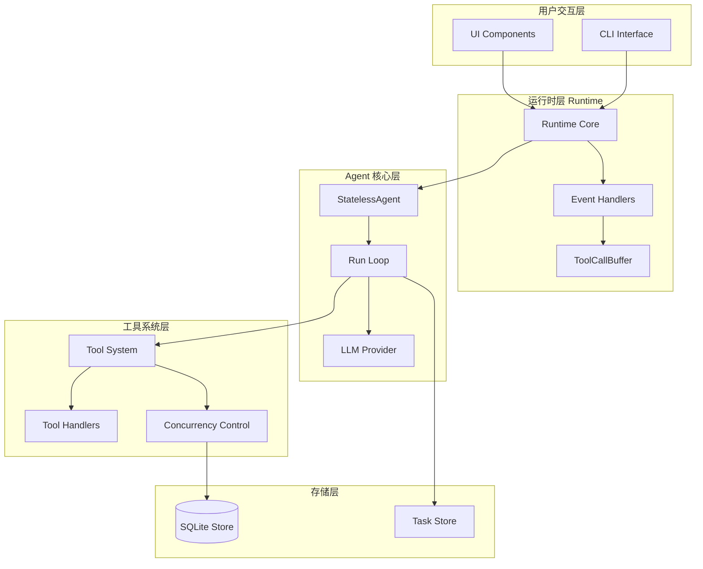

### 2.2 核心文件结构

```
src/agent/runtime/
├── runtime.ts                 # 运行时核心入口（约1000行）
├── types.ts                   # 类型定义
├── event-format.ts            # 事件格式化
├── tool-catalog.ts            # 工具目录管理
├── tool-confirmation.ts       # 工具确认机制
├── tool-call-buffer.ts        # 工具调用缓冲
├── source-modules.ts          # 源码模块加载
├── model-types.ts             # 模型类型
├── workspace-paths.ts        # 工作空间路径
└── [测试文件]
```

---

## 3. 核心组件详解

### 3.1 RuntimeCore - 运行时核心状态

`runtime.ts` 中的核心类型定义了整个运行时的状态结构：

```typescript
type RuntimeCore = {
  modelId: string; // 当前使用的模型ID
  modelLabel: string; // 模型显示名称
  maxSteps: number; // 最大执行步数限制
  conversationId: string; // 会话唯一标识
  workspaceRoot: string; // 工作空间根目录
  skillRoots: string[]; // 技能根目录列表
  parentTools: ToolSchemaLike[]; // 父级工具列表
  agent: StatelessAgentLike; // Agent 实例
  appService: AgentAppServiceLike; // 应用服务
  appStore: AgentAppStoreLike; // 应用存储
  logger?: Logger; // 日志记录器
  modules: SourceModules; // 源码模块集合
};
```

**关键设计**：

- 单例模式确保整个应用生命周期内只有一个 Runtime 实例
- 延迟初始化模式避免启动时的循环依赖

### 3.2 SourceModules - 动态模块加载

`source-modules.ts` 负责从 `core` 包动态加载所需模块：

```typescript
type SourceModules = {
  // LLM 提供商相关
  ProviderRegistry: ProviderRegistryConstructor;

  // Agent 核心
  StatelessAgent: StatelessAgentConstructor;
  AgentAppService: AgentAppServiceConstructor;

  // 存储
  createSqliteAgentAppStore: CreateSqliteStore;
  getTaskStateStoreV2: GetTaskStateStoreV2;

  // 工具系统
  createEnterpriseToolSystemV2WithSubagents: CreateToolSystem;
  createEnterpriseAgentAppService: CreateAgentService;

  // 工具
  SHELL_POLICY_PROFILES: ShellPolicyProfiles;
  filterToolSchemas: FilterToolSchemas;

  // 技能
  listAvailableSkills: ListSkills;
  formatAvailableSkillsForBootstrap: FormatSkills;

  // 日志
  createLoggerFromEnv: CreateLogger;
  createAgentLoggerAdapter: CreateAgentLogger;
};
```

**加载流程**：

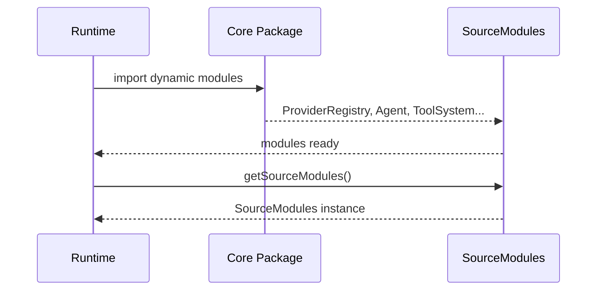

### 3.3 ToolCallBuffer - 工具调用缓冲

`tool-call-buffer.ts` 实现了一个智能缓冲机制，用于优化用户体验：

**设计目的**：

- 隐藏 LLM 计划但尚未执行的工具调用
- 减少用户看到的"思考中"工具数量
- 保持工具调用顺序一致性

**核心数据结构**：

```typescript
class ToolCallBuffer {
  // 保持工具调用注册顺序
  private readonly plannedOrder: string[] = [];

  // 快速查找已计划的ID
  private readonly plannedIds = new Set<string>();

  // 按ID索引的工具调用
  private readonly toolCallsById = new Map<string, AgentToolUseEvent>();

  // 防止重复发出
  private readonly emittedIds = new Set<string>();
}
```

**核心方法**：

| 方法              | 作用                                   |
| ----------------- | -------------------------------------- |
| `register()`      | 注册工具调用，executing=true时立即发出 |
| `flush()`         | 批量发出所有缓冲的工具调用             |
| `ensureEmitted()` | 确保特定ID的工具调用被发出             |

---

## 4. 工具配置与执行流程

### 4.1 工具系统初始化

工具系统的初始化是整个运行时启动过程的关键环节：

```typescript
// runtime.ts - 创建工具系统
const toolSystem = modules.createEnterpriseToolSystemV2WithSubagents({
  appService: deferredSubagentAppService.service,
  resolveTools: (allowedTools?: string[]) =>
    filterToolSchemas(runtimeCompositionRef.current?.toolExecutor?.getToolSchemas?.() || [], {
      allowedTools,
    }),
  resolveModelId: () => modelConfig.model || modelId,
  builtIns: {
    shell: fullAccessEnabled ? { profile: modules.SHELL_POLICY_PROFILES.fullAccess } : undefined,
    skill: { loaderOptions: { skillRoots } },
    task: { store: taskStore, defaultNamespace: conversationId },
  },
});
```

### 4.2 工具配置过滤

`tool-catalog.ts` 提供了工具可见性控制机制：

```typescript
function filterToolSchemas(
  schemas: ToolSchemaLike[],
  options?: {
    allowedTools?: string[]; // 白名单
    hiddenToolNames?: Set<string>; // 黑名单
  }
): ToolSchemaLike[];
```

**过滤策略**：

1. **第一阶段 - 隐藏过滤**：移除在黑名单中的工具
2. **第二阶段 - 白名单过滤**：如果提供了白名单，只返回白名单中的工具

### 4.3 完整执行流程

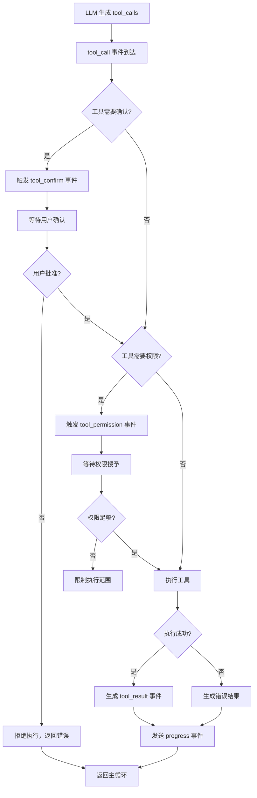

### 4.4 工具执行的核心步骤

根据 `core-agent-flow.md` 文档，一次完整的工具执行包含以下步骤：

1. **LLM Stage**：消费 Provider 流，聚合 assistant 消息和 tool_calls
2. **并发策略解析**：`resolveToolConcurrencyPolicy` 确定并发/独占策略
3. **批量处理**：`processToolCallBatch` 处理工具调用批次
4. **Ledger 幂等**：`executeToolWithLedger` 确保幂等性
5. **确认/权限检查**：必要时构建确认/权限 Promise
6. **执行工具**：调用实际 tool handler
7. **结果写入**：写入 shared history，触发 tool_result 事件

---

## 5. 事件流与通信机制

### 5.1 事件类型体系

`types.ts` 定义了完整的事件类型体系：

```typescript
// 文本相关
type AgentTextDeltaEvent = { text: string; isReasoning?: boolean; };

// 工具相关
type AgentToolStreamEvent = { toolCallId: string; toolName: string; type: string; ... };
type AgentToolUseEvent = { [key: string]: unknown; };
type AgentToolResultEvent = { toolCall: unknown; result: unknown; };

// 控制流相关
type AgentStepEvent = { stepIndex: number; finishReason?: string; toolCallsCount: number; };
type AgentLoopEvent = { loopIndex: number; steps: number; };
type AgentStopEvent = { reason: string; message?: string; };

// 交互相关
type AgentToolConfirmEvent = { kind: 'approval'; toolCallId: string; toolName: string; args: ...; };
type AgentToolPermissionEvent = { kind: 'permission'; requestedScope: 'turn' | 'session'; ... };

// 统计相关
type AgentUsageEvent = { promptTokens: number; completionTokens: number; totalTokens: number; ... };
type AgentContextUsageEvent = { stepIndex: number; contextTokens: number; contextLimit: number; ... };
```

### 5.2 事件处理器接口

```typescript
type AgentEventHandlers = {
  // 文本事件
  onTextDelta?: (event: AgentTextDeltaEvent) => void;
  onTextComplete?: (text: string) => void;

  // 工具事件
  onToolStream?: (event: AgentToolStreamEvent) => void;
  onToolUse?: (event: AgentToolUseEvent) => void;
  onToolResult?: (event: AgentToolResultEvent) => void;

  // 交互事件（需要决策）
  onToolConfirmRequest?: (event: AgentToolConfirmEvent) => AgentToolConfirmDecision | Promise<...>;
  onToolPermissionRequest?: (event: AgentToolPermissionEvent) => AgentPermissionGrant | Promise<...>;

  // 生命周期事件
  onStep?: (event: AgentStepEvent) => void;
  onLoop?: (event: AgentLoopEvent) => void;
  onStop?: (event: AgentStopEvent) => void;

  // 统计事件
  onUsage?: (event: AgentUsageEvent) => void;
  onContextUsage?: (event: AgentContextUsageEvent) => void;
};
```

### 5.3 事件流转图

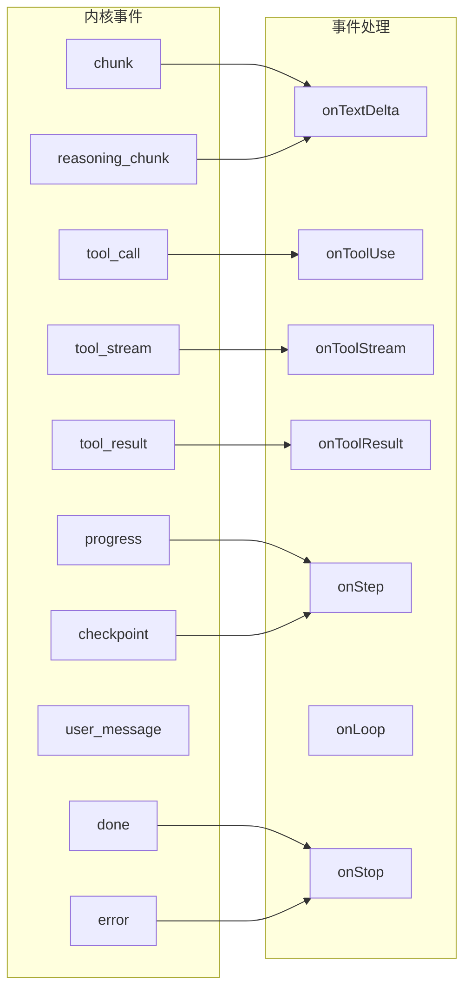

### 5.4 运行时事件处理

`runtime.ts` 中的事件处理逻辑（第739-862行）：

```typescript
onEvent: async (envelope) => {
  const payload = asRecord(envelope.data);
  switch (envelope.eventType) {
    case 'chunk':
      // 处理文本块
      handlers.onTextDelta?.(toTextDeltaEvent(payload, false));
      break;

    case 'reasoning_chunk':
      // 处理推理过程
      handlers.onTextDelta?.(toTextDeltaEvent(payload, true));
      break;

    case 'tool_stream':
      // 处理工具流式输出
      toolCallBuffer.ensureEmitted(toolStreamEvent.toolCallId, emit);
      handlers.onToolStream?.(toolStreamEvent);
      break;

    case 'tool_call':
      // 处理工具调用（注册到缓冲）
      for (const item of rawToolCalls) {
        toolCallBuffer.register(toolCall, emit, executing);
      }
      break;

    case 'tool_result':
      // 处理工具结果
      toolCallBuffer.ensureEmitted(toolCallId, emit);
      handlers.onToolResult?.(toolResultEvent);
      break;

    case 'progress':
      // 处理进度更新，触发flush
      if (nextAction === 'tool') {
        toolCallBuffer.flush(emit);
      }
      break;

    case 'done':
      handlers.onTextComplete?.(text);
      handlers.onStop?.(stopEvent);
      break;
  }
};
```

---

## 6. 工具确认与权限机制

### 6.1 工具确认流程

当工具执行需要用户确认时，流程如下：

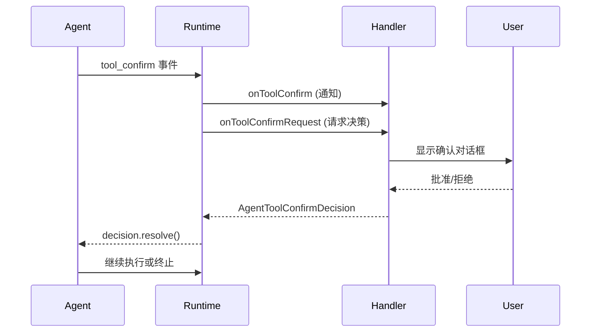

### 6.2 确认决策处理

```typescript
// tool-confirmation.ts
export const resolveToolConfirmDecision = async (
  event: AgentToolConfirmEvent,
  handlers: AgentEventHandlers
): Promise<AgentToolConfirmDecision> => {
  // 1. 无处理程序时默认拒绝
  if (!handlers.onToolConfirmRequest) {
    return { approved: false, message: 'Tool confirmation handler is not available.' };
  }

  // 2. 调用处理程序获取决策
  const decision = await handlers.onToolConfirmRequest(event);

  // 3. 空返回值视为拒绝
  return decision ?? { approved: false, message: 'Tool confirmation was not resolved.' };
};
```

### 6.3 权限管理机制

权限配置文件结构：

```typescript
type AgentToolPermissionProfile = {
  fileSystem?: {
    read?: string[]; // 允许读取的路径
    write?: string[]; // 允许写入的路径
  };
  network?: {
    enabled?: boolean;
    allowedHosts?: string[];
    deniedHosts?: string[];
  };
};

type AgentToolPermissionGrant = {
  granted: AgentToolPermissionProfile;
  scope: 'turn' | 'session'; // turn=单次, session=整个会话
};
```

### 6.4 权限请求流程

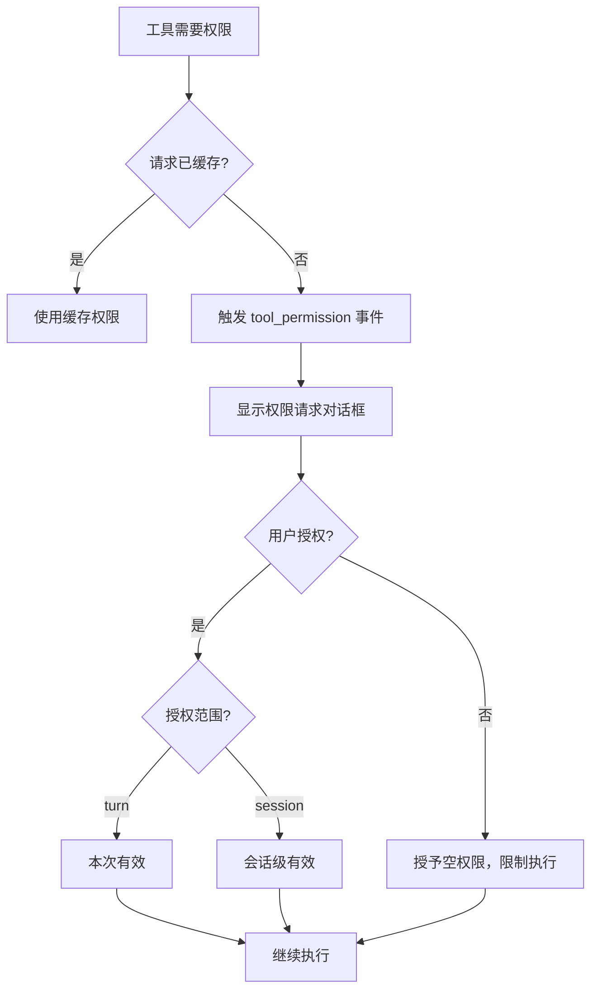

---

## 7. Mermaid 流程图

### 7.1 Agent 主执行链路

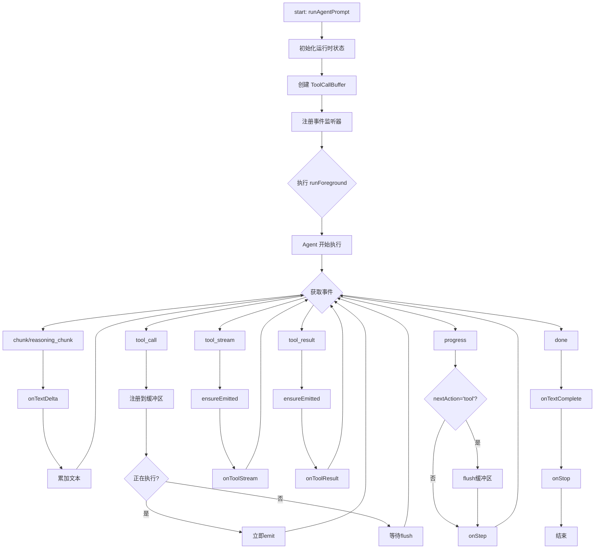

### 7.2 工具调用完整流程

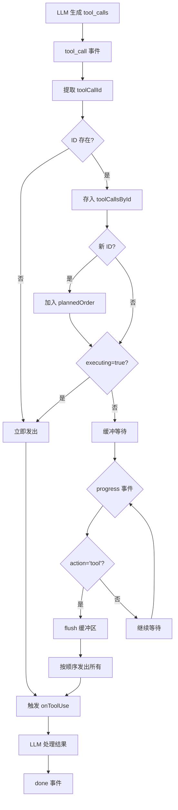

### 7.3 工具确认与权限决策

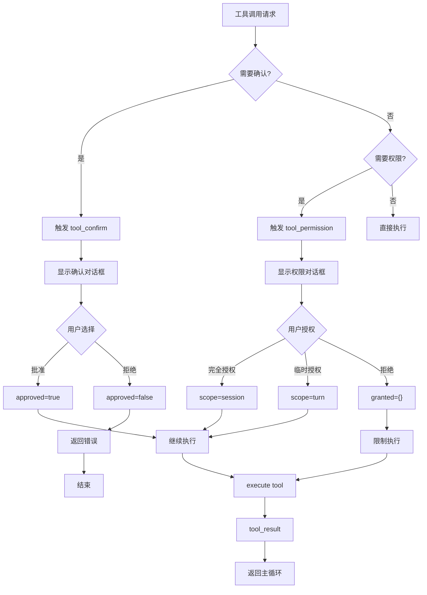

### 7.4 上下文使用量追踪

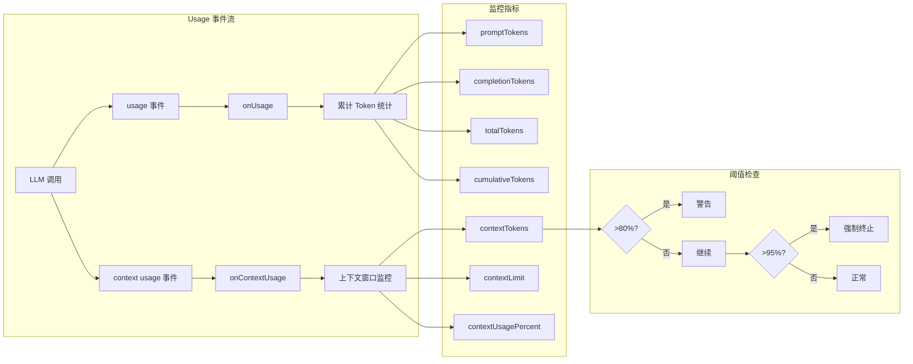

### 7.5 子代理执行流程

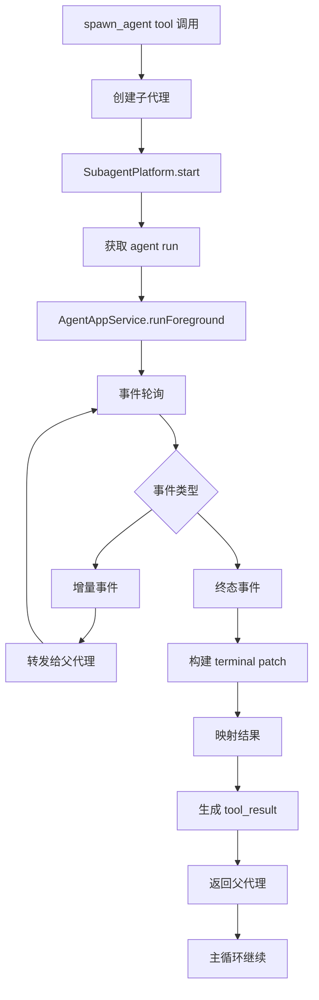

---

## 8. 类型系统详解

### 8.1 事件类型层次

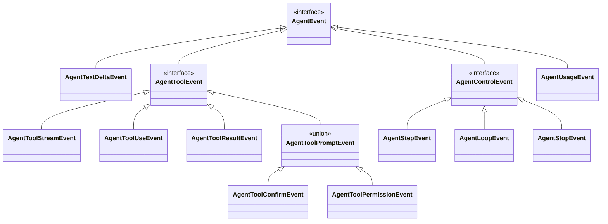

### 8.2 核心类型定义

**工具调用**：

```typescript
type ToolCallLike = {
  id?: string;
  function?: {
    name?: string;
    arguments?: string;
  };
};
```

**工具确认事件**：

```typescript
type AgentToolConfirmEvent = {
  kind: 'approval';
  toolCallId: string;
  toolName: string;
  args: Record<string, unknown>;
  rawArgs: Record<string, unknown>;
  reason?: string;
  metadata?: Record<string, unknown>;
};
```

**确认决策**：

```typescript
type AgentToolConfirmDecision = {
  approved: boolean;
  message?: string;
};
```

**运行结果**：

```typescript
type AgentRunResult = {
  text: string;
  completionReason: string;
  completionMessage?: string;
  durationSeconds: number;
  modelLabel: string;
  usage?: AgentUsageEvent;
};
```

---

## 9. 数据流与状态管理

### 9.1 状态流图

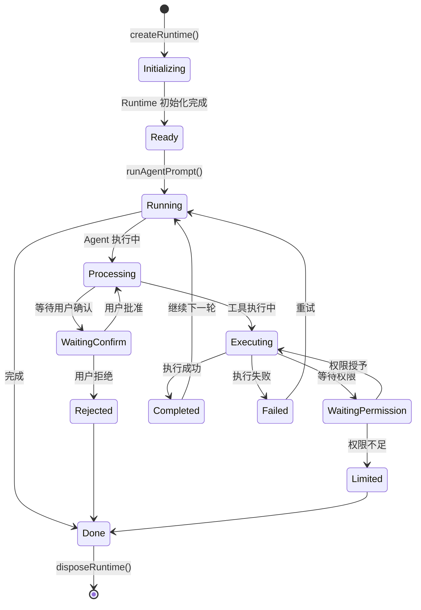

### 9.2 状态管理关键点

1. **运行时单例**：通过 `runtimePromise` 确保只有一个 Runtime 实例
2. **事件缓冲**：`ToolCallBuffer` 管理工具调用顺序
3. **使用量追踪**：实时统计 Token 使用，防止溢出
4. **错误恢复**：支持配置最大重试次数

---

## 10. UI 层集成

### 10.1 组件架构

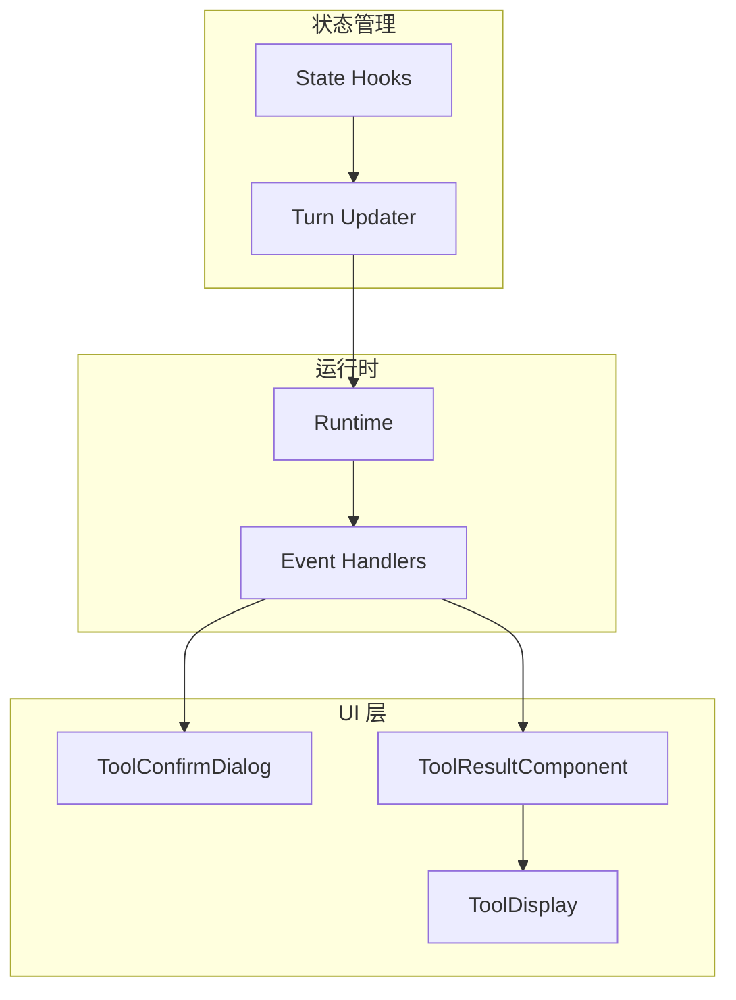

### 10.2 工具确认对话框

`tool-confirm-dialog-content.ts` 提供了用户交互界面：

```typescript
// 核心功能
-显示工具名称和参数 - 显示执行原因 - 提供批准 / 拒绝按钮 - 支持自定义处理程序;
```

### 10.3 工具结果展示

`assistant-tool-result.ts` 格式化工具执行结果：

```typescript
// 核心功能
- 检测输出类型（文本/错误/结构化数据）
- 限制显示长度（最大12000字符）
- 支持代码块格式化
- 处理特殊工具（如local_shell）的输出
```

---

## 11. 安全机制

### 11.1 安全层次

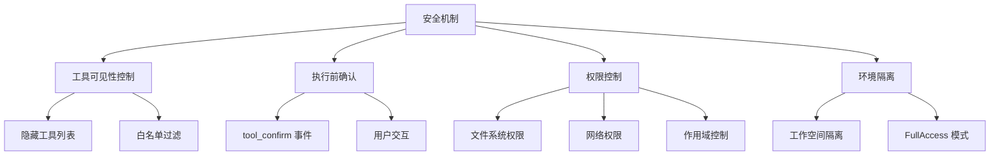

### 11.2 全局访问模式

通过环境变量 `AGENT_FULL_ACCESS` 启用完全访问：

```typescript
const isFullAccessEnabled = (env: NodeJS.ProcessEnv): boolean => {
  const raw = env['AGENT_FULL_ACCESS']?.trim().toLowerCase();
  return raw === '1' || raw === 'true' || raw === 'yes' || raw === 'on';
};
```

启用时应用完全访问策略：

```typescript
{
  fileSystemPolicy: { mode: 'unrestricted', readRoots: [], writeRoots: [] },
  networkPolicy: { mode: 'enabled', allowedHosts: [], deniedHosts: [] },
  approvalPolicy: 'unless-trusted',
  trustLevel: 'trusted',
}
```

### 11.3 默认安全策略

| 机制     | 默认行为 | 可配置                         |
| -------- | -------- | ------------------------------ |
| 工具确认 | 默认拒绝 | 通过 `onToolConfirmRequest`    |
| 权限授予 | 空权限   | 通过 `onToolPermissionRequest` |
| 文件访问 | 受限     | 通过权限配置                   |
| 网络访问 | 禁用     | 通过网络策略                   |
| 重试次数 | 10次     | 通过 `AGENT_MAX_RETRY_COUNT`   |

---

## 12. 总结与设计模式

### 12.1 核心设计模式

1. **单例模式**：`getRuntime()` 确保全局唯一实例
2. **延迟绑定**：`createDeferredSubagentAppService()` 解决循环依赖
3. **事件驱动**：通过回调函数处理各种 Agent 事件
4. **缓冲机制**：`ToolCallBuffer` 优化用户体验
5. **安全调用**：`safeInvoke()` 防止异常中断执行
6. **类型适配**：多种 `to*Event` 函数进行数据转换

### 12.2 架构特点

- **分层设计**：清晰的分层（UI → Runtime → Agent → Tool）
- **事件驱动**：灵活的事件机制支持多种扩展
- **安全优先**：多层次的安全确认和权限控制
- **可观测性**：完整的使用量统计和日志记录
- **错误恢复**：支持重试和优雅降级

### 12.3 关键设计决策

| 决策       | 选择         | 理由               |
| ---------- | ------------ | ------------------ |
| 工具缓冲   | 延迟显示     | 提升用户体验       |
| 确认机制   | 默认拒绝     | 安全优先           |
| 权限作用域 | turn/session | 平衡便利性和安全性 |
| 状态存储   | SQLite       | 支持会话恢复       |
| 模型选择   | 可切换       | 适应不同场景       |

---

## 附录

### A. 关键文件位置

| 文件                 | 路径               | 行数  | 作用       |
| -------------------- | ------------------ | ----- | ---------- |
| runtime.ts           | src/agent/runtime/ | ~1000 | 运行时核心 |
| types.ts             | src/agent/runtime/ | ~130  | 类型定义   |
| event-format.ts      | src/agent/runtime/ | ~200  | 事件格式化 |
| tool-catalog.ts      | src/agent/runtime/ | ~40   | 工具过滤   |
| tool-confirmation.ts | src/agent/runtime/ | ~30   | 确认机制   |
| tool-call-buffer.ts  | src/agent/runtime/ | ~60   | 调用缓冲   |

### B. 环境变量

| 变量                    | 默认值 | 作用             |
| ----------------------- | ------ | ---------------- |
| `AGENT_MAX_STEPS`       | 10000  | 最大执行步数     |
| `AGENT_MAX_RETRY_COUNT` | 10     | 最大重试次数     |
| `AGENT_FULL_ACCESS`     | -      | 启用完全访问模式 |

### C. 核心导出

```typescript
// runtime.ts 主要导出
export const runAgentPrompt: (...) => Promise<AgentRunResult>;
export const appendAgentPrompt: (...) => Promise<void>;
export const getAgentModelLabel: () => string;
export const getAgentModelId: () => string;
export const listAgentModels: () => Promise<ModelInfo[]>;
export const switchAgentModel: (modelId: string) => Promise<void>;
export const disposeAgentRuntime: () => Promise<void>;

// tool-catalog.ts
export const filterToolSchemas: (...) => ToolSchemaLike[];

// tool-confirmation.ts
export const resolveToolConfirmDecision: (...) => Promise<...>;
export const resolveToolPermissionGrant: (...) => Promise<...>;
```

---

_本文档基于对源代码的详细分析生成，涵盖了 Agent 与 Tool 配置执行的完整机制。_
