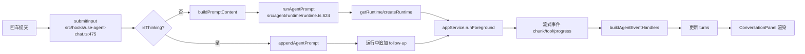

# CLI 代码执行流程

本文基于当前 `packages/cli` 目录中的实际代码，梳理 CLI 从启动到一次消息执行完成的主要流程。

关键入口文件：

- `bin/renx.cjs:1`
- `src/index.tsx:1`
- `src/App.tsx:45`
- `src/hooks/use-agent-chat.ts:475`
- `src/agent/runtime/runtime.ts:624`
- `src/hooks/agent-event-handlers.ts:37`

## 1. 总体执行流程图

```mermaid
flowchart TD
    A[用户执行 renx] --> B[bin/renx.cjs 启动\nbin/renx.cjs:1]

    B --> C{是否传 -v/--version\nbin/renx.cjs:12}
    C -- 是 --> C1[输出版本并退出]
    C -- 否 --> D{是否找到原生二进制\nbin/renx.cjs:86}
    D -- 是 --> D1[spawnSync 执行二进制\nbin/renx.cjs:17]
    D -- 否 --> E{是否存在 src/index.tsx 且可找到 bun\nbin/renx.cjs:102}
    E -- 否 --> E1[报错退出]
    E -- 是 --> F[bun run src/index.tsx\n注入版本/工作目录/rg环境]

    F --> G[src/index.tsx 初始化\nsrc/index.tsx:1]
    G --> H[configureBundledRipgrepEnv\nsrc/index.tsx:58]
    H --> I[applyCliArgsToEnv 解析参数\nsrc/index.tsx:59]
    I --> J{参数是否要求立即退出\nsrc/index.tsx:64}
    J -- 是 --> J1[输出后退出]
    J -- 否 --> K[绑定退出守卫/终端主题/OpenTUI renderer\nsrc/index.tsx:71]
    K --> L[渲染 App 组件\nsrc/index.tsx:107]

    L --> M[App 初始化 useAgentChat\nsrc/App.tsx:46]
    M --> N[加载模型标签/附件能力\nsrc/hooks/use-agent-chat.ts:280]

    N --> O[用户输入并提交\nsrc/App.tsx:237]
    O --> P[submitInput\nsrc/hooks/use-agent-chat.ts:475]

    P --> Q{当前是否 isThinking\nsrc/hooks/use-agent-chat.ts:484}

    Q -- 否 --> R{是否 slash 命令且无附件\nsrc/hooks/use-agent-chat.ts:524}
    R -- 是 --> R1[本地命令处理\nclear/exit/help/unsupported\nsrc/hooks/use-agent-chat.ts:445]
    R -- 否 --> S[创建 turn + streaming reply\nsrc/hooks/use-agent-chat.ts:541]
    S --> T[buildPromptContent 组装文本/附件\nsrc/hooks/use-agent-chat.ts:654]
    T --> U[runAgentPrompt\nsrc/hooks/use-agent-chat.ts:656]

    Q -- 是 --> V[追加 follow-up 到当前运行\nsrc/hooks/use-agent-chat.ts:494]
    V --> W[appendAgentPrompt\nsrc/agent/runtime/runtime.ts:914]
    W --> X[排队 follow-up turn\nsrc/hooks/use-agent-chat.ts:507]

    U --> Y[getRuntime 单例初始化\nsrc/agent/runtime/runtime.ts:580]
    Y --> Z[createRuntime\nsrc/agent/runtime/runtime.ts:461]

    Z --> ZA[加载 env/config/workspaceRoot\nsrc/agent/runtime/runtime.ts:463]
    ZA --> ZB[解析模型与 API Key\nsrc/agent/runtime/runtime.ts:467]
    ZB --> ZC[创建 provider / toolSystem / appService / appStore\nsrc/agent/runtime/runtime.ts:475]
    ZC --> ZD[过滤父层可用工具\nsrc/agent/runtime/runtime.ts:557]

    ZD --> AA[appService.runForeground\nsrc/agent/runtime/runtime.ts:710]
    AA --> AB[注入 historyMessages / systemPrompt / tools / bootstrap skills\nsrc/agent/runtime/runtime.ts:706]

    AB --> AC{事件流 onEvent\nsrc/agent/runtime/runtime.ts:748}
    AC --> AD[chunk / reasoning_chunk\n文本增量]
    AC --> AE[tool_call / tool_stream / tool_result\n工具调用与输出]
    AC --> AF[progress / checkpoint\n步骤推进]
    AC --> AG[user_message\nfollow-up 切换 turn]
    AC --> AH[done / error\n完成或失败]

    AD --> AI[buildAgentEventHandlers 映射到 UI 段落\nsrc/hooks/agent-event-handlers.ts:37]
    AE --> AI
    AF --> AI
    AG --> AJ[切换到排队的 follow-up turn\nsrc/hooks/use-agent-chat.ts:645]
    AH --> AK[汇总最终结果/usage/状态\nsrc/agent/runtime/runtime.ts:898]

    AI --> AL[更新 turns 状态并刷新会话面板\nsrc/hooks/use-agent-chat.ts:315]
    AJ --> AL
    AK --> AL

    AE --> AM{是否需要工具确认/权限确认}
    AM -- 是 --> AN[弹出 ToolConfirmDialog\nsrc/App.tsx:251]
    AN --> AO[用户 approve/deny\nsrc/hooks/use-agent-chat.ts:770]
    AO --> AP[resolve 回 runtime\nsrc/agent/runtime/runtime.ts:658]
    AP --> AC

    AL --> AQ[ConversationPanel 显示结果\nsrc/App.tsx:236]
```

## 2. 简化流程图

这个版本只保留一次普通输入的关键链路。

## 3. 分层说明

### 3.1 启动层

入口文件是 `bin/renx.cjs:1`。

主要职责：

- 处理 `--version` 参数，见 `bin/renx.cjs:12`
- 优先执行本地原生二进制，见 `bin/renx.cjs:86`
- 找不到二进制时回退到 `bun run src/index.tsx`，见 `bin/renx.cjs:102`
- 设置 `RENX_VERSION`、`AGENT_WORKDIR`、`AGENT_REPO_ROOT`、ripgrep 环境变量，见 `bin/renx.cjs:94`、`bin/renx.cjs:116`

### 3.2 CLI 初始化层

入口文件是 `src/index.tsx:1`。

主要职责：

- 获取 CLI 版本，见 `src/index.tsx:27`
- 配置 bundled ripgrep，见 `src/index.tsx:96`
- 解析基础参数到环境变量，见 `src/index.tsx:97` 和 `src/runtime/cli-args.ts:26`
- 解析命令路由（`run` / `ask` / `session` / 默认 TUI），见 `src/index.tsx:123` 和 `src/commands/cli-commands.ts:84`
- 在非交互模式下选择 `text` / `json` 输出，见 `src/index.tsx:147`
- 在交互模式下绑定退出保护、探测终端颜色并启动 OpenTUI，见 `src/index.tsx:59`

### 3.2.1 非交互命令层

新增命令路由主要包括：

- `renx run <prompt>`：非交互执行任务型 prompt
- `renx ask <prompt>`：非交互执行问答型 prompt
- `renx session list`：列出本地会话摘要
- `renx session show --id <id>`：查看单个会话摘要
- `renx session open --id <id>`：加载指定会话并进入 TUI

对应文件：

- 参数/帮助：`src/commands/cli-commands.ts:1`
- 会话输出格式：`src/commands/session-output.ts:1`
- 入口分发：`src/index.tsx:147`

### 3.3 UI 层

核心文件是 `src/App.tsx:45`。

主要职责：

- 组合 `ConversationPanel`、`Prompt`、`ToolConfirmDialog`、`FilePickerDialog`、`ModelPickerDialog`
- 管理键盘交互：
  - `Ctrl+C` 退出，见 `src/App.tsx:155`
  - `Esc` 停止执行或清空输入，见 `src/App.tsx:213`
  - `Ctrl+L` 清空会话，见 `src/App.tsx:208`
- 处理 `/models` 和 `/files` 这类 UI 级命令，见 `src/App.tsx:124`

### 3.4 会话状态层

核心文件是 `src/hooks/use-agent-chat.ts:146`。

主要职责：

- 管理 turns、input、selectedFiles、isThinking、modelLabel、contextUsagePercent 等状态
- 在 `submitInput` 中区分三种路径：
  - 本地 slash 命令处理，见 `src/hooks/use-agent-chat.ts:524`
  - 新建一次 agent run，见 `src/hooks/use-agent-chat.ts:530`
  - 向当前运行中的 agent 追加 follow-up，见 `src/hooks/use-agent-chat.ts:484`
- 管理工具确认队列，见 `src/hooks/use-agent-chat.ts:238`
- 在运行结束时汇总 UI 状态，见 `src/hooks/use-agent-chat.ts:660`

### 3.5 运行时层

核心文件是 `src/agent/runtime/runtime.ts:461` 和 `src/agent/runtime/runtime.ts:624`。

主要职责：

- 初始化 runtime 单例，见 `src/agent/runtime/runtime.ts:580`
- 创建模型 provider、toolSystem、appService、appStore，见 `src/agent/runtime/runtime.ts:475` 和 `src/agent/runtime/runtime.ts:518`
- 计算 system prompt、工具列表、历史消息，见 `src/agent/runtime/runtime.ts:706`
- 调用 `appService.runForeground` 执行一次对话，见 `src/agent/runtime/runtime.ts:710`
- 将底层事件流映射成前端统一事件，见 `src/agent/runtime/runtime.ts:748`
- 支持运行中追加输入 `appendAgentPrompt`，见 `src/agent/runtime/runtime.ts:914`

### 3.6 事件渲染层

核心文件是 `src/hooks/agent-event-handlers.ts:37`。

主要职责：

- 将文本增量映射为 `thinking` / `text` 段落，见 `src/hooks/agent-event-handlers.ts:60`
- 将工具调用、工具输出、工具结果映射为代码块段落，见 `src/hooks/agent-event-handlers.ts:112`、`src/hooks/agent-event-handlers.ts:139`、`src/hooks/agent-event-handlers.ts:162`
- 根据 `AGENT_SHOW_EVENTS` 决定是否显示调试事件日志，见 `src/hooks/agent-event-handlers.ts:32`

## 4. 一次普通消息的实际执行顺序

1. 用户在 `Prompt` 输入内容并按回车，入口见 `src/App.tsx:237`
2. `useAgentChat.submitInput()` 被调用，见 `src/hooks/use-agent-chat.ts:475`
3. 如果不是本地 slash 命令，则创建新的 turn 和 streaming reply，见 `src/hooks/use-agent-chat.ts:541`
4. 文本和附件被转换成 `MessageContent`，见 `src/hooks/use-agent-chat.ts:654`
5. 调用 `runAgentPrompt()`，见 `src/hooks/use-agent-chat.ts:656`
6. `runAgentPrompt()` 获取或初始化 runtime，见 `src/agent/runtime/runtime.ts:629`
7. runtime 组装 `historyMessages`、`systemPrompt`、`tools`，见 `src/agent/runtime/runtime.ts:706`
8. 调用 `appService.runForeground(...)`，见 `src/agent/runtime/runtime.ts:710`
9. 底层 agent 持续产出文本、工具、进度、停止等事件，见 `src/agent/runtime/runtime.ts:748`
10. `buildAgentEventHandlers()` 将事件映射成 UI reply segments，见 `src/hooks/agent-event-handlers.ts:98`
11. `turns` 状态持续更新，会话面板重新渲染，见 `src/hooks/use-agent-chat.ts:315` 和 `src/App.tsx:236`
12. 运行结束后写入完成状态、usage 和耗时，见 `src/hooks/use-agent-chat.ts:699` 和 `src/agent/runtime/runtime.ts:904`

## 5. 工具确认流程

当模型准备调用工具且需要确认时，流程如下：

1. runtime 收到底层 `tool_confirm` 或 `tool_permission` 事件，见 `src/agent/runtime/runtime.ts:697`
2. 事件被转换成统一结构，见 `src/agent/runtime/runtime.ts:645` 和 `src/agent/runtime/runtime.ts:671`
3. `useAgentChat` 将确认请求放入队列，见 `src/hooks/use-agent-chat.ts:238`
4. `App` 渲染 `ToolConfirmDialog`，见 `src/App.tsx:251`
5. 用户选择 approve/deny 或作用域，见 `src/hooks/use-agent-chat.ts:770` 和 `src/hooks/use-agent-chat.ts:776`
6. 结果通过 resolver 返回给 runtime，见 `src/hooks/use-agent-chat.ts:213`
7. runtime 再将确认结果回传给底层工具执行，见 `src/agent/runtime/runtime.ts:658` 和 `src/agent/runtime/runtime.ts:685`

## 6. follow-up 追加输入流程

当当前 agent 还在执行时，如果用户继续输入新消息：

1. `submitInput()` 检测到 `isThinking === true`，见 `src/hooks/use-agent-chat.ts:484`
2. 新输入被转换成 `MessageContent`，见 `src/hooks/use-agent-chat.ts:494`
3. 调用 `appendAgentPrompt()` 追加到当前运行中的 execution，见 `src/hooks/use-agent-chat.ts:495` 和 `src/agent/runtime/runtime.ts:914`
4. 如果追加成功，则先创建一个排队中的 turn，见 `src/hooks/use-agent-chat.ts:507`
5. runtime 后续发出 `user_message` 事件时，前端切换到新的 turn 继续流式显示，见 `src/hooks/use-agent-chat.ts:640` 和 `src/hooks/use-agent-chat.ts:645`

## 7. 关键文件清单

- 启动脚本：`bin/renx.cjs:1`
- TS 入口：`src/index.tsx:1`
- 根组件：`src/App.tsx:45`
- 会话主逻辑：`src/hooks/use-agent-chat.ts:146`
- 事件到 UI 的映射：`src/hooks/agent-event-handlers.ts:37`
- runtime 主逻辑：`src/agent/runtime/runtime.ts:461`
- CLI 参数解析：`src/runtime/cli-args.ts:26`
- slash 命令定义：`src/commands/slash-commands.ts:10`

## 8. 一句话总结

主链路现在分为两条：

- 交互式：`bin/renx.cjs` → `src/index.tsx` → `App` → `useAgentChat.submitInput` → `runAgentPrompt` → `appService.runForeground` → 事件流回传 → `turns` 更新 → `ConversationPanel` 渲染。
- 非交互式：`bin/renx.cjs` → `src/index.tsx` → `parseCliCommand` → `runAgentPromptNonInteractive` / `listAgentSessions` / `getAgentSession` → 文本或 JSON 输出。
