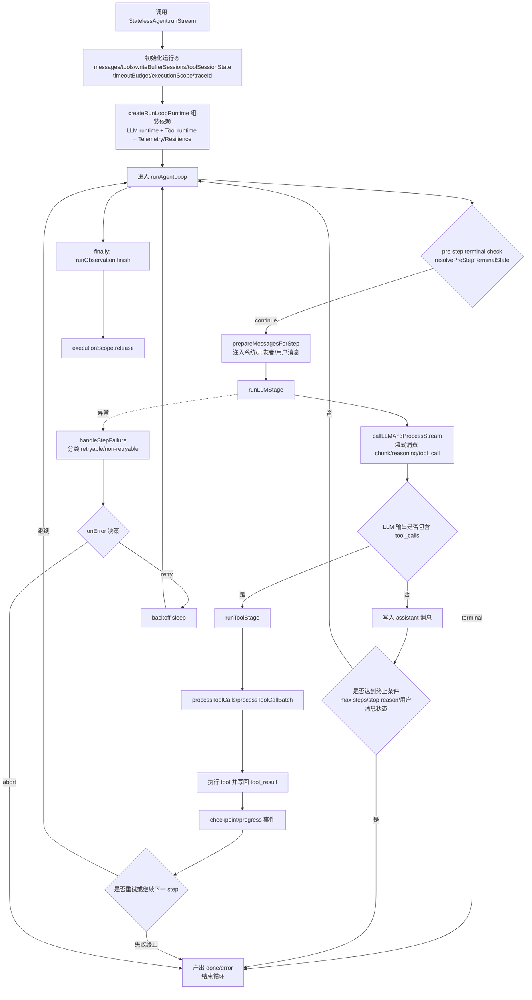
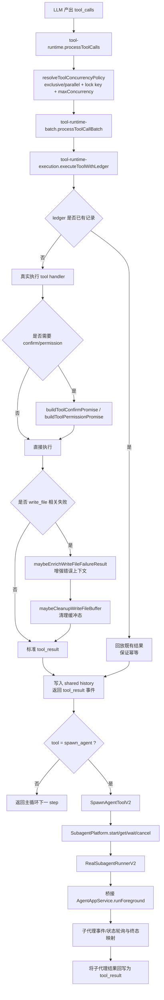

# Core Agent 核心实现梳理与流程图

## 1. 分析目标

本文档基于 `core` 中 agent 相关实现，梳理以下内容：

- 主执行链路（入口、循环控制、终止与错误处理）
- 工具调用链路（并发策略、ledger 幂等、write_file 特殊处理）
- 子代理流程（`spawn_agent` 到 app 层执行）
- 状态管理流程（stream event 到落库与终态收敛）

---

## 2. 核心结论（先看这个）

- `StatelessAgent.runStream` 是门面入口，负责 runtime 组装与上下文初始化。
- 真正的执行控制中枢在 `runAgentLoop`，它负责 step 循环、阶段切换、重试与终止判定。
- 每个 step 分为两大阶段：
  - LLM stage：消费 provider stream，聚合 assistant/tool_calls。
  - Tool stage：按并发策略执行工具调用，写回结果消息。
- `run-loop-control.ts` 统一收敛“是否终止 / 是否重试 / 是否超时 / 是否 abort”等控制语义。
- app 层 `AgentAppService.runForeground` 负责将内核事件映射为事件存储与 execution 状态 patch，并最终生成 terminal patch。

---

## 3. Agent 主执行链路（Mermaid）

---

## 4. Tool 与子代理链路（Mermaid）

---

## 5. 状态管理与事件模型

内核流式事件包含：

- `progress`
- `chunk`
- `reasoning_chunk`
- `tool_call`
- `tool_result`
- `checkpoint`
- `compaction`
- `user_message`
- `done`
- `error`

在 app 层（`AgentAppService.runForeground`）中，`for await ... runStream(...)` 消费这些事件并完成：

- 事件落库（event store）
- 执行状态 patch（execution store）
- 终态收敛（`buildTerminalPatch`）

---

## 6. 关键代码定位

- `../core/src/agent/agent/index.ts`
  - `StatelessAgent.runStream(...)` 入口与 runtime 组装。
- `../core/src/agent/agent/run-loop.ts`
  - `runAgentLoop(...)` 主循环、阶段驱动、统一收尾。
- `../core/src/agent/agent/run-loop-control.ts`
  - `resolvePreStepTerminalState(...)`
  - `prepareMessagesForStep(...)`
  - `handleStepFailure(...)`
- `../core/src/agent/agent/run-loop-stages.ts`
  - `runLLMStage(...)`
  - `runToolStage(...)`
- `../core/src/agent/agent/runtime-composition.ts`
  - `createRunLoopRuntime(...)`
  - `createToolRuntime(...)`
  - `createLLMStreamRuntimeDeps(...)`
- `../core/src/agent/agent/llm-stream-runtime.ts`
  - `callLLMAndProcessStream(...)`
- `../core/src/agent/agent/tool-runtime.ts`
  - `resolveToolConcurrencyPolicy(...)`
  - `processToolCalls(...)`
- `../core/src/agent/agent/tool-runtime-batch.ts`
  - `processToolCallBatch(...)`
- `../core/src/agent/agent/tool-runtime-execution.ts`
  - `executeToolWithLedger(...)`
  - `buildToolConfirmPromise(...)`
  - `buildToolPermissionPromise(...)`
  - `maybeEnrichWriteFileFailureResult(...)`
  - `maybeCleanupWriteFileBuffer(...)`
- `../core/src/agent/tool-v2/handlers/spawn-agent.ts`
  - `SpawnAgentToolV2`
- `../core/src/agent/tool-v2/agent-runner.ts`
  - `SubagentPlatform`
- `../core/src/agent/tool-v2/agent-real-runner.ts`
  - `RealSubagentRunnerV2`
- `../core/src/agent/app/agent-app-service.ts`
  - `runForeground(...)` 事件消费、状态 patch、终态映射。

---

## 7. 可继续扩展

可在此基础上补一张 `sequenceDiagram`，按一次真实路径展开：

`tool_call -> tool_result -> checkpoint -> done`
