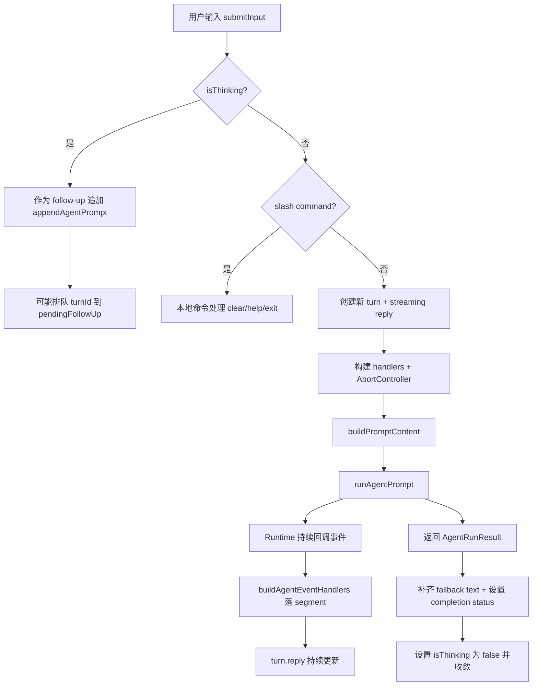
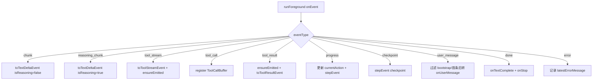
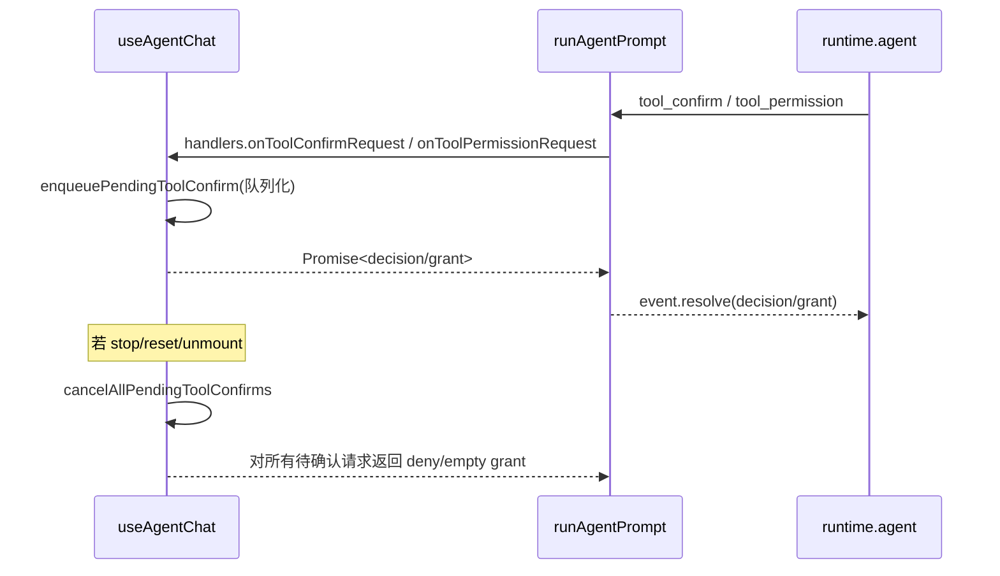
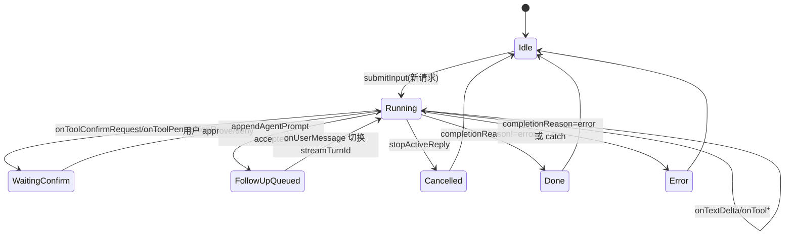
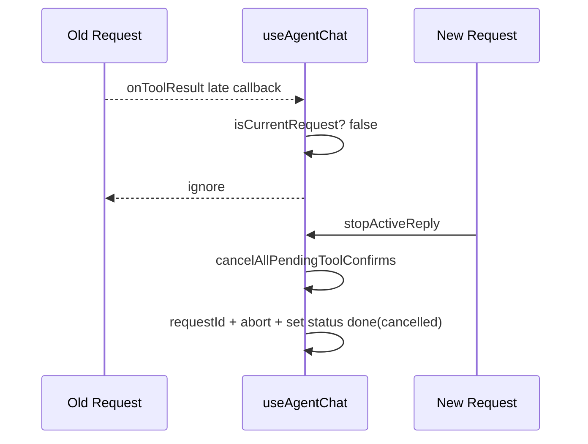

# 消息处理逻辑深度分析（CLI）

> 面向 `packages/cli` 的消息处理链路说明文档。本文重点覆盖：
>
> 1. 从用户输入到 Runtime 的端到端消息流；
> 2. 事件分发、工具调用编排与 UI 渲染；
> 3. 可靠性保障、测试证据、风险与演进建议。

## 1. 分析范围与入口

### 1.1 核心入口文件

- UI 编排主入口：`src/hooks/use-agent-chat.ts:529`
- Runtime 执行主入口：`src/agent/runtime/runtime.ts:935`
- UI 事件渲染器：`src/hooks/agent-event-handlers.ts:167`
- 工具调用缓冲器：`src/agent/runtime/tool-call-buffer.ts:18`
- 工具确认策略：`src/agent/runtime/tool-confirmation.ts:18`

### 1.2 关键问题

- 用户输入如何进入并驱动一次完整的消息处理？
- Runtime 如何把底层 event 归一化成 UI 可消费事件？
- 工具调用为什么不会“乱序显示”或“重复显示”？
- 取消、错误、权限确认如何保证流程最终收敛？

---

## 2. 架构总览

消息处理分三层：

1. **输入与会话编排层（Hook）**
   - 位于 `useAgentChat`，负责 turn 状态、请求生命周期、确认弹窗队列、取消/重置。
2. **事件归一化层（Runtime）**
   - 位于 `runAgentPrompt`，负责把 app service 回调转换为标准事件（text/tool/step/stop/usage）。
3. **展示与来源分层（Event Handlers）**
   - 位于 `buildAgentEventHandlers`，负责把事件落地到 segments，并处理子 agent 来源标记。

---

## 3. 端到端主流程图（用户输入 -> UI 更新）



### 3.1 关键代码锚点

- 输入分流：`src/hooks/use-agent-chat.ts:538`
- slash 命令处理：`src/hooks/use-agent-chat.ts:578`
- 新运行初始化：`src/hooks/use-agent-chat.ts:595`
- 启动 runtime：`src/hooks/use-agent-chat.ts:724`
- 结束状态写回：`src/hooks/use-agent-chat.ts:767`

---

## 4. Runtime 事件分发流程图（onEvent switch）



### 4.1 关键代码锚点

- 事件总入口：`src/agent/runtime/runtime.ts:1062`
- `tool_stream` 分支：`src/agent/runtime/runtime.ts:1084`
- `tool_call` 分支：`src/agent/runtime/runtime.ts:1092`
- `tool_result` 分支：`src/agent/runtime/runtime.ts:1135`
- `progress` 分支：`src/agent/runtime/runtime.ts:1149`
- `user_message` 分支：`src/agent/runtime/runtime.ts:1173`
- `done` 分支：`src/agent/runtime/runtime.ts:1193`

### 4.2 设计意图（事件层）

- `tool_call` 与 `tool_stream/tool_result` 解耦，借助 `ToolCallBuffer` 对齐显示时机。
- 允许流式输出先到达，再通过 `ensureEmitted` 反向补发 `tool_use`，避免 UI 缺失“工具已调用”的上下文。
- 即使没有 `done`，最终也会在 `runForeground` 返回后补发 stop/textComplete（兜底收敛）。见 `src/agent/runtime/runtime.ts:1221`。

---

## 5. 工具确认与取消流程图



### 5.1 关键代码锚点

- Runtime 注册确认监听：`src/agent/runtime/runtime.ts:1011`
- Runtime 确认决策兜底：`src/agent/runtime/runtime.ts:972`
- Runtime 权限授权兜底：`src/agent/runtime/runtime.ts:999`
- UI 确认队列入队：`src/hooks/use-agent-chat.ts:273`
- UI 队列取消（stop/reset/unmount）：`src/hooks/use-agent-chat.ts:283`
- UI stop 时主动取消确认：`src/hooks/use-agent-chat.ts:413`

---

## 6. Turn / Message 生命周期



### 6.1 状态字段（Hook）

- 请求代际：`requestIdRef`，用于丢弃过期异步回调。`src/hooks/use-agent-chat.ts:215`
- 当前 turn：`activeTurnIdRef` + `streamTurnId`。`src/hooks/use-agent-chat.ts:216`、`src/hooks/use-agent-chat.ts:596`
- 运行控制：`activeAbortControllerRef`、`activeRunPromiseRef`。`src/hooks/use-agent-chat.ts:217`
- follow-up 缓冲：`pendingFollowUpTurnIdsRef`。`src/hooks/use-agent-chat.ts:220`
- 工具确认队列：`pendingToolConfirm*`。`src/hooks/use-agent-chat.ts:221`

### 6.2 转换规则（关键）

- 新请求会等待前一个 `activeRunPromise` 结束，避免并行写 UI。`src/hooks/use-agent-chat.ts:585`
- `onUserMessage` 到来时，旧 turn 先标记 done，再切换到 next turn 并启动 streaming reply。`src/hooks/use-agent-chat.ts:712`
- `finally` 中才真正收尾 `setIsThinking(false)`，保证异常路径也收敛。`src/hooks/use-agent-chat.ts:788`

### 6.3 Message 数据结构全链路（接收 -> 处理 -> UI）

这一节给出你要的“完整数据结构变化过程”。

#### 6.3.1 输入到 Runtime 的数据结构（请求体）

用户输入会先被 `buildPromptContent` 组装成 `MessageContent`，然后传给 `runAgentPrompt`。见 `src/files/attachment-content.ts:239`、`src/types/message-content.ts:41`、`src/hooks/use-agent-chat.ts:722`。

```ts
// src/types/message-content.ts
export type InputContentPart =
  | { type: 'text'; text: string }
  | { type: 'image_url'; image_url: { url: string; detail?: 'auto' | 'low' | 'high' } }
  | { type: 'input_audio'; input_audio: { data: string; format: 'wav' | 'mp3' } }
  | {
      type: 'input_video';
      input_video: {
        url?: string;
        file_id?: string;
        data?: string;
        format?: 'mp4' | 'mov' | 'webm';
      };
    }
  | { type: 'file'; file: { file_id?: string; file_data?: string; filename?: string } };

export type MessageContent = string | InputContentPart[];
```

Runtime 下发给 app service 的请求结构（核心字段）定义在 `src/agent/runtime/source-modules.ts:111`：

```ts
// AgentAppRunRequestLike（节选）
{
  executionId?: string;
  conversationId: string;
  userInput: MessageContent;
  historyMessages?: AgentV4MessageLike[];
  bootstrapMessages?: AgentV4MessageLike[];
  systemPrompt?: string;
  tools?: Array<{ type: string; function: Record<string, unknown> }>;
  config?: Record<string, unknown>;
  maxSteps?: number;
  abortSignal?: AbortSignal;
  modelLabel?: string;
}
```

#### 6.3.2 Runtime 接收的原始事件结构（流式回调）

Runtime 从 `runForeground` 的 `onEvent` 接收的是统一 envelope（`src/agent/runtime/source-modules.ts:54`）：

```ts
// CliEventEnvelopeLike
{
  executionId?: string;
  conversationId?: string;
  eventType: string; // chunk | reasoning_chunk | tool_stream | tool_call | tool_result | progress | checkpoint | user_message | done | error
  data: unknown;
  createdAt: number;
}
```

同时还会收到：

- `onUsage`（token 与上下文比例）`src/agent/runtime/source-modules.ts:73`
- `onContextUsage`（实时 context 使用率）`src/agent/runtime/source-modules.ts:61`
- `onError`（运行期错误）`src/agent/runtime/runtime.ts:1044`

#### 6.3.3 Runtime 归一化后的标准事件结构

`runAgentPrompt` 会把 envelope 转换成强类型事件，再分发给 UI handlers。见 `src/agent/runtime/runtime.ts:1062`、`src/agent/runtime/types.ts:3`。

```ts
// 代表性事件（节选）
AgentTextDeltaEvent {
  text: string;
  isReasoning?: boolean;
  executionId?: string;
  conversationId?: string;
}

AgentToolStreamEvent {
  toolCallId: string;
  toolName: string;
  type: string;      // stdout/stderr/...
  sequence: number;
  timestamp: number;
  content?: string;
  data?: unknown;
  executionId?: string;
  conversationId?: string;
}

AgentToolResultEvent {
  toolCall: unknown;
  result: unknown;
  content?: MessageContent;
  executionId?: string;
  conversationId?: string;
}

AgentRunResult {
  executionId: string;
  conversationId: string;
  text: string;
  completionReason: string;
  completionMessage?: string;
  durationSeconds: number;
  modelLabel: string;
  usage?: AgentUsageEvent;
}
```

#### 6.3.4 UI message list 的最终数据结构

最终 UI 展示列表是 `turns: ChatTurn[]`。定义见 `src/types/chat.ts:26`。

```ts
type ReplySegmentType = 'thinking' | 'text' | 'code' | 'note';

type ReplySegment = {
  id: string;
  type: ReplySegmentType;
  content: string;
  data?: unknown; // 可挂 source meta、tool stream meta 等
};

type AssistantReply = {
  segments: ReplySegment[];
  modelLabel: string;
  agentLabel: string;
  startedAtMs?: number;
  durationSeconds: number;
  usagePromptTokens?: number;
  usageCompletionTokens?: number;
  usageTotalTokens?: number;
  status: 'streaming' | 'done' | 'error';
  completionReason?: string;
  completionMessage?: string;
};

type ChatTurn = {
  id: number;
  prompt: string;
  createdAtMs: number;
  files?: string[];
  reply?: AssistantReply;
};
```

#### 6.3.5 字段如何一步步变化（完整过程）


关键映射如下：

1. `chunk/reasoning_chunk` -> `onTextDelta` -> `ReplySegment(type=thinking|text)` 追加文本。见 `src/agent/runtime/runtime.ts:1069`、`src/hooks/agent-event-handlers.ts:339`。
2. `tool_call` -> `onToolUse` -> `ReplySegment(type=code,id=*tool-use*)`。见 `src/agent/runtime/runtime.ts:1092`、`src/hooks/agent-event-handlers.ts:386`。
3. `tool_stream(stdout/stderr)` -> `onToolStream` -> `ReplySegment(type=code,id=*tool:...:stdout|stderr*)`，长输出会被截断保头尾。见 `src/hooks/agent-event-handlers.ts:352`、`src/hooks/turn-updater.ts:10`。
4. `tool_result` -> `onToolResult` -> `ReplySegment(type=code,id=*tool-result*)`，若已有流式输出可抑制重复 output。见 `src/hooks/agent-event-handlers.ts:410`。
5. `progress/checkpoint` -> `onStep/onLoop` -> 事件日志段（可选，取决于 `AGENT_SHOW_EVENTS`）。见 `src/hooks/agent-event-handlers.ts:331`。
6. `user_message`（满足过滤条件）-> `onUserMessage` -> 切换 `streamTurnId`，旧 turn `done`，新 turn 开始 streaming。见 `src/agent/runtime/runtime.ts:1173`、`src/hooks/use-agent-chat.ts:707`。
7. `done` 或兜底 stop -> `setReplyStatus` 写入 `status/completionReason/completionMessage/duration/modelLabel/usage`。见 `src/agent/runtime/runtime.ts:1193`、`src/hooks/use-agent-chat.ts:767`。

#### 6.3.6 一次典型消息的“结构快照”

**快照 A：用户刚提交后（UI 先建空回复）**

```json
{
  "turns": [
    {
      "id": 12,
      "prompt": "请分析这个错误",
      "createdAtMs": 1774800000000,
      "files": ["src/foo.ts"],
      "reply": {
        "segments": [],
        "modelLabel": "gpt-5.4",
        "agentLabel": "",
        "startedAtMs": 1774800000001,
        "durationSeconds": 0,
        "status": "streaming"
      }
    }
  ]
}
```

**快照 B：流式处理中（文本+工具）**

```json
{
  "reply": {
    "segments": [
      { "id": "12:text:1", "type": "text", "content": "先看下报错栈..." },
      {
        "id": "12:tool-use:exec|exec_abc|call_1",
        "type": "code",
        "content": "# Tool: local_shell ..."
      },
      { "id": "12:tool:exec|exec_abc|call_1:stdout", "type": "code", "content": "line1\nline2\n" },
      {
        "id": "12:tool-result:exec|exec_abc|call_1",
        "type": "code",
        "content": "# Result: local_shell ..."
      }
    ],
    "status": "streaming"
  }
}
```

**快照 C：完成后（最终 UI message list）**

```json
{
  "reply": {
    "status": "done",
    "completionReason": "stop",
    "completionMessage": null,
    "durationSeconds": 4.12,
    "usagePromptTokens": 1200,
    "usageCompletionTokens": 380,
    "usageTotalTokens": 1580
  }
}
```

> 说明：`completionMessage` 在代码里是可选字段，成功时通常不存在；这里只用 `null` 作为展示示例。

---

### 6.4 P0：原始事件样例库（按 eventType）

> 以下样例是按代码契约整理的“规范化示例”，用于理解字段，不代表某次真实运行日志。

#### 6.4.1 `chunk`

```json
{
  "executionId": "exec_cli_1710000000000_abcd1234",
  "conversationId": "conv_cli_1710000000000_efgh5678",
  "eventType": "chunk",
  "createdAt": 1710000001234,
  "data": {
    "content": "正在分析问题...",
    "stepIndex": 1
  }
}
```

#### 6.4.2 `reasoning_chunk`

```json
{
  "executionId": "exec_cli_1710000000000_abcd1234",
  "conversationId": "conv_cli_1710000000000_efgh5678",
  "eventType": "reasoning_chunk",
  "createdAt": 1710000001250,
  "data": {
    "reasoningContent": "先检查最近一次工具调用结果",
    "stepIndex": 1
  }
}
```

#### 6.4.3 `tool_call`

```json
{
  "executionId": "exec_cli_1710000000000_abcd1234",
  "conversationId": "conv_cli_1710000000000_efgh5678",
  "eventType": "tool_call",
  "createdAt": 1710000001300,
  "data": {
    "toolCalls": [
      {
        "id": "call_1",
        "function": {
          "name": "local_shell",
          "arguments": "{\"command\":\"rg \\\"TODO\\\" src\",\"workdir\":\"/workspace\"}"
        }
      }
    ],
    "stepIndex": 1
  }
}
```

#### 6.4.4 `tool_stream`

```json
{
  "executionId": "exec_cli_1710000000000_abcd1234",
  "conversationId": "conv_cli_1710000000000_efgh5678",
  "eventType": "tool_stream",
  "createdAt": 1710000001320,
  "data": {
    "toolCallId": "call_1",
    "toolName": "local_shell",
    "chunkType": "stdout",
    "chunk": "src/foo.ts:10: TODO\\n"
  }
}
```

#### 6.4.5 `tool_result`

```json
{
  "executionId": "exec_cli_1710000000000_abcd1234",
  "conversationId": "conv_cli_1710000000000_efgh5678",
  "eventType": "tool_result",
  "createdAt": 1710000001500,
  "data": {
    "tool_call_id": "call_1",
    "content": "src/foo.ts:10: TODO",
    "metadata": {
      "toolResult": {
        "success": true,
        "summary": "Found 1 match",
        "output": "src/foo.ts:10: TODO",
        "payload": {
          "exitCode": 0
        }
      }
    }
  }
}
```

#### 6.4.6 `progress`

```json
{
  "executionId": "exec_cli_1710000000000_abcd1234",
  "conversationId": "conv_cli_1710000000000_efgh5678",
  "eventType": "progress",
  "createdAt": 1710000001600,
  "data": {
    "stepIndex": 2,
    "currentAction": "llm"
  }
}
```

#### 6.4.7 `user_message`

```json
{
  "executionId": "exec_cli_1710000000000_abcd1234",
  "conversationId": "conv_cli_1710000000000_efgh5678",
  "eventType": "user_message",
  "createdAt": 1710000001700,
  "data": {
    "stepIndex": 2,
    "message": {
      "messageId": "msg_usr_2",
      "role": "user",
      "type": "user",
      "content": "继续，输出修复建议"
    }
  }
}
```

#### 6.4.8 `done` 与 `error`

```json
{
  "executionId": "exec_cli_1710000000000_abcd1234",
  "conversationId": "conv_cli_1710000000000_efgh5678",
  "eventType": "done",
  "createdAt": 1710000001900,
  "data": {
    "finishReason": "stop"
  }
}
```

```json
{
  "executionId": "exec_cli_1710000000000_abcd1234",
  "conversationId": "conv_cli_1710000000000_efgh5678",
  "eventType": "error",
  "createdAt": 1710000001910,
  "data": {
    "message": "Network connection lost. (chunk: gen-retryable)"
  }
}
```

### 6.5 P0：字段级写入映射表（谁改了 UI 的什么字段）

| 来源                     | 处理入口           | 写入 UI 路径                                                              | 代码锚点                                |
| ------------------------ | ------------------ | ------------------------------------------------------------------------- | --------------------------------------- |
| `AgentTextDeltaEvent`    | `onTextDelta`      | `turns[*].reply.segments[*].content`                                      | `src/hooks/agent-event-handlers.ts:339` |
| `AgentToolUseEvent`      | `onToolUse`        | `turns[*].reply.segments[*]`（`type=code`，`tool-use`）                   | `src/hooks/agent-event-handlers.ts:386` |
| `AgentToolStreamEvent`   | `onToolStream`     | `turns[*].reply.segments[*]`（`type=code`，`tool:...:stdout/stderr`）     | `src/hooks/agent-event-handlers.ts:352` |
| `AgentToolResultEvent`   | `onToolResult`     | `turns[*].reply.segments[*]`（`type=code`，`tool-result`）                | `src/hooks/agent-event-handlers.ts:410` |
| `AgentUsageEvent`        | `onUsage`          | `turns[*].reply.usagePromptTokens/usageCompletionTokens/usageTotalTokens` | `src/hooks/use-agent-chat.ts:670`       |
| `AgentContextUsageEvent` | `onContextUsage`   | `contextUsagePercent`                                                     | `src/hooks/use-agent-chat.ts:698`       |
| `AgentUserMessageEvent`  | `onUserMessage`    | 旧 turn `status=done` + 切换 `streamTurnId` + 新 turn `reply=streaming`   | `src/hooks/use-agent-chat.ts:707`       |
| `AgentRunResult`         | `runPromise.then`  | `turns[*].reply.status/completion*/duration/modelLabel`                   | `src/hooks/use-agent-chat.ts:767`       |
| 运行异常                 | `runPromise.catch` | 当前 turn `status=error` + 事件行                                         | `src/hooks/use-agent-chat.ts:781`       |

### 6.6 P1：消息处理不变量清单（Invariants）

1. 同一工具实例最多渲染一次 `tool_use`。
   - 保障：`renderedToolUseIds`。
   - 代码：`src/hooks/agent-event-handlers.ts:396`。
2. `tool_stream/tool_result` 到达时，若 `tool_use` 尚未展示，必须先补发 `tool_use`。
   - 保障：`ToolCallBuffer.ensureEmitted`。
   - 代码：`src/agent/runtime/runtime.ts:1086`、`src/agent/runtime/runtime.ts:1137`。
3. 工具调用展示顺序应与计划顺序一致。
   - 保障：`plannedOrder + flush`。
   - 代码：`src/agent/runtime/tool-call-buffer.ts:19`、`src/agent/runtime/tool-call-buffer.ts:46`。
4. 过期请求不得写入当前 UI。
   - 保障：`isCurrentRequest()` 代际判断。
   - 代码：`src/hooks/use-agent-chat.ts:599`。
5. 每次运行都应进入终态（`done/error/cancelled` 之一），避免悬挂。
   - 保障：`done` 分支 + 无 `done` 兜底 stop。
   - 代码：`src/agent/runtime/runtime.ts:1193`、`src/agent/runtime/runtime.ts:1221`。
6. 任意 stop/reset/unmount 后，不允许遗留待处理确认请求。
   - 保障：`cancelAllPendingToolConfirms`。
   - 代码：`src/hooks/use-agent-chat.ts:283`、`src/hooks/use-agent-chat.ts:413`。

### 6.7 P1：竞态时序专章（高风险边界）

#### 场景 A：`stop` 与待确认工具请求交错

- 期望：所有待确认 Promise 都被 resolve 为 deny 或空 grant，不阻塞主流程。
- 防线：`cancelAllPendingToolConfirms` + `buildCancelledToolPromptResult`。
- 代码：`src/hooks/use-agent-chat.ts:229`、`src/hooks/use-agent-chat.ts:283`、`src/hooks/use-agent-chat.ts:413`。

#### 场景 B：follow-up 入队后立即 `resetConversation`

- 期望：旧 run 终止，follow-up 队列清空，UI 回到空会话。
- 防线：`requestIdRef` 递增 + abort + 队列清空。
- 代码：`src/hooks/use-agent-chat.ts:435`、`src/hooks/use-agent-chat.ts:795`。

#### 场景 C：旧请求异步回调晚到，污染新请求

- 期望：旧回调被丢弃，不改动新 turn。
- 防线：`isCurrentRequest()` 检查。
- 代码：`src/hooks/use-agent-chat.ts:599`。



### 6.8 P1：Segment ID 与 Source Meta 协议

#### 6.8.1 Segment ID 约定

- 事件日志段：`${turnId}:events`。`src/hooks/use-agent-chat.ts:400`
- 文本段：`${turnId}:${type}:${streamSegmentCursor}`。`src/hooks/agent-event-handlers.ts:255`
- 子 agent 文本段：`${turnId}:${type}:${streamSegmentCursor}:${sourceKey}`。`src/hooks/agent-event-handlers.ts:258`
- 工具调用段：`${turnId}:tool-use:${toolSegmentKey}`。`src/hooks/agent-event-handlers.ts:403`
- 工具流段：`${turnId}:tool:${streamSegmentKey}`。`src/hooks/agent-event-handlers.ts:367`
- 工具结果段：`${turnId}:tool-result:${toolSegmentKey}`。`src/hooks/agent-event-handlers.ts:428`

#### 6.8.2 `toolSegmentKey` 约定

- 主会话：优先 `toolCallId`。
- 子 agent：`buildToolInstanceKey({executionId, conversationId}, toolCallId)`。
- 代码：`src/hooks/agent-event-handlers.ts:310`、`src/utils/reply-source.ts:54`。

#### 6.8.3 Source Meta 字段

`ReplySegment.data` 可携带以下来源元数据（用于子 agent 可视化分层）：

- `executionId`
- `conversationId`
- `sourceKey`
- `sourceLabel`
- `spawnedByLabel`
- `spawnToolCallId`
- `isSubagent`
- `showSourceHeader`

定义与写入：`src/utils/reply-source.ts:6`、`src/utils/reply-source.ts:119`。

### 6.9 P2：容量与截断策略

#### 6.9.1 Shell 流式输出截断

- 最大展示字符：`SHELL_STREAM_MAX_CHARS = 16000`。
- 保留策略：头部 `8000` + 标记 + 尾部 `8000`。
- 代码：`src/hooks/turn-updater.ts:10`、`src/hooks/turn-updater.ts:37`。

#### 6.9.2 工具结果文本截断

- `formatToolResultAsCode` 最大文本：`MAX_TOOL_TEXT = 12000`。
- 超长追加 `... (truncated)`。
- 代码：`src/agent/runtime/event-format.ts:11`、`src/agent/runtime/event-format.ts:42`。

#### 6.9.3 附件输入限制

- 单附件大小上限：`MAX_ATTACHMENT_BYTES = 2 * 1024 * 1024`。
- 文本附件最大字符：`MAX_TEXT_ATTACHMENT_CHARS = 80000`。
- 代码：`src/files/attachment-content.ts:40`、`src/files/attachment-content.ts:41`。

### 6.10 P2：测试矩阵（机制 -> 用例 -> 状态）

| 机制                          | 当前测试                                               | 覆盖状态 | 备注                                 |
| ----------------------------- | ------------------------------------------------------ | -------- | ------------------------------------ |
| 错误信息回传与终止收敛        | `src/agent/runtime/runtime.error-handling.test.ts:165` | 已覆盖   | 包含 finishReason=error 路径         |
| 可恢复流错误不误终止          | `src/agent/runtime/runtime.error-handling.test.ts:172` | 已覆盖   | 验证 retryable 场景                  |
| 上下文使用率实时上报          | `src/agent/runtime/runtime.context-usage.test.ts:181`  | 已覆盖   | 覆盖 `onContextUsage`                |
| ToolCallBuffer 顺序与补发     | `src/agent/runtime/tool-call-buffer.test.ts:15`        | 已覆盖   | 含 `flush/ensureEmitted`             |
| bootstrap/user_message 过滤   | `src/agent/runtime/runtime.test.ts:683`                | 已覆盖   | 防止误触发 follow-up                 |
| 确认与权限兜底                | `src/agent/runtime/tool-confirmation.test.ts:38`       | 已覆盖   | 无 UI 回调时默认策略                 |
| stop/reset 与确认队列竞态     | 无专门端到端用例                                       | 建议补充 | 建议新增 `use-agent-chat` 竞态测试   |
| 子 agent source header 稳定性 | 无专门用例                                             | 建议补充 | 建议新增 `agent-event-handlers` 用例 |

### 6.11 最小实现伪代码（<=100行）

> 目标：给出一个可复刻的最小消息处理模板，覆盖“接收事件 -> 归一化 -> 写入 UI message list -> 收敛”。

```ts
// Minimal Message Pipeline (TypeScript-like pseudocode)
type MessageContent = string | Array<{ type: string; [k: string]: unknown }>;
type Envelope = {
  eventType: string;
  data: any;
  executionId?: string;
  conversationId?: string;
  createdAt: number;
};
type Segment = {
  id: string;
  type: 'thinking' | 'text' | 'code' | 'note';
  content: string;
  data?: unknown;
};
type Turn = {
  id: number;
  prompt: string;
  reply: {
    segments: Segment[];
    status: 'streaming' | 'done' | 'error';
    completionReason?: string;
    completionMessage?: string;
    usagePromptTokens?: number;
    usageCompletionTokens?: number;
    usageTotalTokens?: number;
  };
};

const turns: Turn[] = [];
let requestId = 0;
let activeTurnId: number | null = null;
const emittedToolUse = new Set<string>();
const toolCallMap = new Map<string, any>();

function addTurn(prompt: string): number {
  const id = turns.length + 1;
  turns.push({ id, prompt, reply: { segments: [], status: 'streaming' } });
  return id;
}

function appendSegment(
  turnId: number,
  segId: string,
  type: Segment['type'],
  chunk: string,
  data?: unknown
) {
  const turn = turns.find((t) => t.id === turnId);
  if (!turn) return;
  let seg = turn.reply.segments.find((s) => s.id === segId);
  if (!seg) {
    seg = { id: segId, type, content: '', data };
    turn.reply.segments.push(seg);
  }
  seg.content += chunk;
  if (data !== undefined) seg.data = data;
}

function handleEvent(currentReq: number, turnId: number, env: Envelope) {
  if (currentReq !== requestId) return; // 防旧请求污染
  const src = { executionId: env.executionId, conversationId: env.conversationId };

  switch (env.eventType) {
    case 'chunk':
      appendSegment(turnId, `${turnId}:text:1`, 'text', String(env.data?.content ?? ''), src);
      break;
    case 'reasoning_chunk':
      appendSegment(
        turnId,
        `${turnId}:thinking:1`,
        'thinking',
        String(env.data?.reasoningContent ?? ''),
        src
      );
      break;
    case 'tool_call': {
      for (const call of env.data?.toolCalls ?? [env.data]) {
        const callId = String(call?.id ?? 'unknown');
        toolCallMap.set(callId, call);
        if (!emittedToolUse.has(callId)) {
          emittedToolUse.add(callId);
          appendSegment(
            turnId,
            `${turnId}:tool-use:${callId}`,
            'code',
            `# ToolUse ${callId}\n`,
            src
          );
        }
      }
      break;
    }
    case 'tool_stream': {
      const callId = String(env.data?.toolCallId ?? 'unknown');
      if (!emittedToolUse.has(callId)) {
        emittedToolUse.add(callId);
        appendSegment(turnId, `${turnId}:tool-use:${callId}`, 'code', `# ToolUse ${callId}\n`, src);
      }
      const channel = env.data?.chunkType === 'stderr' ? 'stderr' : 'stdout';
      appendSegment(
        turnId,
        `${turnId}:tool:${callId}:${channel}`,
        'code',
        String(env.data?.chunk ?? ''),
        src
      );
      break;
    }
    case 'tool_result': {
      const callId = String(env.data?.tool_call_id ?? env.data?.toolCallId ?? 'unknown');
      if (!emittedToolUse.has(callId)) {
        emittedToolUse.add(callId);
        appendSegment(turnId, `${turnId}:tool-use:${callId}`, 'code', `# ToolUse ${callId}\n`, src);
      }
      appendSegment(
        turnId,
        `${turnId}:tool-result:${callId}`,
        'code',
        `# ToolResult ${callId}\n`,
        src
      );
      break;
    }
    case 'error':
      appendSegment(
        turnId,
        `${turnId}:events`,
        'note',
        `[error] ${String(env.data?.message ?? '')}\n`
      );
      break;
    case 'done': {
      const turn = turns.find((t) => t.id === turnId);
      if (!turn) return;
      turn.reply.status = 'done';
      turn.reply.completionReason = String(env.data?.finishReason ?? 'stop');
      break;
    }
  }
}

async function runPrompt(prompt: MessageContent, stream: AsyncIterable<Envelope>) {
  const myReq = ++requestId;
  const turnId = addTurn(typeof prompt === 'string' ? prompt : '[multipart prompt]');
  activeTurnId = turnId;

  try {
    for await (const env of stream) handleEvent(myReq, turnId, env);
    const turn = turns.find((t) => t.id === turnId);
    if (turn && turn.reply.status === 'streaming') turn.reply.status = 'done'; // done 兜底
  } catch (e) {
    const turn = turns.find((t) => t.id === turnId);
    if (turn) {
      turn.reply.status = 'error';
      turn.reply.completionMessage = e instanceof Error ? e.message : String(e);
    }
  } finally {
    if (activeTurnId === turnId) activeTurnId = null;
  }
}
```

---

## 7. 顺序保证、去重与并发控制

### 7.1 ToolCallBuffer（Runtime）

- 目标：保证工具调用展示顺序与执行时机一致。
- 核心结构：
  - `plannedOrder`（计划顺序）`src/agent/runtime/tool-call-buffer.ts:19`
  - `toolCallsById`（已登记调用）`src/agent/runtime/tool-call-buffer.ts:21`
  - `emittedIds`（已发射幂等）`src/agent/runtime/tool-call-buffer.ts:22`
- 行为：
  - `register` 仅登记，不一定立即发射。`src/agent/runtime/tool-call-buffer.ts:24`
  - `flush` 在进入 tool action 时统一发射。`src/agent/runtime/tool-call-buffer.ts:46`
  - `ensureEmitted` 在 stream/result 到达时按需补发。`src/agent/runtime/tool-call-buffer.ts:52`

### 7.2 UI 渲染去重（Event Handlers）

- `renderedToolUseIds` 防止重复渲染 `tool_use`。`src/hooks/agent-event-handlers.ts:175`
- `streamedToolCallIds` 标记已有 stdout/stderr 的工具，`tool_result` 可抑制冗余 output。`src/hooks/agent-event-handlers.ts:174`
- `activeTextSegment` 保持 text/reasoning 分段连续性，遇工具事件会断开续写。`src/hooks/agent-event-handlers.ts:182`

### 7.3 请求隔离（Hook）

- 通过 `isCurrentRequest()` 判断异步回调是否仍有效，避免旧请求污染新状态。`src/hooks/use-agent-chat.ts:599`

---

## 8. 错误处理与可靠性保障

### 8.1 Runtime 侧

- `onError` 捕获 runtime/app 层错误文本，写入 `latestErrorMessage`。`src/agent/runtime/runtime.ts:1044`
- 完成时 `completionMessage` 优先使用流中最新错误。`src/agent/runtime/runtime.ts:1232`
- handler 调用都包在 `safeInvoke` 内，避免 UI 回调异常中断主流程。`src/agent/runtime/runtime.ts:372`

### 8.2 UI 侧

- 请求取消：abort + turn 状态写回 + 事件日志，保证视觉上闭环。`src/hooks/use-agent-chat.ts:408`
- 组件卸载：中止活跃请求、清 timeout、取消所有待确认，防泄漏。`src/hooks/use-agent-chat.ts:337`
- 运行 catch：写错误事件行并设置 turn 为 error。`src/hooks/use-agent-chat.ts:781`

### 8.3 权限/确认默认安全策略

- 无确认回调时默认 deny。`src/agent/runtime/tool-confirmation.ts:22`
- 无权限回调时默认空授权（继承请求 scope）。`src/agent/runtime/tool-confirmation.ts:34`

---

## 9. 测试覆盖映射

### 9.1 已覆盖（证据）

- 错误消息与 stop 行为：`src/agent/runtime/runtime.error-handling.test.ts:165`
- 可恢复错误不误报终止错误：`src/agent/runtime/runtime.error-handling.test.ts:172`
- context usage 实时转发：`src/agent/runtime/runtime.context-usage.test.ts:181`
- ToolCallBuffer 顺序与 ensureEmitted：`src/agent/runtime/tool-call-buffer.test.ts:15`
- bootstrap user_message 过滤：`src/agent/runtime/runtime.test.ts:683`
- full-access/runtime 配置路径：`src/agent/runtime/runtime.test.ts:765`

### 9.2 建议补充

- `useAgentChat` 层：
  - stop/reset 与 pending confirm 队列交错时序（race）用例。
  - follow-up 入队后立即取消的 UI 收敛一致性。
- `agent-event-handlers` 层：
  - 子 agent source header 切换频繁时 segment key 稳定性。

---

## 10. 风险评估（按优先级）

### P0 / 高

- **隐式状态机复杂**：`requestIdRef`、`activeTurnIdRef`、局部 `streamTurnId`、`pendingFollowUpTurnIdsRef` 多点协同，维护成本高，边界事件易回归。
  - 代码位置：`src/hooks/use-agent-chat.ts:595`

### P1 / 中

- **事件语义分散**：顺序保证分布于 Runtime buffer、Hook 渲染去重、progress action 状态，新增 eventType 时容易遗漏一致性约束。
  - 代码位置：`src/agent/runtime/runtime.ts:1149`、`src/hooks/agent-event-handlers.ts:410`

### P2 / 低

- **异常可观测性不足**：`safeInvoke` 吞掉 handler 异常，不利于问题定位。
  - 代码位置：`src/agent/runtime/runtime.ts:372`

---

## 11. 演进建议（可执行）

1. 把 `useAgentChat` 改造成显式状态机（`idle/running/waiting_confirm/followup/cancelled`），并把 run context 聚合为单对象，减少 ref 分散。
2. 将 `runAgentPrompt` 的 `switch(eventType)` 拆为 handler 映射表，给每个分支提供统一输入/输出契约。
3. 给 `safeInvoke` 增加 debug 开关日志（仅开发态），保留隔离同时提高可观测性。
4. 为消息处理定义“事件一致性契约”文档（例如：tool_result 前必须可追溯 tool_use），配套单测模板。

---

## 12. 快速排障清单

当出现“消息乱序 / 无响应 / 工具结果异常”时，优先检查：

1. 当前回调是否被 `isCurrentRequest()` 过滤：`src/hooks/use-agent-chat.ts:599`
2. `toolCallId` 是否一致，`ToolCallBuffer.ensureEmitted` 是否命中：`src/agent/runtime/runtime.ts:1136`
3. 是否因 `streamedToolCallIds` 导致 result 输出被抑制：`src/hooks/agent-event-handlers.ts:424`
4. `done` 未到达时是否触发了兜底 stop：`src/agent/runtime/runtime.ts:1221`
5. 是否存在未处理的 pending confirm 队列：`src/hooks/use-agent-chat.ts:283`

---

## 13. 一句话总结

当前实现已经具备较成熟的消息流稳定性设计（顺序、幂等、取消、确认兜底），下一阶段的主要价值在于**降低状态机隐式复杂度**和**提升可观测性**，以减少后续演进回归成本。
