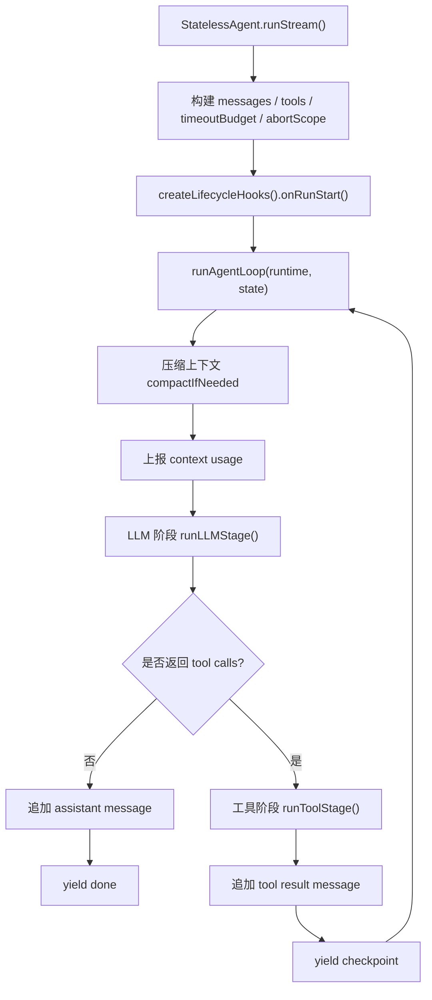

# Agent Execution Flow

## 目标

本文档描述 `D:\work\renx-code\packages\core\src\agent\agent` 当前版本的执行流程、模块职责、异常边界与扩展点。

适用对象：

- 维护 `StatelessAgent` 的开发者
- 需要理解 Agent 运行链路的测试编写者
- 后续继续做架构优化、平台扩展、可观测性增强的开发者

本文档以当前代码实现为准，重点覆盖：

- 正常执行链路
- LLM 阶段与工具阶段的边界
- 重试、超时、取消等异常流程
- lifecycle hooks 的作用与扩展方式

## 核心文件

- `index.ts`
  - `StatelessAgent` 门面
  - 组装 runtime
  - 组装 lifecycle hooks
- `run-loop.ts`
  - Agent 主循环
  - 控制 step、重试、完成、终止
- `llm-stream-runtime.ts`
  - 调用 LLM stream
  - 聚合 assistant 文本、reasoning、tool calls
- `tool-runtime.ts`
  - 工具执行
  - 并发控制
  - ledger 去重
  - write_file 特殊处理
- `runtime-hooks.ts`
  - 生命周期 hook 抽象
  - 将观测逻辑与控制流解耦
- `timeout-budget.ts`
  - 总超时预算
  - stage 级预算
- `abort-runtime.ts`
  - abort 传播
  - sleep 中断
  - timeout reason 归一化
- `continuation.ts`
  - continuation 增量调用策略
- `tool-call-merge.ts`
  - 流式 tool_call 合并
- `write-file-session.ts`
  - 流式 write_file 分片缓冲与补偿

## 总体结构

当前架构不是“大型插件系统”，而是“明确主流程 + 内部 hooks 扩展点”的模式。

设计原则：

- 主控制流必须清晰、直接、可读
- 可观测性不直接污染主循环
- runtime 依赖按职责分组，而不是平铺成巨大 `Deps`
- 对外仍保持 `StatelessAgent` 作为稳定入口

## 顶层执行入口

入口方法：

- `StatelessAgent.runStream()` in `index.ts`

主要职责：

1. 接收 `AgentInput`
2. 准备消息列表与 system prompt
3. 解析可用工具
4. 初始化 write buffer session
5. 创建 timeout budget 与 execution abort scope
6. 创建 trace id
7. 触发 `onRunStart` hooks
8. 调用 `runAgentLoop()`

## 执行总流程

## Runtime 分层

### 1. RunLoopRuntime

定义位置：

- `run-loop.ts`

作用：

- 把主循环所需能力按职责分组

当前分组：

- `limits`
- `callbacks`
- `messages`
- `stages`
- `stream`
- `resilience`
- `diagnostics`
- `hooks`

这样做的意义：

- 避免 `createRunLoopDeps()` 这种单层大对象继续膨胀
- 让主循环依赖更有语义
- 便于后续对某个分组单独替换或测试

### 2. ToolRuntime

定义位置：

- `tool-runtime.ts`

作用：

- 聚合工具执行侧能力

当前分组：

- `agentRef`
- `execution`
- `callbacks`
- `diagnostics`
- `resilience`
- `hooks`
- `events`

这比之前的平铺式 `ToolRuntimeDeps` 更适合继续扩展。

## Lifecycle Hooks

定义位置：

- `runtime-hooks.ts`

当前 hook 类型：

- `onRunStart`
- `onLLMStageStart`
- `onToolStageStart`
- `onToolExecutionStart`
- `onRunError`
- `onRetryScheduled`

### 设计意图

这些 hooks 不是为了做“任意业务插件系统”，而是为了处理横切关注点：

- metrics
- tracing
- structured logging
- 后续可能加入审计、SLO、采样

### 运行方式

每个 start hook 可以返回一个 `AgentRuntimeObservation`：

- `spanId`
- `startedAt`
- `finish(context)`

主流程只关心：

1. 在阶段开始时拿到 observation
2. 在阶段结束时调用 `finish()`

这样控制流不需要知道具体如何打点、记日志、上报 trace。

### 当前实现

当前 `index.ts` 中只组装了一个 `observabilityHook`，负责：

- startSpan
- endSpan
- emitMetric
- logInfo
- logWarn
- logError

如果后续需要拆分，可进一步分为：

- metrics hook
- tracing hook
- logging hook

## 主循环详解

实现位置：

- `run-loop.ts`

### Step 1. 进入循环前状态

主循环维护以下关键状态：

- `stepIndex`
- `retryCount`
- `runOutcome`
- `runErrorCode`
- `terminalDoneEmitted`

### Step 2. 循环开始前的终止判定

每轮开始先检查：

- execution abort
- timeout budget 是否已转化为 abort reason
- 是否达到 `maxRetryCount`

若触发：

- yield `error`
- 或 yield `max retries`
- 然后结束循环

### Step 3. 上下文压缩

调用：

- `runtime.messages.compactIfNeeded()`

如果发生压缩：

- 触发 `callbacks.onCompaction`
- yield `compaction` event

### Step 4. 上报上下文使用量

调用：

- `runtime.messages.estimateContextUsage()`

然后：

- 调用 `callbacks.onContextUsage`

### Step 5. 执行 LLM 阶段

调用：

- `runLLMStage()`

内部做的事情：

1. 触发 `onLLMStageStart`
2. 创建 llm stage abort scope
3. 合并 LLM config
4. 调用 `runtime.stages.llm()`
5. 在 finally 中调用 observation.finish

### Step 6. 处理 assistant 输出

LLM 返回后：

- assistant message 追加到 `messages`
- 调用 `callbacks.onMessage`

然后分支：

- 没有 tool calls
  - 直接 `yield done`
  - 结束
- 有 tool calls
  - 进入工具阶段

### Step 7. 执行工具阶段

调用：

- `runToolStage()`

内部做的事情：

1. 触发 `onToolStageStart`
2. 创建 tool stage abort scope
3. 调用 `runtime.stages.tools()`
4. 在 finally 中调用 observation.finish

### Step 8. 工具完成后生成 checkpoint

工具阶段返回最后一条 tool result message 后：

- `yield checkpoint`
- 继续下一轮 loop

## LLM 阶段详解

实现位置：

- `llm-stream-runtime.ts`

### 输入

- `messages`
- `config`
- `abortSignal`
- `executionId`
- `stepIndex`
- `writeBufferSessions`

### 主要流程

1. `buildLLMRequestPlan()`
   - 处理 continuation
   - 计算 request messages
   - 计算 request config
2. `llmProvider.generateStream()`
3. 逐 chunk 聚合：
   - `content`
   - `reasoning_content`
   - `tool_calls`
   - `usage`
   - `responseId`
4. `applyContinuationMetadata()`
5. 校验 assistant 是否为空响应

### 关键边界

#### 1. 空白响应视为无效

使用：

- `hasNonEmptyText()`

语义是 `trim()` 后非空。

因此以下情况会视为无效响应：

- 仅空格
- 仅换行
- 没有 tool calls 且没有有效文本/推理文本

这类情况会抛出：

- `AgentUpstreamRetryableError`

#### 2. 流式工具调用合并

通过：

- `mergeToolCallsWithBuffer()`

解决问题：

- tool call 参数分段到达
- write_file 参数可能非常大

#### 3. write_file 特殊缓冲

在合并 tool call 参数时，会将 write_file 分片缓存到：

- `writeBufferSessions`

目的是避免大内容工具调用在流式过程中丢失或半成品执行。

## 工具阶段详解

实现位置：

- `tool-runtime.ts`

### processToolCalls()

按两种模式执行：

- 串行
- 并发波次执行

是否并发由：

- `maxConcurrentToolCalls`
- `resolveToolConcurrencyPolicy()`
- `buildExecutionWaves()`

共同决定。

### executeTool()

单个工具执行时主要流程：

1. 触发 `onToolExecutionStart`
2. 调用 `executeToolCallWithLedger()`
3. 实际执行 `toolExecutor.execute()`
4. 转换为统一 tool result message
5. 调用 `callbacks.onMessage`
6. yield `tool_result`
7. finally 中 observation.finish

### Ledger 的作用

实现位置：

- `tool-execution-ledger.ts`

作用：

- 同一次 execution 中避免重复执行同一 toolCall
- 支持缓存回放
- 支持并发去重

### write_file 特殊处理

工具失败时，如果是 write_file：

- 可能先输出协议型中间结果
- 可能做错误增强
- 可能触发自动 finalize

相关逻辑：

- `isWriteFileToolCall()`
- `isWriteFileProtocolOutput()`
- `enrichWriteFileToolError()`
- `maybeAutoFinalizeWriteFileResult()`

## 异常与重试流程

### 主循环中的错误分类

`run-loop.ts` 中错误大致分为：

- timeout budget
- abort
- 普通 agent error
- retryable upstream error

### 处理顺序

1. 先判断是否 timeout budget
2. 再判断是否 abort
3. 否则执行 `normalizeError()`
4. 触发 `onRunError`
5. yield `error` event
6. 根据：
   - `callbacks.onError` 返回值
   - `normalizedError.retryable`
   决定是否重试

### 重试行为

如果允许重试：

1. `retryCount += 1`
2. 触发 `onRetryScheduled`
3. `calculateRetryDelay()`
4. `sleep()`
5. 进入下一轮 loop

### 注意点

当前设计中：

- retry 前也会 `yield error`

这意味着：

- `error` event 不一定代表最终失败
- 消费方必须结合后续 `done` 或新的 `progress` 事件判断完整状态

这是已知设计语义，测试已覆盖。

## Abort 与 Timeout 机制

### 执行级 abort

`runStream()` 中创建：

- execution abort scope

来源可能包括：

- 外部传入的 `abortSignal`
- timeout budget

### 阶段级 abort

每个 stage 进入时再创建：

- llm stage abort scope
- tool stage abort scope

好处：

- 每个阶段可以独立消费预算
- stage 结束后能正确 release listener

### timeout budget

相关文件：

- `timeout-budget.ts`
- `abort-runtime.ts`

职责：

- 追踪总预算
- 区分 llm / tool 阶段预算
- 将 budget exceed 映射为 abort reason

## 关键事件输出

当前主要 `StreamEvent`：

- `progress`
- `chunk`
- `reasoning_chunk`
- `tool_call`
- `tool_result`
- `checkpoint`
- `compaction`
- `done`
- `error`

语义说明：

- `progress`
  - 阶段开始或阶段切换
- `chunk`
  - assistant 文本增量
- `reasoning_chunk`
  - reasoning 文本增量
- `tool_call`
  - 工具调用增量聚合结果
- `tool_result`
  - 工具执行完成后的统一输出
- `checkpoint`
  - 一轮工具调用完成后的可恢复点
- `done`
  - 正常结束或达到最大步数
- `error`
  - 可能是中间错误，也可能是终态错误

## 典型执行路径示例

### 路径 A：纯文本回答

1. `runStream()`
2. `runAgentLoop()`
3. `runLLMStage()`
4. `llm-stream-runtime.ts` 返回 assistant text
5. 无 tool calls
6. yield `done`

### 路径 B：LLM 调工具再继续

1. `runStream()`
2. `runAgentLoop()`
3. `runLLMStage()`
4. assistant 返回 tool calls
5. `runToolStage()`
6. `processToolCalls()`
7. `executeTool()`
8. 写入 tool result message
9. yield `checkpoint`
10. 回到下一轮 `runAgentLoop()`
11. 再次进入 `runLLMStage()`
12. 最终 yield `done`

### 路径 C：LLM 失败后重试

1. `runLLMStage()` 抛错
2. `run-loop.ts` 归一化错误
3. 调 `onRunError`
4. yield `error`
5. 触发 `onRetryScheduled`
6. sleep backoff
7. 重进下一轮 loop

## 扩展建议

### 推荐扩展方式

优先通过 hooks 扩展横切能力，而不是直接改主流程：

- metrics 增强
- trace attributes 增强
- 结构化日志增强
- 审计日志

### 不推荐的方式

当前阶段不建议把这里改造成通用插件总线，因为会带来：

- 主流程可读性下降
- 生命周期顺序不透明
- 调试复杂度提升
- 测试隔离难度提升

## 维护建议

### 修改主流程时优先检查

- `run-loop.test.ts`
- `index.test.ts`
- `llm-stream-runtime.test.ts`
- `tool-runtime.test.ts`
- `task-run-lifecycle.test.ts`

### 修改 hooks 时优先检查

- `runtime-hooks.test.ts`
- `telemetry.test.ts`
- `logger.test.ts`

### 修改 task lifecycle 时优先检查

- `task-parent-abort.test.ts`
- `task-tools-runtime-edges.test.ts`
- `task-run-lifecycle.test.ts`

## 结论

当前 `agent/agent` 已经形成了比较稳定的企业级执行骨架：

- `StatelessAgent` 负责门面与组装
- `run-loop.ts` 负责主控制流
- `llm-stream-runtime.ts` 与 `tool-runtime.ts` 各自负责阶段逻辑
- `runtime-hooks.ts` 负责横切扩展能力

这是一个“无状态 facade + 显式主循环 + 内部 hooks 扩展点”的实现。

对当前项目来说，这比“继续堆大依赖包”更合理，也比“直接引入重型插件系统”更安全。
