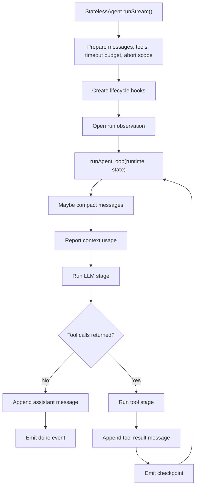

# Agent Execution Flow

## Purpose

This document explains how the stateless agent kernel in
`D:\work\renx-code\packages\core\src\agent\agent` executes one run.

It focuses on:

- the normal control flow
- the boundary between the LLM stage and the tool stage
- retry, timeout, and abort behavior
- how lifecycle hooks are used for observation only

## Core Modules

- `index.ts`
  - public `StatelessAgent` facade
  - per-run runtime assembly
  - shared adapters such as logging, timeout budget, and callback safety
- `run-loop.ts`
  - owns the step loop
  - decides retry, finish, abort, and max-step behavior
- `llm-stream-runtime.ts`
  - talks to the provider stream
  - aggregates assistant text, reasoning, and tool calls
- `tool-runtime.ts`
  - executes tool calls
  - handles concurrency, idempotency ledger, confirmations, and tool result messages
- `runtime-composition.ts`
  - builds grouped runtime contracts for the loop and tool execution
- `runtime-hooks.ts`
  - defines lifecycle hook contracts and composition utilities
- `observability-hooks.ts`
  - builds the default metrics, tracing, and logging hooks

## Design Rules

- `agent/agent` is a stateless execution kernel, not an application session layer.
- Control flow stays explicit in `run-loop.ts`; it is not delegated to a plugin system.
- Hooks are observational only. They can record metrics, traces, and logs, but they must not override retry, abort, or tool execution decisions.
- Tool schemas are normalized once at the agent boundary so the main loop does not depend on registry details.

## Top-Level Flow

Entry point:

- `StatelessAgent.runStream()` in `index.ts`

High-level steps:

1. Copy input messages and inject `systemPrompt` if needed.
2. Resolve the tool list passed to the provider.
3. Create per-run write buffer sessions.
4. Create timeout budget state and the execution abort scope.
5. Create a trace id.
6. Build lifecycle hooks for observation.
7. Open the run observation with `onRunStart`.
8. Hand execution to `runAgentLoop(...)`.

## Runtime Assembly

### RunLoopRuntime

Built by:

- `createRunLoopRuntime(...)` in `runtime-composition.ts`

Grouped responsibilities:

- `limits`
- `callbacks`
- `messages`
- `stages`
- `stream`
- `resilience`
- `diagnostics`
- `hooks`

Why this exists:

- removes bulky composition logic from `StatelessAgent`
- keeps the loop contract explicit instead of hiding it behind a service container
- gives future refactors a stable seam for testing and further file splits

### ToolRuntime

Built by:

- `createToolRuntime(...)` in `runtime-composition.ts`

Responsibilities grouped into:

- `execution`
- `callbacks`
- `diagnostics`
- `resilience`
- `hooks`
- `events`

Why this exists:

- tool execution has different dependencies from the step loop
- concurrency and idempotency can evolve without bloating the facade class
- tool tests can target this boundary directly

## Lifecycle Hooks

Hook contract:

- defined in `runtime-hooks.ts`

Default implementation:

- built in `observability-hooks.ts`

Available lifecycle events:

- `onRunStart`
- `onLLMStageStart`
- `onToolStageStart`
- `onToolExecutionStart`
- `onRunError`
- `onRetryScheduled`

Important rule:

- hooks are append-only observation points
- they are not a public behavior override system
- they should never decide whether to retry, skip, or mutate the business result

Current default hook behavior:

- open and close spans
- emit duration and retry metrics
- write structured info, warn, and error logs

## Step Loop Details

Implementation:

- `run-loop.ts`

Main mutable run state:

- `stepIndex`
- `retryCount`
- `runOutcome`
- `runErrorCode`
- `terminalDoneEmitted`

Per iteration:

1. Check for abort, timeout conversion, and retry limit.
2. Compact messages if needed.
3. Emit context usage.
4. Enter the LLM stage.
5. If no tool calls were returned:
   - append the assistant message
   - emit `done`
   - finish the run
6. If tool calls were returned:
   - enter the tool stage
   - append the tool result message
   - emit a checkpoint
   - continue to the next step

## LLM Stage

Implementation:

- `runLLMStage(...)` in `run-loop.ts`
- `callLLMAndProcessStream(...)` in `llm-stream-runtime.ts`

What happens:

1. Open `onLLMStageStart` observation.
2. Create a stage-specific abort scope from the shared timeout budget.
3. Merge request config with tools, abort signal, and conversation cache key.
4. Stream from the provider.
5. Aggregate:
   - assistant text
   - reasoning content
   - tool calls
   - provider usage data
6. Validate final output and return one structured stage result.
7. Finish the stage observation with success or failure metadata.

## Tool Stage

Implementation:

- `runToolStage(...)` in `run-loop.ts`
- `processToolCalls(...)` in `tool-runtime.ts`

What happens:

1. Open `onToolStageStart` observation.
2. Create a tool-stage abort scope.
3. Turn tool calls into execution plans with concurrency policy.
4. Build execution waves.
5. Execute each tool call:
   - open `onToolExecutionStart`
   - consult the ledger for idempotent replay
   - forward chunks and confirmations
   - normalize result output
   - finish observation with cached and success flags
6. Merge all tool outputs into one tool result message.
7. Finish the stage observation.

## Abort, Timeout, and Retry

Timeout model:

- `timeout-budget.ts` tracks the whole-run budget and per-stage slices
- `abort-runtime.ts` converts timeout state into a consistent abort reason

Retry model:

- owned by `run-loop.ts`
- retry decision stays outside the LLM stream runtime and tool runtime
- backoff delay is calculated once at the loop level

Error handling model:

- raw errors are normalized into agent errors
- timeout and abort errors are detected before generic normalization
- run-level errors trigger `onRunError`
- scheduled retries trigger `onRetryScheduled`

Important behavior note:

- the stream may emit an `error` event before the loop decides to retry
- consumers must not assume every `error` event is terminal on its own

## Why This Architecture Is Better Than The Old One

- `StatelessAgent` is now a thin facade instead of a giant mixed implementation.
- Runtime composition is explicit, but no longer buried inside one oversized file.
- Observability logic is separated from control flow.
- Tool schema resolution is centralized at one boundary.
- New unit tests can target composition and hook behavior directly.

## Current Follow-Up Targets

The next likely refactor candidates are still:

- `run-loop.ts`
- `tool-runtime.ts`

They are now the largest runtime modules and contain the most control-flow detail.
The current composition split makes that next step much safer.
