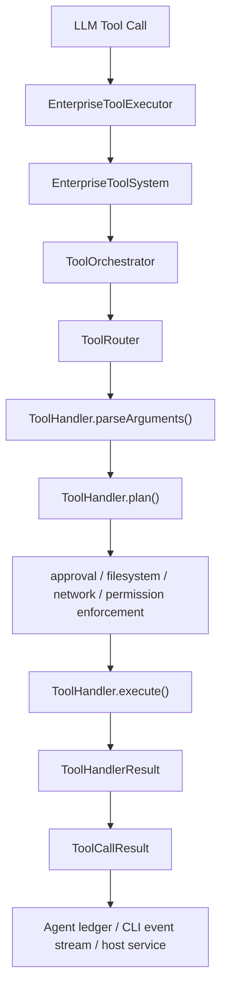

# Tool V2 Architecture

## Goal

`tool-v2` is a clean-slate enterprise tool subsystem for `renx-code`.

It is intentionally **not** a compatibility wrapper around `packages/core/src/agent/tool`.
The design starts from four principles:

1. Tool specs visible to the model must be separate from execution handlers.
2. Approval, permission enforcement, and execution orchestration must live in shared infrastructure rather than inside individual tools.
3. Session-scoped and turn-scoped permission grants must be first-class.
4. Tools must be easy to add without growing a god-manager.

## Layers

### 1. Contracts

- `contracts.ts`
- `context.ts`
- `errors.ts`

These files define the public runtime model:

- tool spec
- tool call request/result
- approval request/decision
- permission request/grant
- execution context
- session state
- lifecycle event hook contract

`ToolSpec` carries two different schema contracts:

- `inputSchema`: model-facing argument schema
- `outputSchema`: structured result schema for `ToolHandlerResult.structured`

This distinction is important:

- models consume `inputSchema`
- the orchestrator and downstream host integrations can consume `outputSchema`
- plain-text `output` remains human-readable, but should not be treated as the only machine contract

### 2. Registry and routing

- `registry.ts`
- `router.ts`

Responsibilities:

- register handlers
- expose model-visible specs
- resolve a tool call to a handler

Handlers implement a small interface:

- `parseArguments`
- `plan`
- `execute`

`StructuredToolHandler` provides the default zod-backed path for typed tools.

Schema rules for enterprise tools:

- every public input field should have a clear `.describe(...)`
- nested objects and wrapper schemas (`optional`, `default`, preprocess/pipe) must preserve descriptions into emitted JSON Schema
- handlers should declare `outputSchema` whenever they return stable structured data
- `tool-v2` public input/output contracts use `camelCase`
- do not mix `snake_case` and `camelCase` inside the same public handler contract

### 3. Orchestration

- `orchestrator.ts`

Responsibilities:

- apply granted session/turn permissions to the base environment
- enforce file-system and network policy before execution
- centralize approval behavior
- emit normalized lifecycle events for observability
- return normalized success/failure results

This keeps approval and permission logic out of individual handlers.

Lifecycle stages currently emitted:

- `received`
- `parsed`
- `planned`
- `approval_requested`
- `approval_resolved`
- `executing`
- `succeeded`
- `failed`

These hooks are best-effort by design: observer failures are swallowed so telemetry cannot break tool execution.

### 4. Permission model

- `permissions.ts`
- `approval-store.ts`

The permission model is intentionally explicit:

- base file-system policy
- base network policy
- session grants
- turn grants

Grants are merged into the effective execution environment at dispatch time.

The effective execution context also receives the active tool call metadata so handlers can safely reference the real `callId` without re-threading it manually.

### 5. Handlers

- `handlers/*`

Handlers stay focused on business logic:

- declare execution plan
- perform the tool action
- return structured output

For built-ins, the preferred pattern is:

1. `output`: concise human-readable text or protocol text
2. `structured`: stable machine-readable object
3. `outputSchema`: schema for that structured object

This keeps tool-v2 useful for both LLM-facing workflows and host/runtime integrations.

Current built-ins:

- `read_file`
- `file_edit`
- `file_history_list`
- `file_history_restore`
- `glob`
- `grep`
- `lsp`
- `write_file`
- `web_fetch`
- `web_search`
- `request_permissions`
- `local_shell`
- `spawn_agent`
- `agent_status`
- `wait_agents`
- `cancel_agent`

`local_shell` now has two explicit extension seams:

- pluggable `ShellRuntime`
- pluggable `ShellCommandPolicy`

This allows hosts to tighten guardrails or swap process execution transport without rewriting the tool handler itself.

`tool-v2` also exposes a brokered runtime assembly layer:

- a sandboxed runtime handles normal in-sandbox command execution
- an optional escalated runtime handles approved out-of-sandbox execution
- stateful runtimes can implement sandbox-state updates before command dispatch

`local_shell` also supports explicit shell profiles:

- sandbox profiles describe the requested isolation target
- policy profiles describe command allow/ask/deny posture
- rule-based policies can choose sandboxed execution or sandbox escalation

Built-in profiles currently include:

- `standard`: full-access sandbox target with approval on every command
- `workspace-guarded`: workspace-write sandbox target with approval driven by policy
- `restricted-strict`: restricted sandbox target with deny-by-default command posture

Hosts can provide their own profiles instead of baking security posture into ad hoc handler flags.

The shell policy layer also supports Codex-style prefix rules:

- `allow`: permit the command and mark it for sandbox escalation
- `prompt`: require approval and then run with sandbox escalation
- `forbidden`: fail closed before execution

When no rule matches, the policy falls back to the configured default command classifier.

### 6. Assembly

- `builtins.ts`
- `factory.ts`

These files provide two integration levels:

- raw handlers for teams that want custom assembly
- turn-key system construction for teams that want a ready-to-use tool platform

Assembly is intentionally configurable rather than magical:

- `createBuiltInToolHandlersV2({ shell })` can inject shell runtime/policy options
- `createEnterpriseToolSystemV2({ builtIns })` forwards built-in configuration without exposing subagent internals
- `createEnterpriseToolSystemV2WithSubagents(...)` layers shell customization and subagent orchestration together

Factory entrypoints:

- `createEnterpriseToolSystemV2()`
- `createEnterpriseToolSystemV2WithSubagents(...)`

## Subagent orchestration

`tool-v2` includes a clean-slate subagent orchestration layer:

- `agent-contracts.ts`
- `agent-runner.ts`
- `agent-store.ts`
- `agent-real-runner.ts`
- `agent-roles.ts`

Design rules:

- roles are explicit named profiles
- role prompt and allowed tools are part of configuration, not hidden inside handlers
- execution projection is persisted separately from the live runner
- the tool layer talks to a `SubagentRunner` interface, not directly to app services

This keeps runtime transport, persistence, and tool UX separate.

## Execution flow

1. Model produces a tool call.
2. `ToolRouter` resolves the tool handler.
3. Handler parses arguments.
4. Handler produces a `ToolExecutionPlan`.
5. `ToolOrchestrator` enforces:
   - file read/write access
   - network policy
   - approval policy
6. Handler executes with the effective context.
7. Output is normalized into a single `ToolCallResult`.

### Flow chart

## Native agent integration

`tool-v2` now integrates with agent through a native executor boundary instead of
going back through legacy `ToolManager` / `ToolResult`.

Key pieces:

- `packages/core/src/agent/agent/tool-executor.ts`
- `packages/core/src/agent/tool-v2/agent-tool-executor.ts`

Design rules:

- agent consumes `ToolCallResult`
- handler internals stay on `ToolHandlerResult`
- `EnterpriseToolExecutor` is the only place that maps:
  - provider `ToolCall`
  - agent approval / policy callbacks
  - tool-v2 execution context

This keeps the execution path single-directional:

1. agent receives provider tool call
2. `AgentToolExecutor` executes it against `EnterpriseToolSystem`
3. result is stored in the agent ledger as native `ToolCallResult`
4. agent emits `role="tool"` message from that native result

There is intentionally no adapter that converts native results back into the
legacy tool package model.

## Current host integration

The current native host chain is:

1. host creates `EnterpriseToolSystem`
2. host wraps it with `EnterpriseToolExecutor`
3. `StatelessAgent` consumes `EnterpriseToolExecutor`
4. `AgentAppService` wraps `StatelessAgent`

CLI now follows this path directly:

- [`packages/cli/src/agent/runtime/runtime.ts`](/Users/wrr/work/renx-code-v2/packages/cli/src/agent/runtime/runtime.ts)
- [`packages/cli/src/agent/runtime/source-modules.ts`](/Users/wrr/work/renx-code-v2/packages/cli/src/agent/runtime/source-modules.ts)

The concrete CLI composition is:

1. create task store
2. create deferred subagent app service stub
3. call `createEnterpriseToolSystemV2WithSubagents(...)`
4. create `EnterpriseToolExecutor`
5. create `StatelessAgent`
6. create `AgentAppService`
7. bind the real `appService` back into the deferred subagent bridge

This keeps subagent recursion on the native `tool-v2` path without re-entering legacy `ToolManager`.

## Practical usage

Practical service-layer and agent-layer examples live in:

- [`packages/core/src/agent/tool-v2/USAGE.md`](/Users/wrr/work/renx-code-v2/packages/core/src/agent/tool-v2/USAGE.md)

## Approval model

Tool approval is cacheable by key:

- `once`: do not cache
- `turn`: cached for the current turn
- `session`: cached for the session

This is stored in `ToolSessionState`, together with granted permissions.

Approval requests can also carry a `commandPreview`, which is especially useful for `local_shell` approval UX.

## Shell runtime capability model

Shell sandboxing is modeled explicitly instead of being implied:

- policy/profile layer chooses a requested sandbox mode such as `workspace-write` or `restricted`
- shell execution derives a concrete `ShellSandboxPolicy` object for the runtime
- runtime layer advertises whether each sandbox mode is supported and whether enforcement is `advisory` or `enforced`
- runtime layer also advertises whether escalation outside the sandbox is supported
- strict sandbox profiles can require runtime enforcement and fail closed when only advisory support is available

`ShellSandboxPolicy` carries runtime-facing state derived from the effective execution context:

- sandbox type
- readable roots
- writable roots
- network access flag
- sandbox marker environment variables such as `CODEX_SANDBOX` and `CODEX_SANDBOX_NETWORK_DISABLED`

Some runtimes may also implement a stateful sandbox transport similar to Codex MCP shell integrations:

- `updateSandboxPolicy(policy)` lets the harness push effective sandbox state before execution
- `BrokeredShellRuntime` composes a sandboxed runtime and an escalated runtime behind one handler-facing interface

This split is important for enterprise deployments because the same tool profile may run against different runtimes:

- a local process runtime may only provide advisory sandbox semantics
- a containerized or VM-backed runtime may provide enforced isolation for the same requested mode
- an MCP or wrapped-shell runtime may support true in-sandbox execution plus explicit escalation for selected commands

## Why this is easier to extend

To add a new tool:

1. Create a handler under `handlers/`.
2. Define its zod schema.
3. Implement `plan`.
4. Implement `execute`.
5. Register it in `builtins.ts` or another registry assembly file.

No central manager needs to learn tool-specific business rules.

## Current intentional limits

- `local_shell` now exposes sandbox capability, sandbox policy objects, escalation signaling, and profile grading, but the default local process runtime still reports sandboxing as advisory rather than OS-enforced isolation.
- `on-failure` approval mode is reserved in the contracts but not yet implemented because it requires retry-capable runtimes.
- `request_permissions` depends on the host application providing a resolver.
- subagent tools only register when a runner and store are explicitly provided.

These are explicit product limits, not hidden compatibility shortcuts.
