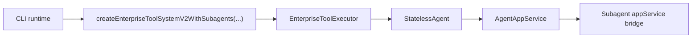

# Tool V2 Usage

## Contract rules

`tool-v2` public contracts are now unified to `camelCase`.

Examples:

- `taskId`, not `task_id`
- `agentId`, not `agent_id`
- `includeHistory`, not `include_history`
- `runInBackground`, not `run_in_background`
- `linkedTaskId`, not `linked_task_id`
- `agentRun`, `shellRun`, `cancelledTaskIds`, `timeoutHit`, `waitedMs`

If a third-party API itself requires `snake_case`, that is kept only in the outbound provider request body, not in the internal tool contract.

## Minimal service example

Use this when you want to call `tool-v2` directly from an external service layer without going through agent:

```ts
import {
  createEnterpriseToolSystemV2,
  ToolSessionState,
  createRestrictedNetworkPolicy,
  createWorkspaceFileSystemPolicy,
} from '@renx-code/core';

const workingDirectory = '/absolute/workspace';

const toolSystem = createEnterpriseToolSystemV2();

const result = await toolSystem.execute(
  {
    toolCallId: 'task-create-1',
    toolName: 'task_create',
    arguments: JSON.stringify({
      namespace: 'demo',
      subject: 'Implement tool-v2 service integration',
      description: 'Create one task through the native tool-v2 service entrypoint.',
      priority: 'high',
    }),
  },
  {
    workingDirectory,
    sessionState: new ToolSessionState(),
    fileSystemPolicy: createWorkspaceFileSystemPolicy(workingDirectory),
    networkPolicy: createRestrictedNetworkPolicy(),
    approvalPolicy: 'unless-trusted',
    trustLevel: 'trusted',
  }
);

if (!result.success) {
  console.error(result.error);
} else {
  console.log(result.structured);
}
```

## Minimal agent example

Use this when you want agent to call `tool-v2` natively:

```ts
import {
  StatelessAgent,
  EnterpriseToolExecutor,
  createEnterpriseToolSystemV2WithSubagents,
  createRestrictedNetworkPolicy,
  createWorkspaceFileSystemPolicy,
} from '@renx-code/core';

const workingDirectory = '/absolute/workspace';

const toolSystem = createEnterpriseToolSystemV2WithSubagents({
  appService,
  resolveTools: (allowedTools) =>
    allToolSchemas.filter((tool) => !allowedTools || allowedTools.includes(tool.function.name)),
  resolveModelId: () => 'gpt-5',
});

const toolExecutor = new EnterpriseToolExecutor({
  system: toolSystem,
  workingDirectory,
  fileSystemPolicy: createWorkspaceFileSystemPolicy(workingDirectory),
  networkPolicy: createRestrictedNetworkPolicy(),
  approvalPolicy: 'unless-trusted',
  trustLevel: 'trusted',
});

const agent = new StatelessAgent(provider, toolExecutor, {
  maxRetryCount: 2,
  enableCompaction: true,
});
```

## CLI integration shape

CLI is already on the native `tool-v2` path.

Current composition:



Concrete files:

- [`packages/cli/src/agent/runtime/runtime.ts`](/Users/wrr/work/renx-code-v2/packages/cli/src/agent/runtime/runtime.ts)
- [`packages/cli/src/agent/runtime/source-modules.ts`](/Users/wrr/work/renx-code-v2/packages/cli/src/agent/runtime/source-modules.ts)

## Common call examples

### Create a task

```json
{
  "namespace": "demo",
  "subject": "Prepare release notes",
  "description": "Collect notable changes and produce a release summary.",
  "activeForm": "Preparing release notes"
}
```

### Update a task

```json
{
  "namespace": "demo",
  "taskId": "task_123",
  "status": "in_progress",
  "owner": "main-agent",
  "updatedBy": "planner"
}
```

### Start a background shell task

```json
{
  "command": "pnpm dev",
  "runInBackground": true,
  "timeoutMs": 300000
}
```

### Poll a background task

```json
{
  "taskId": "task_bg_1",
  "block": false
}
```

### Spawn a linked subagent

```json
{
  "role": "worker",
  "prompt": "Investigate the failing test and summarize root cause.",
  "description": "Investigate failing test",
  "linkedTaskId": "task_123",
  "taskNamespace": "demo"
}
```

## Result shape examples

### `task_output` for subagent

```json
{
  "namespace": "demo",
  "agentRun": {
    "agentId": "agent_1",
    "status": "completed"
  },
  "completed": true,
  "waitedMs": 1200
}
```

### `task_output` for background shell

```json
{
  "namespace": "demo",
  "taskId": "task_bg_1",
  "shellRun": {
    "taskId": "task_bg_1",
    "status": "completed"
  },
  "completed": true,
  "waitedMs": 800
}
```

### `task_stop`

```json
{
  "namespace": "demo",
  "agentRun": {
    "agentId": "agent_1",
    "status": "cancelled"
  },
  "cancelledTaskIds": ["task_123"]
}
```

## Recommendation

For all new code:

- construct `EnterpriseToolSystem` or `createEnterpriseToolSystemV2WithSubagents(...)`
- use `EnterpriseToolExecutor` for agent integration
- use `ToolCallResult` / `ToolHandlerResult`
- treat `structured` as the stable machine contract
- do not add new legacy adapters or `snake_case` compatibility fields
